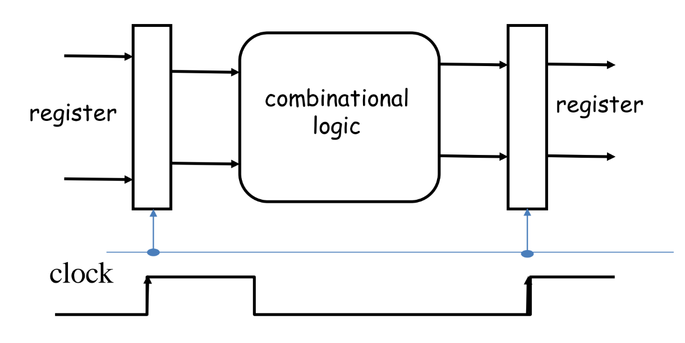
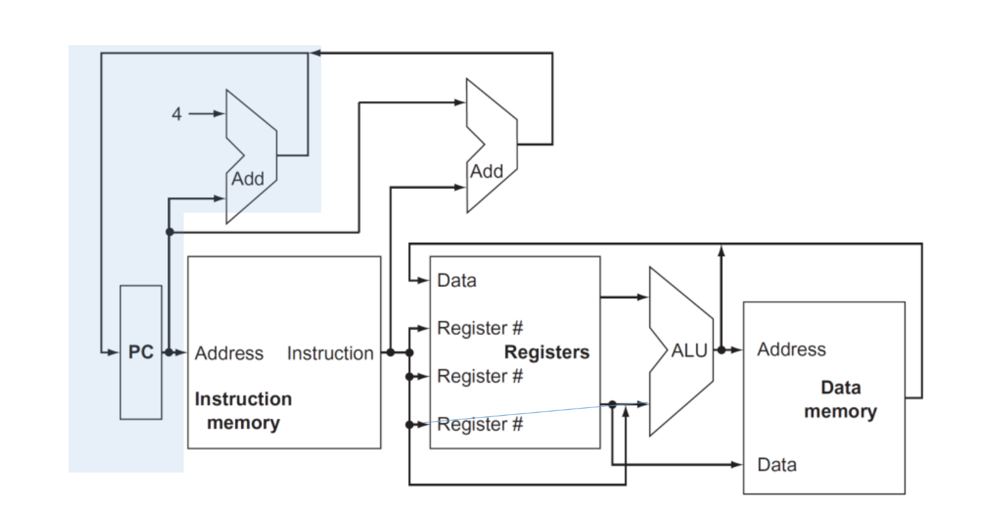
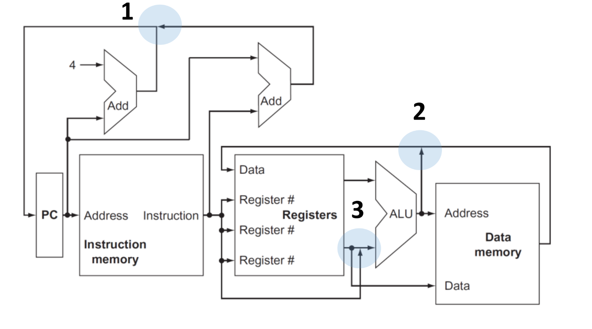
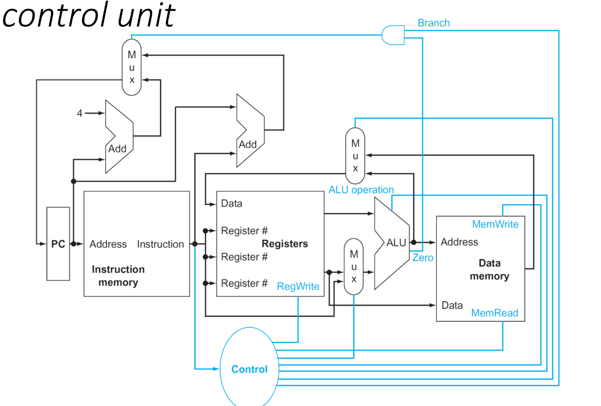

# Useful notes for Computer Architecture oral exam

Before starting:

- I'm writing these notes BEFORE the exam, using the slides the professor gave us, trying to find those arguments that are more likely to be asked during the oral exam;
- Feel free to add anything you think is useful;
- After your exam, please add any question you remember, so that we can help future students.

## Topics

### Wire delay problem - Slide "Performance part 1"

We first define what is a **clock cycle**. It is the time between two consecutive rising edges of the clock signal. The actual time is defined by different parameters, such as time-of-flight, gate delay, and setup time.

Clock delay is a phenomenon where the same clock signal arrives at different components at different times, affecting the system's operation.

A larger fraction of the clock cycle is spent on the wire delay, which is the time it takes for the signal to travel from one component to another. This is a problem because the wire delay is proportional to the distance between the components, and the distance between components is increasing. This increases the power consumption and the time it takes for the signal to travel.

### Classes of computers - Slide "Performance part 1"

- IoT devices: devices in everyday life, such as smartwatches, smart thermostats, etc, connected to internet. **The ability to run third-party applications is the line between non-embedded and embedded systems**. They offers useful data and local services to remote applications, using remote information and resources. Wide range of performances and costs. In general, we want to reach required performances with the lowest cost possible.
- Personal Mobile Devices: smartphones, tablets, etc. They have limited power consumption, due to battery life and absence of cooling systems. Key aspects are efficient use of energy, and the memory optimization.
- Desktop computers: spanning from low-cost to high-performance machines, market is driven to *price-performance ratio*. Performance evaluation is challenging, because of the large use of web applications; they also are considered the **access point to data to cloud services**
- Servers: backbone of large-scale computing. Main points are **availability**, **scalability** and **efficient troughput**. They are used for web services, data storage, etc.
- Clusters/Warehouse-scale computers: collections of desktops/servers, connected to the same network, acting together as a single computer, communicating through the network. Main cost for these systems is the **power consumption and cooling**.

### Defining a computer architecture - Slide "Performance part 1"

Functional requirements for computer architecture can be influenced by market and product competition. Specific features inspired by the market, such as the availability of software for a particular instruction set architecture, can drive the choice of functional requirements.

For each class:

- personal mobile devices require real-time performance for graphics, video, and audio, as well as energy efficiency.

- General-purpose desktops require balanced performance for a range of tasks, including interactive performance for graphics, video, and audio. 

- Servers require support for databases and transaction processing, enhancements for reliability and availability, and support for scalability. 

- Clusters/warehouse-scale computers require throughput performance for many independent tasks, error correction for memory, and energy proportionality. 

- Embedded computing often requires special support for graphics or video, power limitations and power control, and real-time constraints.

#### Software compatibility

- at programming language: more flexibility, but need new compilers and interpreters.
- object code: instruction set already defined, little flexibility but no need for investment in software.

#### OS requirements

- Size of address space: important because it may limit some applications.
- Memory management (paging, segmentation, etc);
- Protection: derives from the previous point;
- Virtualization: memory management and protection are key points;

### Flynn's Taxonomy - Slide "Performance part 1"

- **SISD**: Single Instruction, Single Data. Uni-processor systems.
- **SIMD**: Single Instruction, Multiple Data. Vector processors, GPUs.
- **MISD**: Multiple Instruction, Single Data. Is the logic behind the pipeline.
- **MIMD**: Multiple Instruction, Multiple Data. Multi-core processors, clusters.

### Parallel architectures

Different classes of parallel architectures:

- Instruction level parallelism (ILP): multiple instructions executed in parallel (pipeline and speculative execution).
- GPU: single instruction applied to a collection of data in parallel.
- Thread level parallelism (TLP): multiple threads executed in parallel.
- Request level parallelism (RLP): multiple requests executed in parallel.

Tightly coupled MIMD exploit TPL, where cooperative threads are executed in parallel. Loosely coupled MIMD exploit RLP, where independent tasks can proceed in parallel, needed only limited communication.

### Comparison between CPU and memory performance - Slide "Performance part 1"

WHile CPU performance has been increasing, memory performance has been increasing at a slower rate. Taking as reference an Intel i7 CPU, we can reach a peak bandwidth of 400 GB/s, while the memory bandwidth is 25 GB/s. This is a problem because the CPU is not able to reach its peak performance due to the memory bottleneck. This bandwidth can be reached by exploiting various techniques:

- multiporting and pipelining cache accesses;
- use multiple cache levels;
- using different caches for data and for instructions;
- implementing different caches for each core;

### Dependability - Slide "Performance part 1"

Dependability is the ability to deliver service that can justifiably be trusted. Infrastructures provides SLA (Service Level Agreement) to guarantee the service, or simply check if a system is up and running. Other software resources can be used to check the system's status:

- error detection: parity, checksums, CRCs;
- system reconfiguration: hot swapping, hot standby;
- system recovery: checkpointing, rollback, re-execution;

#### Fault tolerant system design

- **Error detection**: when a fault is present, it may leads to an incorrect operation state. There is a distance between the error and the incorrect state:
  - **temporal distance**: time between the fault and the error. If I don't use a certain component, I can't detect the error: periodic checking is needed;
  - **spatial distance**: space between the fault and the error;
- Reconfiguration and recovery: when a fault is detected, the system must be reconfigured to avoid the error. The reconfiguration can be **hot** (while the system is running) or **cold** (system is stopped). Recovery can be **rollback** (return to a previous state) or **re-execution** (re-execute the operation).

#### Reliability

- Mean time to failure (MTTF): average time between two failures.
- Mean time to repair (MTTR): average time to repair a failure.
- Mean time between failures (MTBF): average time between two failures, considering the repair time. Is the sum of MTTF and MTTR.
- Availability: ratio between the time the system is up and running and the total time. Is the fraction between MTTF and MTBF.

#### Redundancy

We can cope with failure by using redundancy. There are different types of redundancy:

- in time: redo the operation to check if the result is still erroneous;
- in resources: use multiple modules to perform the same operation;

### Measuring performance - Slide "Performance part 2"

Typical metrics to measure performance are the **throughput** and the **response time**. The throughput is the number of tasks completed per unit of time, while the response time is the time between the submission of a task and the completion of the task.

Dealing with execution time, two are the possible approaches:

- **wall clock time**: the time between the start and the end of the task, including all the system overhead;
- **CPU time**: the time the CPU is actually working on the task.

Whatever the approach, we can define the **speedup** as the ratio between the execution time of the system $X$ and the execution time of the system $Y$. When we state that a system is $n$ times faster than another, we are referring to the speedup.

#### Benchmarking

To measure the performance of a system, there are some tests that can be performed:

- **kernels**: small programs that test a specific feature of the system, such as matrix multiplication;
- **toy benchmarks**: small programs that test the system's performance in a specific task, such as sorting algorithms;
- **synthetic benchmarks**;
- **benchmark suites**: collection of benchmarks that test the system's performance in a wide range of tasks.

This approach can be affected by some biases:

- compiler can recognize the benchmark, and optimize the code in order to artificially increase the performance;
- the conditions in which the benchmark is executed can affect the performance.

To avoid this inconvenience, no code modifications should be allowed, except for the essential ones that produce the same output.

Benchmarks are prepared by organizations, such as SPEC, that provide a set of benchmarks to test the system's performance, specifically for a target systems, such as servers, desktops, IoT devices, etc.

### Deal with performance while defining a Computer Architecture - Slide "Performances part 2"

Some useful equations:

$$\text{CPU time} = \text{CPU Clock Time for a program} \times \text{Clock cycle time} = \frac{\text{CPU Clock Time for a program}}{\text{Clock rate}}$$

$$\text{CPI} = \frac{\text{CPU Clock Time for a program}}{\text{Instruction count}}$$

$$\text{CPU time} = \text{Instruction count} \times \text{Cycles per Instruction} \times \text{Clock cycle time}$$

$$\frac{\text{Instruction}}{\text{Program}} \times \frac{\text{Cycles}}{\text{Instruction}} \times \frac{\text{Seconds}}{\text{Cycle}} = \frac{\text{Seconds}}{\text{Program}} = \text{CPU Time}$$

Different instructions types have different CPIs, and the CPI is the sum of the CPIs of the different instructions types.

### Principles of Computer Design - Slide "Performance part 2"

#### Parallelism

Take advantage of **parallelism**: multiple processors, disks, pipelines, multiple functional units. It's important to **design efficient parallel solutions**. This is achieved by:

- ensuring load balancing of each component;
- minimizing communication overhead. This include both:
  - time spent in **communication**, such as data transfer, synchronization, etc;
  - time spent in **managing the parallelism**, such as scheduling, distributing tasks, etc;

#### Principle of locality

- temporal locality (if an instruction is executed, it is likely to be executed again) - spatial locality (if an instruction is executed, the next instruction is likely to be executed);

#### Amdahl's Law [Professor explicitly says that this could be an exam question]

An important think to take in consideration is **focus on the common case**: this include both **identifying the common case** and **optimizing for the common case**. Here comes in help Amdahl's Law, that states that the speedup of a system is limited by the fraction of the system that can't be parallelized. The speedup is given by the formula:

$$\text{Speedup} = \frac{\text{Execution time of the system without the enhancement}}{\text{Execution time of the system with the enhancement when possible}}$$

- **fraction enhanced** is the fraction of computation time in the original solution than can be converted to the enhanced solution;
- **speedup enhanced** is the improvement gained by the enhancement.

The last term of the formula is given by:

- execution time for a fraction of a task without the enhancement;
- execution time for the same fraction of the task with the enhancement;

Mathematically speaking:

$$(1-\text{fraction enhanced}) \times T_{\text{old}} + \frac{\text{fraction enhanced} \times T_{\text{old}}}{\text{speedup enhanced}}$$

So the formula or the speedup becomes:

$$\text{Speedup} = \frac{1}{(1-\text{fraction enhanced}) + \frac{\text{fraction enhanced}}{\text{speedup enhanced}}}$$

Look at this table as an example:

| Solution | Fraction enhanced | Computing time | I/O time | Overall time |
|----------|-------------------|----------------|---------|--------------|
| Original | ... | 7s | 3s | 10s |
| Disk | I/O speedup 3x | 7s | 1s | 8s |
| CPU 1| Computing speedup 2x | 3.5s | 3s | 6.5s |
| CPU 2| Computing speedup 3x | 2.33s | 3s | 5.33s |

- Disk: fraction enhanced is 0.3, speedup enhanced is 3, so the speedup is 1.25;
- CPU 1: fraction enhanced is 0.7, speedup enhanced is 2, so the speedup is 1.54;
- CPU 2: fraction enhanced is 0.7, speedup enhanced is 3, so the speedup is 1.87.

#### Take advantage of asynchronous operations

This aspect is fundamental in networked systems, where the time to send a message is much higher than the time to execute the operation. We should design the system in order to increase the number of asynchronous operations, covering the delay introduced by the network with other operations.

This method is also applied trough the **speculative execution**, where the system executes an operation before it is actually needed, in order to cover the time needed to execute the operation.

### The CPU, from instruction set to the architecture - Slide "CPU - part 1"

I expect that possible questions for this topic may be like "Take this instruction, and talk about which components of the CPU circuit involves", or "Explain the function of this component, and its properties"

#### Read an instruction from memory

The state elements to read an instruction from memory are the **instruction memory** and the **program counter**. Memory has to be **read-only**, because data path does not need to write on it. The program counter is a register that contains the address of the next instruction to be executed, and it's written at the end of a clock cycle, thus it doesn't need to a write control signal.

The output of the entire operation reflects, at any time, the content of the program counter, so no additional control signal is needed.

#### ALU operations

To do do ALu operations, data are needed. For this reason, a **multiported register file** is used: it contains all the registers, and it has **two read ports**, to read the two operands, and **one write port**, to write the result. It always outputs the content of a given register, so no additional control signal is needed. On the contrary, the write port is controlled by the **write control signal**: it is **edge-triggered**, so the write operation is performed at the end of the clock cycle. This unlock the possibility to read and write on the same register in the same clock cycle: read will output the old value, write will write the new value. Wires in input to the register file are:

- **5 wires** to specify the target register;
- **64 wires** to specify the value to be written, because the register files are 64-bit wide.

For what regards the ALU, it has:

- **4 wires** to specify the operation to be performed;
- **two 64-bit wires** to specify the two operands;
- **one 64-bit wire** to output the result;
- **one wire** to specify if the result is zero.

The partial CPU is shown in the following image:

#### Increment the program counter

Given the fact that instructions always have to be **aligned to 8 bytes**, an ALU is used, whose inputs are the program counter and a fixed value of 4, and the output is the address of the next instruction, which directly goes to the Program Counter.

#### Edge-triggered clocking methodology

In general, clock methodology defines when the signal can be red and written. In edge-triggered clocking, any element can be updated only on a clock transition, and they are available for operations on the next clock cycle.

Take two state elements, surrounded by combinational logic, which operated in a single clock cycle. For this very reason, all signals from element 1 to element 2 must be transmitted within a clock cycle; the maximum time needed to transmit a signal will define the length of the clock cycle.

##### D flip-flop rising edge-triggered

Master-Slave structure:

- Master is open and follows the input signal when the clock is high;
- when the clock falls, Master is closed and the slave, which is open, takes as input the output of the master.

#### Pipeline data transfer

- **Asynchronous pipeline**: data is transferred from one stage to the next one when the data is ready, using an **ACK signal** to confirm the data has been received. When a stage finishes, it asks for new data to the previous stage using an handshake protocol.
- **Synchronous pipeline**: data is transferred from one stage to the next one when the clock signal is high. Data must be stable at the clock edge, which have to consider the time of the slower stage.

Asynchronous pipelines are more flexible and faster, but they are more complex to design and to test due to need of additional logic; synchronous pipelines are easier to design and to test, but they are slower.

To implement synchronous pipelines, latches are used, with an edge-triggered methodology: in this way clock signal activates all the staging latches simultaneously. An issue with latches is that the signal may be unstable during the clock edge, so designers should implement logic to keep the output stable until the next period of latch transparency.

It's also possible to implement an asynchronous pipeline exploiting the clock: this methodology is used in industrial plants to reduce the effects of capacitative couplings and electromagnetic disturbance on the transfer.

#### Instruction: $\texttt{CBZ X1, offset}$

**C**ompare **B**ranch **Z**ero is an ARM Assembly instruction, that tests if the content of register X1 is zero, and if it is, it jumps to the instruction at the address given by the sum of the program counter and the offset. To implement the instruction, we have to compute the target address by adding the sign-extended offset to the program counter; moreover, offset field is shifted left by 2 bits, to align to a word boundary. In this way, the range of addresses that can be reached is increased by a factor of 4.

- a comparison between 0 and the content of X1 is performed by the ALU;
- target address is computed by the ALU;
- if the comparison returns true, the target address is written in the program counter.
- else, the program counter is incremented as usual.

So two main operations are performed.

#### Instruction: $\texttt{ADD X1, X2, X3}$

This instruction adds the content of register X2 and X3, and writes the result in register X1. The operation is performed by the ALU, and the result is written in the register file. Three operands are involved, two read and one write, so the existence of this operation justifies the use of a multiported register file.

#### Instruction: $\texttt{LDUR X1, [X2, offset]}$

The instruction computes a memory address, by adding the base register X2 to the 9 bit signed offset, contained in the instruction, and reads the content of the memory at that address. The content is then written in the register X1.

Modules involved in the operation are:

- the register file, to read the base register, and write the result;
- the ALU, to compute the sum,
- the memory unit, to read the content of the memory.
- sign extension unit, to extend the offset to 64 bits.

#### The main control unit

Points signed with 1, 2, and 3 underline the fact that different outputs *merged* in the same wire: in reality, a multiplexer is added in order to always select the right output for the right operation.

The main control unit is responsible for this operation: knowing which instruction is being executed, it send an appropriate signal to every multiplexer involved in the operation. The integration of its circuit is shown in the image above.

- select the right code to be passed to the ALU, to perform the right operation;
- set the write control signal to the register file,;
- set the multiplexer to correctly write into register file:
- set the multiplexer to correctly write into the program counter;
- set the signals to read and write from memory
