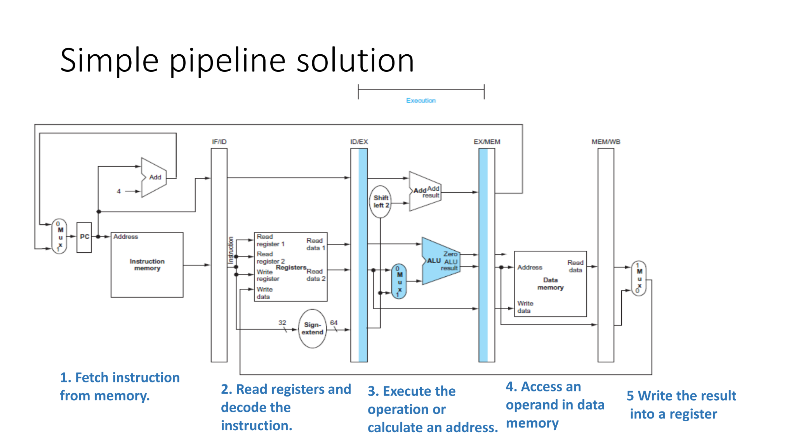
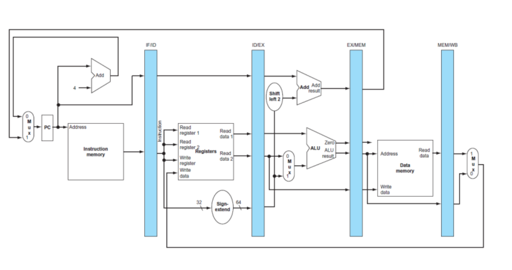
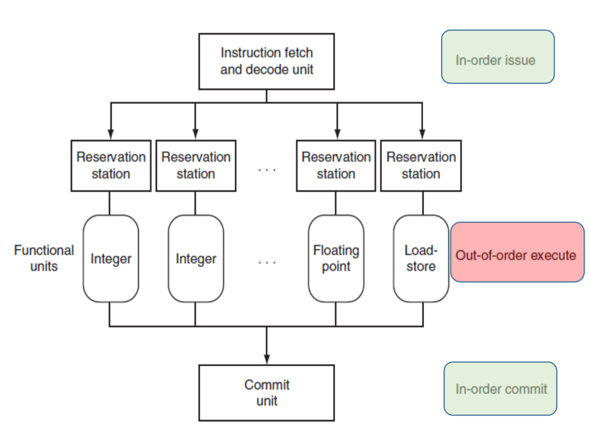
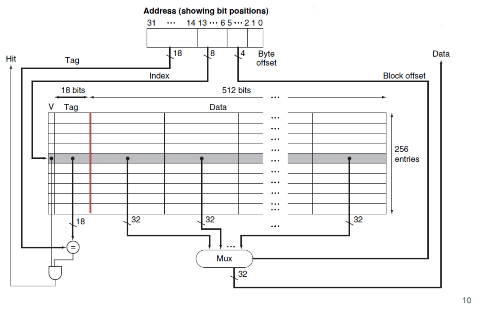

# Useful notes for Computer Architecture oral exam

Before starting:

- I'm writing these notes BEFORE the exam, using the slides the professor gave us, trying to find those arguments that are more likely to be asked during the oral exam;
- Feel free to add anything you think is useful;
- After your exam, please add any question you remember, so that we can help future students.

## Topics

### Wire delay problem - Slide "Performance part 1"

We first define what is a **clock cycle**. It is the time between two consecutive rising edges of the clock signal. The actual time is defined by different parameters, such as time-of-flight, gate delay, and setup time.


Clock delay is a phenomenon where the same clock signal arrives at different components at different times, affecting the system's operation.

A larger fraction of the clock cycle is spent on the wire delay, which is the time it takes for the signal to travel from one component to another. This is a problem because the wire delay is proportional to the distance between the components, and the distance between components is increasing. This increases the power consumption and the time it takes for the signal to travel.

### Classes of computers - Slide "Performance part 1"

- IoT devices: devices in everyday life, such as smartwatches, smart thermostats, etc, connected to internet. **The ability to run third-party applications is the line between non-embedded and embedded systems**. They offers useful data and local services to remote applications, using remote information and resources. Wide range of performances and costs. In general, we want to reach required performances with the lowest cost possible.
- Personal Mobile Devices: smartphones, tablets, etc. They have limited power consumption, due to battery life and absence of cooling systems. Key aspects are efficient use of energy, and the memory optimization.
- Desktop computers: spanning from low-cost to high-performance machines, market is driven to *price-performance ratio*. Performance evaluation is challenging, because of the large use of web applications; they also are considered the **access point to data to cloud services**
- Servers: backbone of large-scale computing. Main points are **availability**, **scalability** and **efficient troughput**. They are used for web services, data storage, etc.
- Clusters/Warehouse-scale computers: collections of desktops/servers, connected to the same network, acting together as a single computer, communicating through the network. Main cost for these systems is the **power consumption and cooling**.

### Defining a computer architecture - Slide "Performance part 1"

Functional requirements for computer architecture can be influenced by market and product competition. Specific features inspired by the market, such as the availability of software for a particular instruction set architecture, can drive the choice of functional requirements.

For each class:

- personal mobile devices require real-time performance for graphics, video, and audio, as well as energy efficiency.

- General-purpose desktops require balanced performance for a range of tasks, including interactive performance for graphics, video, and audio. 

- Servers require support for databases and transaction processing, enhancements for reliability and availability, and support for scalability. 

- Clusters/warehouse-scale computers require throughput performance for many independent tasks, error correction for memory, and energy proportionality. 

- Embedded computing often requires special support for graphics or video, power limitations and power control, and real-time constraints.

#### Software compatibility

- at programming language: more flexibility, but need new compilers and interpreters.
- object code: instruction set already defined, little flexibility but no need for investment in software.

#### OS requirements

- Size of address space: important because it may limit some applications.
- Memory management (paging, segmentation, etc);
- Protection: derives from the previous point;
- Virtualization: memory management and protection are key points;

### Flynn's Taxonomy - Slide "Performance part 1"

- **SISD**: Single Instruction, Single Data. Uni-processor systems.
- **SIMD**: Single Instruction, Multiple Data. Vector processors, GPUs.
- **MISD**: Multiple Instruction, Single Data. Is the logic behind the pipeline.
- **MIMD**: Multiple Instruction, Multiple Data. Multi-core processors, clusters.

### Parallel architectures

Different classes of parallel architectures:

- Instruction level parallelism (ILP): multiple instructions executed in parallel (pipeline and speculative execution).
- GPU: single instruction applied to a collection of data in parallel.
- Thread level parallelism (TLP): multiple threads executed in parallel.
- Request level parallelism (RLP): multiple requests executed in parallel.

Tightly coupled MIMD exploit TPL, where cooperative threads are executed in parallel. Loosely coupled MIMD exploit RLP, where independent tasks can proceed in parallel, needed only limited communication.

### Comparison between CPU and memory performance - Slide "Performance part 1"

WHile CPU performance has been increasing, memory performance has been increasing at a slower rate. Taking as reference an Intel i7 CPU, we can reach a peak bandwidth of 400 GB/s, while the memory bandwidth is 25 GB/s. This is a problem because the CPU is not able to reach its peak performance due to the memory bottleneck. This bandwidth can be reached by exploiting various techniques:

- multiporting and pipelining cache accesses;
- use multiple cache levels;
- using different caches for data and for instructions;
- implementing different caches for each core;

### Dependability - Slide "Performance part 1"

Dependability is the ability to deliver service that can justifiably be trusted. Infrastructures provides SLA (Service Level Agreement) to guarantee the service, or simply check if a system is up and running. Other software resources can be used to check the system's status:

- error detection: parity, checksums, CRCs;
- system reconfiguration: hot swapping, hot standby;
- system recovery: checkpointing, rollback, re-execution;

#### Fault tolerant system design

- **Error detection**: when a fault is present, it may leads to an incorrect operation state. There is a distance between the error and the incorrect state:
  - **temporal distance**: time between the fault and the error. If I don't use a certain component, I can't detect the error: periodic checking is needed;
  - **spatial distance**: space between the fault and the error;
- Reconfiguration and recovery: when a fault is detected, the system must be reconfigured to avoid the error. The reconfiguration can be **hot** (while the system is running) or **cold** (system is stopped). Recovery can be **rollback** (return to a previous state) or **re-execution** (re-execute the operation).

#### Reliability

- Mean time to failure (MTTF): average time between two failures.
- Mean time to repair (MTTR): average time to repair a failure.
- Mean time between failures (MTBF): average time between two failures, considering the repair time. Is the sum of MTTF and MTTR.
- Availability: ratio between the time the system is up and running and the total time. Is the fraction between MTTF and MTBF.

#### Redundancy

We can cope with failure by using redundancy. There are different types of redundancy:

- in time: redo the operation to check if the result is still erroneous;
- in resources: use multiple modules to perform the same operation;

### Measuring performance - Slide "Performance part 2"

Typical metrics to measure performance are the **throughput** and the **response time**. The throughput is the number of tasks completed per unit of time, while the response time is the time between the submission of a task and the completion of the task.

Dealing with execution time, two are the possible approaches:

- **wall clock time**: the time between the start and the end of the task, including all the system overhead;
- **CPU time**: the time the CPU is actually working on the task.

Whatever the approach, we can define the **speedup** as the ratio between the execution time of the system $X$ and the execution time of the system $Y$. When we state that a system is $n$ times faster than another, we are referring to the speedup.

#### Benchmarking

To measure the performance of a system, there are some tests that can be performed:

- **kernels**: small programs that test a specific feature of the system, such as matrix multiplication;
- **toy benchmarks**: small programs that test the system's performance in a specific task, such as sorting algorithms;
- **synthetic benchmarks**;
- **benchmark suites**: collection of benchmarks that test the system's performance in a wide range of tasks.

This approach can be affected by some biases:

- compiler can recognize the benchmark, and optimize the code in order to artificially increase the performance;
- the conditions in which the benchmark is executed can affect the performance.

To avoid this inconvenience, no code modifications should be allowed, except for the essential ones that produce the same output.

Benchmarks are prepared by organizations, such as SPEC, that provide a set of benchmarks to test the system's performance, specifically for a target systems, such as servers, desktops, IoT devices, etc.

### Deal with performance while defining a Computer Architecture - Slide "Performances part 2"

Some useful equations:

$$\text{CPU time} = \text{CPU Clock Time for a program} \times \text{Clock cycle time} = \frac{\text{CPU Clock Time for a program}}{\text{Clock rate}}$$

$$\text{CPI} = \frac{\text{CPU Clock Time for a program}}{\text{Instruction count}}$$

$$\text{CPU time} = \text{Instruction count} \times \text{Cycles per Instruction} \times \text{Clock cycle time}$$

$$\frac{\text{Instruction}}{\text{Program}} \times \frac{\text{Cycles}}{\text{Instruction}} \times \frac{\text{Seconds}}{\text{Cycle}} = \frac{\text{Seconds}}{\text{Program}} = \text{CPU Time}$$

Different instructions types have different CPIs, and the CPI is the sum of the CPIs of the different instructions types.

### Principles of Computer Design - Slide "Performance part 2"

#### Parallelism

Take advantage of **parallelism**: multiple processors, disks, pipelines, multiple functional units. It's important to **design efficient parallel solutions**. This is achieved by:

- ensuring load balancing of each component;
- minimizing communication overhead. This include both:
  - time spent in **communication**, such as data transfer, synchronization, etc;
  - time spent in **managing the parallelism**, such as scheduling, distributing tasks, etc;

#### Principle of locality

- temporal locality (if an instruction is executed, it is likely to be executed again) - spatial locality (if an instruction is executed, the next instruction is likely to be executed);

#### Amdahl's Law [Professor explicitly says that this could be an exam question]

An important think to take in consideration is **focus on the common case**: this include both **identifying the common case** and **optimizing for the common case**. Here comes in help Amdahl's Law, that states that the speedup of a system is limited by the fraction of the system that can't be parallelized. The speedup is given by the formula:

$$\text{Speedup} = \frac{\text{Execution time of the system without the enhancement}}{\text{Execution time of the system with the enhancement when possible}}$$

- **fraction enhanced** is the fraction of computation time in the original solution than can be converted to the enhanced solution;
- **speedup enhanced** is the improvement gained by the enhancement.

The last term of the formula is given by:

- execution time for a fraction of a task without the enhancement;
- execution time for the same fraction of the task with the enhancement;

Mathematically speaking:

$$(1-\text{fraction enhanced}) \times T_{\text{old}} + \frac{\text{fraction enhanced} \times T_{\text{old}}}{\text{speedup enhanced}}$$

So the formula or the speedup becomes:

$$\text{Speedup} = \frac{1}{(1-\text{fraction enhanced}) + \frac{\text{fraction enhanced}}{\text{speedup enhanced}}}$$

Look at this table as an example:

| Solution | Fraction enhanced | Computing time | I/O time | Overall time |
|----------|-------------------|----------------|---------|--------------|
| Original | ... | 7s | 3s | 10s |
| Disk | I/O speedup 3x | 7s | 1s | 8s |
| CPU 1| Computing speedup 2x | 3.5s | 3s | 6.5s |
| CPU 2| Computing speedup 3x | 2.33s | 3s | 5.33s |

- Disk: fraction enhanced is 0.3, speedup enhanced is 3, so the speedup is 1.25;
- CPU 1: fraction enhanced is 0.7, speedup enhanced is 2, so the speedup is 1.54;
- CPU 2: fraction enhanced is 0.7, speedup enhanced is 3, so the speedup is 1.87.

#### Take advantage of asynchronous operations

This aspect is fundamental in networked systems, where the time to send a message is much higher than the time to execute the operation. We should design the system in order to increase the number of asynchronous operations, covering the delay introduced by the network with other operations.

This method is also applied trough the **speculative execution**, where the system executes an operation before it is actually needed, in order to cover the time needed to execute the operation.

### The CPU, from instruction set to the architecture - Slide "CPU - part 1"

I expect that possible questions for this topic may be like "Take this instruction, and talk about which components of the CPU circuit involves", or "Explain the function of this component, and its properties"

#### Read an instruction from memory

The state elements to read an instruction from memory are the **instruction memory** and the **program counter**. Memory has to be **read-only**, because data path does not need to write on it. The program counter is a register that contains the address of the next instruction to be executed, and it's written at the end of a clock cycle, thus it doesn't need to a write control signal.

The output of the entire operation reflects, at any time, the content of the program counter, so no additional control signal is needed.

#### ALU operations

To do do ALu operations, data are needed. For this reason, a **multiported register file** is used: it contains all the registers, and it has **two read ports**, to read the two operands, and **one write port**, to write the result. It always outputs the content of a given register, so no additional control signal is needed. On the contrary, the write port is controlled by the **write control signal**: it is **edge-triggered**, so the write operation is performed at the end of the clock cycle. This unlock the possibility to read and write on the same register in the same clock cycle: read will output the old value, write will write the new value. Wires in input to the register file are:

- **5 wires** to specify the target register;
- **64 wires** to specify the value to be written, because the register files are 64-bit wide.

For what regards the ALU, it has:

- **4 wires** to specify the operation to be performed;
- **two 64-bit wires** to specify the two operands;
- **one 64-bit wire** to output the result;
- **one wire** to specify if the result is zero.

The partial CPU is shown in the following image:


#### Increment the program counter

Given the fact that instructions always have to be **aligned to 8 bytes**, an ALU is used, whose inputs are the program counter and a fixed value of 4, and the output is the address of the next instruction, which directly goes to the Program Counter.

#### Edge-triggered clocking methodology

In general, clock methodology defines when the signal can be red and written. In edge-triggered clocking, any element can be updated only on a clock transition, and they are available for operations on the next clock cycle.

Take two state elements, surrounded by combinational logic, which operated in a single clock cycle. For this very reason, all signals from element 1 to element 2 must be transmitted within a clock cycle; the maximum time needed to transmit a signal will define the length of the clock cycle.

##### D flip-flop rising edge-triggered

Master-Slave structure:

- Master is open and follows the input signal when the clock is high;
- when the clock falls, Master is closed and the slave, which is open, takes as input the output of the master.

#### Pipeline data transfer

- **Asynchronous pipeline**: data is transferred from one stage to the next one when the data is ready, using an **ACK signal** to confirm the data has been received. When a stage finishes, it asks for new data to the previous stage using an handshake protocol.
- **Synchronous pipeline**: data is transferred from one stage to the next one when the clock signal is high. Data must be stable at the clock edge, which have to consider the time of the slower stage.

Asynchronous pipelines are more flexible and faster, but they are more complex to design and to test due to need of additional logic; synchronous pipelines are easier to design and to test, but they are slower.

To implement synchronous pipelines, latches are used, with an edge-triggered methodology: in this way clock signal activates all the staging latches simultaneously. An issue with latches is that the signal may be unstable during the clock edge, so designers should implement logic to keep the output stable until the next period of latch transparency.

It's also possible to implement an asynchronous pipeline exploiting the clock: this methodology is used in industrial plants to reduce the effects of capacitative couplings and electromagnetic disturbance on the transfer.

#### Instruction: $\texttt{CBZ X1, offset}$

**C**ompare **B**ranch **Z**ero is an ARM Assembly instruction, that tests if the content of register X1 is zero, and if it is, it jumps to the instruction at the address given by the sum of the program counter and the offset. To implement the instruction, we have to compute the target address by adding the sign-extended offset to the program counter; moreover, offset field is shifted left by 2 bits, to align to a word boundary. In this way, the range of addresses that can be reached is increased by a factor of 4.

- a comparison between 0 and the content of X1 is performed by the ALU;
- target address is computed by the ALU;
- if the comparison returns true, the target address is written in the program counter.
- else, the program counter is incremented as usual.

So two main operations are performed.

#### Instruction: $\texttt{ADD X1, X2, X3}$

This instruction adds the content of register X2 and X3, and writes the result in register X1. The operation is performed by the ALU, and the result is written in the register file. Three operands are involved, two read and one write, so the existence of this operation justifies the use of a multiported register file.

#### Instruction: $\texttt{LDUR X1, [X2, offset]}$

The instruction computes a memory address, by adding the base register X2 to the 9 bit signed offset, contained in the instruction, and reads the content of the memory at that address. The content is then written in the register X1.

Modules involved in the operation are:

- the register file, to read the base register, and write the result;
- the ALU, to compute the sum,
- the memory unit, to read the content of the memory.
- sign extension unit, to extend the offset to 64 bits.

#### The main control unit


Points signed with 1, 2, and 3 underline the fact that different outputs *merged* in the same wire: in reality, a multiplexer is added in order to always select the right output for the right operation.

The main control unit is responsible for this operation: knowing which instruction is being executed, it send an appropriate signal to every multiplexer involved in the operation. The integration of its circuit is shown in the image above.


- select the right code to be passed to the ALU, to perform the right operation;
- set the write control signal to the register file,;
- set the multiplexer to correctly write into register file:
- set the multiplexer to correctly write into the program counter;
- set the signals to read and write from memory

#### Instruction format

The first principle to have in mind id **simplicity favors regularity**: the instruction format should be as simple as possible, to make the decoding process easier.

- first register operand is always in position $[9:5]$ for both R-type, load and store instructions;
- the other register operand is always in position $[20:16]$ for R-type instructions, and in position $[4:0]$ when is the destination register;
- another operand can also be a 19-bit offset, for compare and branch 0-bit, or a 9-bit offset for load and store instructions;
- destination register for R-type instructions and for loads is always in position $[4:0]$;

These information are used by the main control unit to set the multiplexers and the ALU.

#### Instruction execution

These are the phases of an instruction execution:

- fetch instruction from memory;
- decode the instruction and read registers;
- execute the instruction;
- access memory, if needed;
- write the result into a register (if necessary).

In the slides, execution of the 3 previous instructions has been described. I won't go into details because I think it' possible to describe with ease the execution of any instruction, given the information above. However, if you want more details, in particular for how the CPU circuit is involved, feel free to look at the slides.

### Why a single cycle CPU is not feasible - Slide "CPU - part 2"

Looking at the previous circuit, let's identify the longest path in the circuit, in order to determine the clock cycle.

- Store and Load executions use 5 functional unities in series (instruction memory, register file, ALU, data memory, register file);
- ADD uses 4 functional unities in series (instruction memory, register file, ALU, register file);
- CBZ also uses 4 functional unities in series (instruction memory, register file, sign extension, ALU).

Although the CPI is 1, the overall performance of a single-cycle implementation is likely to be poor, since the clock cycle is too long. This is due to the fact that the longest path in the circuit determines the clock cycle, and the clock cycle must be long enough to allow the slowest path to complete.

### Pipelining - Slide "CPU - part 2"

Pipelining is a technique used to increase the throughput of a CPU, by allowing multiple instructions to be executed in parallel. The idea is to divide the execution of an instruction into multiple stages, and to execute multiple instructions in parallel, each at a different stage.

Using a synchronous pipeline, the clock causes all output to be transferred to the next units, so since it occurs at fixed intervals, we have to consider the time needed to complete the slowest stage.

We can experimentally measure a certain speedup for the total time of execution for a group of instructions, but on the contrary, the time needed to execute a single instruction is increased, because of the fixed time needed to complete the slowest stage, which slows down the fastest stages.

The results can be seen in the following picture:



### Pipeline hazards - Slide "CPU - part 2"

- write-back stage, where the result of the operation is written in the register file, interfering with the execution of another instruction;
- the selection of the next value for Program Counter, choosing from the incremented PC and the branch address possibly calculated during the execution.

#### Structural hazards

Hardware cannot support the combination of instructions that are to be executed in the same clock cycle. Suppose we had a sigle memory, instead of two: if the pipeline had a fourth instruction, we'd see that in the same clock cycle: the first instruction is reading from memory, and the fourth is fetching another instruction. WIthout two memories, Instruction and Data memory, the pipeline could have a structural hazard.

We define structural hazard as a situation where two instructions are trying to use the same hardware resource at the same time.

#### Data hazards

Occurs when pipeline must be stalled because one step has to wait for another to complete. For example:

```assembly
ADD X1, X2, X3    #X1 is the destination register
SUB X4, X1, X5    #X1 is the source register
```

Without intervention, a **data hazard** will occur, stalling the pipeline. We'll waste three clock cycles, because the second instruction will write the result only in the fifth stage.

How to resolve this issue? **Forwarding**: we don't actually need to wait for the entire instruction to be completed, but only for the result to be written in the register file. We can forward the result directly from the ALU to the ALU, so that the second instruction can be executed in the next clock cycle. This is done by adding some multiplexers in the circuit, to select the right input for the ALU.

However, this solution cannot be applied for a **load-use hazard**, where the second instruction uses the result of the first instruction, which is a load instruction. In this case, we have to stall the pipeline, because we don't know the result of the load instruction until the fifth stage.

Another solution to resolve data hazards is to reorder the instructions, so that the second instruction is executed before the first one. As reference:

```c
a = b + e;    # ADD X3, X1, X2
c = b + f;    # STUR X3, [X4, #24]
```

We can swap the two instructions, so that the second instruction is executed before the first one. This is possible because the two instructions are independent, and the result of the second instruction is not used by the first one.

#### Control hazards and branch prediction

These hazards arise from the need to decide the next instruction to be executed, basing this choice on the result of the current instruction.

**Prediction** is the key to resolve this issue: the simple solution is to always choose the conditional branch, letting the pipeline to run at full speed; in this case, only when the branch is not taken the pipeline stalls. This is called **static prediction**.

In reality, a **dynamic prediction** is used, based on the history of the branch. Accuracy can reach 95%, and the pipeline stalls only when the prediction is wrong: when this case occurs, pipeline control must ensure that the instructions that have been executed won't affect the final result, and that the pipeline can be restarted from the correct instruction.

Deeper pipeline will have severer penalties for a wrong prediction, because the pipeline will have to be restarted from the beginning.

Strategy used: a table is built, look up at the address of the instruction, and check if exist a previous execution of the same instruction and, if so, begin fetching new instructions from the same place of the last time (typical case of a loop). If the prediction appears to be wrong, the entry in the table is updated.

### Pipeline datapath and control - Slide "CPU - part 2"

To store the partial results of the operations within the pipeline, **pipeline registers** are used:



#### $\texttt{LDUR}$ instruction


In the slides, execution with pipeline is described. It only differs from what seen before for the fact that the partial result is stored in the pipeline registers. The only thing worth to mention is the write-back stage, where the result is written in the register file: given the fact that there are no pipeline register for this final stage, the result is written in the register file only at the end of the clock cycle. How? First of all, we need to preserve the destination register used in the fetched instruction: to allow this, it is passed from the $\texttt{ID/EX}$ register to the $\texttt{MEM/WB}$ pipeline register used in the write-back stage, similar to how store passes the register value from the $\texttt{EX/MEM}$ register to the $\texttt{MEM/WB}$ register in the $\texttt{MEM}$ stage: this ensures that the correct register is updated with the loaded data during the write-back operation.

#### Recap for pipeline stages

Assume that PC is written on each clock, so no separated signal is needed; the same helds for the pipeline registers, that are written on each clock.

1. **Instruction fetch**: the control signals to read an instruction from memory and to write the Program Counter, so no special signal is needed.
2. **Instruction decode**: we need to select the correct register, so signal Reg2Loc is needed, that reads bits $[20:16]$ for R-type instructions, and $[4:0]$ for the destination register.
3. **Execution/Addres calculation**: we need to select the correct operation for the ALU, so signal ALUOp is needed.
4. **Memory access**: signals Branch, MemRead and MemWrite are needed to select the correct operation for the memory unit.
5. **Write-back**: we need two control lines: MemToReg, which decides between sending the ALU results or the memory results to the register file, and RegWrite, which decides if the result has to be written in the register file.

### Interrupts and exceptions - Slide "CPU - part 2"

We define as exception any unexpected change in control flow, without distinguishing between the cause of the interruption. Specifically, we define as **interrupt** an exception caused by an external event.

When an exception occurs, the CPU must save the address of the instruction into the Exception Link Register, and then transfers the control to the Operating system at a specific address. It performs some actions, such as services for the user,  and then it can terminate the previous program (in case of a fatal error) or resume the execution of the previous program, using the address saved in the ELR. This behavior can be determined only if the OS knows the **reason of the exception** and the address of the instruction that caused it. Two methods can be used to achieve this:

- **single entry point**, with the OS that decodes the status register to understand the reason of the exception;
- **vectored interrupts**: an index is used to refer to a table of addresses, where each address is the entry point for a specific exception.

From the pipeline point of view, an interruption is seen as a control hazard, where the branch need to be flushed, and the address of the next instruction to be executed is changed.

The circuit to manage the interruption is shown in the following image:


1. retrieve the address of the first instruction of the exception handler;
2. flush the $\texttt{ID/EX}$ section;
3. flush the $\texttt{EX/MEM}$ section;
4. write the exception information in the status register $\texttt{ESR}$ e \texttt{ELR}.

### Instruction Level Parallelism - Slide "CPU - part 2"

Recap on techniques to accelerate single core performance:

| Technique | Description | Limitation |
|-----------|-------------|------------|
|Pipelining | Divide the execution of an instruction into multiple stages | Issue rate, stalls, depth of pipeline|
|Super-pipelining | Inter-clock cycle pipelining | Clock skew, slower ALU, stalls |
| Super-Scalar | Execute multiple instructions in parallel | Hazard resolution (even with compiler) |
| VLIW/EPIC | Each instruction specifies multiple scalar operations | Packing |
| Vector | Execute the same operation on multiple data | Data dependency, data alignment, AVX extensions, GPU|

#### Static vs Dynamic issue

Static multiple issues processors partially rely on the compiler to determine the number and sequence of instructions that can be issued in a clock cycle, while dynamic multiple issues processors use the hardware to determine it at runtime. Static issue systems rely on the compiler to handle data and control hazards, while dynamic ones use hardware techniques to alleviate these hazards at execution time.

#### A design for embedded systems

Some embedded systems are able to issue two 64-bit instructions per cycle, using a specific design. To simplifying decoding and issuing, these processors restrict the layout of simultaneously issued instructions, requiring paired and 64-bit aligned instructions, with the ALU or the branch portion to appears first. If an instruction cannot be used, it is replaced with a NOP.

Static multiple-issue processors may vary in how they manage data and control hazards, relying on compiler or hardware techniques to handle these hazards. In contrast, dynamic multiple-issue processors use hardware techniques to alleviate these hazards at execution time. Hazards often force the entire issue queue to stall, which can be costly in terms of performance: this reinforce the appearance of a large single instruction with multiple operations.

#### Super-scalar processors

In the simplest super-scalar processors, the processor decides how many instructions to issue in a clock cycle, given a liste of ordered instructions. Achieving good performance also depends on the capacity of the compiler to schedule instructions to avoid hazards and dependencies between instructions. Furthermore, there is no need to recompile the code to take advantage of the multiple issue capabilities of the processor, while some VLIW processors require the code to be recompiled when moved across different processors models.

Dynamic pipeline scheduling chooses which instructions to execute next, possibly reordering them in order to avoid stalls; pipeline is divided into three major modules: instruction fetch and issue unit, multiple functional unit and a commit unit. In this way instructions are performed **asyncronously**, and in parallel. The order is guaranteed in the commit unit, exploiting the dynamic scheduling, which offers some advantages:

- don't need a specific compiled version for a specific pipeline;
- can handle those dependencies that are unknown at compile time;
- allow the processor to tolerate unpredictable events, such as cache misses, executing other instructions in the meantime.

The schema of a super-scalar processor is shown in the following image:



- the first unit retrieves the instructions **in order**, and send them to the corresponding functional unit;
- each unit has a **reservation station**, where the instruction is stored until all the operands are available. When all the operands are available, the instruction is sent to the functional unit and the result is calculated. Here the execution is **out of order**;
- the result is then sent to the commit unit, and it stays there until the instruction is committed;
- the buffer in the commit unit is called **Reorder Buffer**, and it is used to store the results of the instructions, in order to commit them in the right order.

#### Register renaming

In a super-scalar processor, the number of registers is increased, in order to avoid data hazards. This is done by renaming the registers, so that the same register can be used by multiple instructions at the same time. This is done by the **Reorder Buffer**, which stores the results of the instructions, and the **Register Alias Table**, which stores the mapping between the physical registers and the logical registers. This technique is particularly useful when the same register is used by multiple instructions at the same time, but without an actual data dependency. For example:

```assembly
ADD X1, X2, X3
ADD X4, X5, X1
```

In this case, the second instruction can be executed in parallel with the first one, because the result of the first instruction is not used by the second one. This is possible because the register X1 is renamed, and the result of the first instruction is stored in a different register.

Thus, these operations:

```assembly
OP R1, R2, R3
OP R3, R2, R4
OP R4, R3, R5
OP R2, R4, R3
OP R3, R2, R6
```

became:

```assembly
OP R1*, R2*, R3*
OP R3*, R2*, R4*
OP R4*, R3*, R5*
OP R2*, R4*, R3**
OP R3**, R2*, R6*
```

This is possible because the number of physical register is mich higher than the number of logical ones (1k vs 64); why don't we have the same number of physical and logical registers? Because the number of physical registers is limited by the number of bits used to address them: the number of bits reserved for the register address is limited and predefined, so the number of logical (also called architectural) registers is limited.

A table is used to store the mapping between the physical and the logical registers, and it is called **Register Alias Table**. This table is used to store the mapping between the physical and the logical registers, and it is used to rename the registers. The table is updated every time an instruction is committed, and the physical register is freed.

#### Speculative execution

Speculative execution is a technique used to increase the performance of a processor, by executing an instruction before it is actually needed. This is done by predicting the outcome of a branch, and executing the instructions that follow the branch before the branch is actually executed. If the prediction is correct, the processor can continue the execution without any problem; if the prediction is wrong, the processor must discard the results of the instructions that have been executed, and restart the execution from the correct instruction.

```c
if (x > 3){
  instruction_1;
  instruction_2;
} else {
  instruction_3;
  }
instruction_4;
```

The processor starts to execute instruction of both branches and, in the commit phase, looks at the result of the compare instruction to decide which branch to commit, deleting all the effects of the other branch. Note that:

- if an instruction has to raise an exception, this is not raised until the instruction is committed;
- the rollback of the wrong branch doesn't leave traces in the architecture; however, it can leave traces in the microarchitecture, such as the cache. Look at the Spectre and Meltdown vulnerabilities for more information (just named during the lesson).

### Multithreading - Slide "CPU - part 2"

A thread is like a process, with its own state and program counter, which shares the same memory space with other threads. Hardware threads permit threads to share the same resources, such as the cache, the functional units, etc, using the same physical processor. Obviously, hardware must support this feature, and the OS must be able to manage the threads: change of context between processes can cost few thousands of cycles, while the change of context between threads can be instantaneous.

#### Coarse-grained multithreading

When a costly stall occurs, such as level 2 o 3 cache miss, the processor can switch to another thread, and continue the execution of the other thread. This is called **coarse-grained multithreading**, and relieves the fact that the time to switch between threads is almost negligible compared to the occurred stall. The main limitation of the model is the start-up cost of the pipeline, which is not negligible: for this reason, the coarse-grained multithreading is used only for long stalls. To better understand the concept, look at the following image:


#### Fine-grained multithreading

In this technique, switches between threads are made after each instruction, resulting in a **interleaved execution** of multiple threads. Round-robin scheduling is used, in order to skip any thread that is stalled at that clock cycle. The main advantage of this technique is that it can hide the throughput loss due to both long and short stalls, but the main disadvantage is that it slows down the execution of a single thread, because the pipeline is shared among multiple threads. An image that shows the concept is shown below:


#### Simultaneous multithreading

This is a variation of fine-grained multithreading, that arises naturally when fine-grained multithreading is implemented on top of a multiple-issue dynamically scheduled processor. It exploits thread-level parallelism to hide long-latency events, increasing the usage of the functional components. Techniques such as register renaming, and dynamic scheduling allow multiple instructions from independent threads to be executed without regards of dependencies among them. The follow image offers a visual representation of the typical execution:


If applied in a out-of-order processor, *per-thread tables* for register renaming and separate PCs helps to avoid conflicts between threads and, at the same time, to increase the performance of the processor.

### Intel i7 architecture - Slide "CPU - part 2"

The Intel i7 architecture is a 64-bit architecture, with a 64-bit address space, and a 64-bit data path. It leverages **CISC** instructions set, so:

- variable-length instructions;
- complex semantics;
- variable execution time;
- complex addressing modes.
- numerous accesses to memory.

However, at $\mu$-architecture level, the processor is a **RISC** processor.

We'll analyze the operation needed to execute a single instruction, referring its actual architecture.


#### Instruction fetch

Process uses a complex **multilevel branch predictor**, to achieve balance between speed and prediction accuracy(a wrong prediction causes a penalty of 17 cycles ), and a return address stack to speedup functions return. The unit is able to fetch 16 bytes from the instruction cache.

#### Instruction decode

The fetched 16 bytes are placed in the **predecoded instruction buffer**. These can be fused into a single instruction under certain condition, such as compare and branch, but they're able to speedup performance up to 10%. In every other case, instructions are splitted into individual x86 instructions, and placed in the **instruction queue**.

#### $\mu$-operation decode

The x86 instructions placed in the queue are translated into $\mu$-operations: they are simple RISC-V instructions, executable directly by the pipeline. The i7 has three simple decoders, and a complex decoder for those instructions that are translated into the equivalent sequence. Once translated, the $\mu$-operations are placed in 64-entries **$\mu$-operation buffer**.

#### Loop stream detector

A **loop stream detector** is used to detect loops, directly issuing the $\mu$-operations from the buffer, avoiding the use of the instruction fetch and decoder. Microfusion combines instructions and send them into the same reservation station, increasing the usage of the buffer. Note that these fusions produce smaller gains when dealing with integer operations, and larger gains when dealing with floating point operations.

#### Basic instruction issue

The process is similar to the one seen in the previous sections; up to four $\mu$-operations can be issued in a single clock cycle, and they are sent to the first Reorder Buffer available.

#### Reservation stations

The processor uses a centralized reservation station, shared by six functional units, thus up to six $\mu$-operations can be issued in a single clock cycle. The reservation station is used to store the $\mu$-operations until all the operands are available, and then they are sent to the functional units.

#### $\mu$-operation execution

Operations are executed by the single function units, and the results are sent back to any waiting reservation station, where they'll update the register as soon as the instruction is no longer speculative. At that time, the entry corresponding to the instruction in the Reorder Buffer is marked as completed.

#### Commit

When instructions are marked as completed:

- pending writes in the register retirement unit are executed;
- the entry in the Reorder Buffer is removed.

### ARM Cortex-A53 architecture - Slide "CPU - part 2"

The ARM Cortex-A53 is a 64-bit processor, with a 64-bit address space, and a 64-bit data path, using a RISC instruction set. The schema of the CPU is the following:


#### Instruction fetch phase

The **AGU** (Address Generation Unit) is used to calculate the address of the next instruction, exploiting Hybrid Predictor, Indirect predictor, and Return Stack Predictor in order to keep the instruction queue as full as possible. The instruction cache is 32KB, and it can fetch 64 bytes per cycle, which as 13 entries. The first three Fetch stages fetch intructions, while the fourth stage included an address generator that produces the next PC either by incrementing the last PC, or from one of the predictors.

Target cache is checked during the first cycle: if it hits, then the next two instructions are fetched from the target cache,, executing the branch without delays.

#### Decode phase

D1 and D2 are for the basic decoding, while the D3 is used for complex ones, and it's overlapped with the first stage of execution pipeline.
After ISS, the Ex1, Ex2 and WB stages completed the integer pipeline.
The floating-point pipeline is 5 cycle deep, that sums up to the 5 cycles for fetch and decode, resulting in a 10-cycle latency for floating-point operations.

Decode stages determine if there are dependencies between instruction, forcing a sequential execution in that case. 

#### Execution phase

The execution section occupies three pipeline stages, providing one pipeline for instruction load, one for store, two for ALU operations, and separate pipelines for integer multiplication and division. The floating-point and SIMD operations add two more stages to the pipeline, and also a pipeline for domain-specific operations (square root, etc).

#### Power saving instructions

- **WFI** (Wait For Interrupt) instruction stops the processor until an interrupt is received;
- **WFE** (Wait For Event) instruction stops the processor until an event is received;
- **SEV** (Send Event) instruction sends an event to another processor.

### JTAG - Slide "CPU - part 2"

Device used during the debugging phase of a microprocessor, when there is no OS running. It takes out bit streams from the registers in a predefined order, and at the same time it inserts bit streams in the desired registers, such as new address in the PC, new data in the registers, etc.

### Introduction - Slide "Cache - part 1"

The cache is a small, fast memory, used to store the most frequently used data, in order to reduce the time needed to access the main memory. The cache is divided into **cache lines**, which are the smallest unit of data that can be stored in the cache. The cache is divided into **cache sets**, which are groups of cache lines, and each cache set is divided into **ways**, which are the number of cache lines that can be stored in the same set.

#### Principles of locality

- **Temporal locality**: if a data is accessed, it is likely to be accessed again in the near future. Keeping most recently accessed data near the processor can reduce the time needed to access the data.
- **Spatial locality**: if a data is accessed, it is likely that nearby data will be accessed soon. Moving data from the main memory closer to the processor can reduce the time needed to access the data.

#### Terminology

- **block**, or **line**: the smallest unit of data that can be stored in the cache;
- **hit rate**: the fraction of memory accesses founds in the cache;
- **miss rate**: the fraction of memory accesses not found in the cache. Also calculated as $1 - \text{hit rate}$;
- **miss penalty**: the time needed to fetch a block from the main memory;

#### Mapping

How do we know if a certain data is in the cache? There are different ways to map the data in the cache:

- **direct-mapped cache**: we use the block address, doing a modulo operation with the number of blocks in cache. Being it a power of 2, we can use the last bits of the address to determine the block in the cache. We also add a **tag** to the block, which contains the address of the block in the main memory. The tag is compared with the tag of the block in the cache, to see if the data is in the cache;
- **fully associative cache**: allows a flexible mapping of the data in the cache, because the block can be placed in any position in the cache. More expensive, because it requires a comparison of the tag with all the tags in the cache;
- **set-associative cache**: a compromise between the two previous methods, where the cache is divided into sets, and the block can be placed in any position in the set. Only need of $n$ comparators, where $n$ is the number of ways, being less expensive than the fully associative cache.

#### How to find the data in the cache

For what regards the direct-mapped and the set-associative cache, an index is used: it can be calculated from the memory address of the data and, once accessed in cache, the tag is checked to see if the data is in the cache. If the tag matches, the data is in the cache, and the data is read from the cache. The validity bit is also checked, to see if the data is valid. Time to check the cache is called **hit time**.

#### Miss rate vs Cache size

We observe that the miss rate goes up if the block size becomes a significant fraction of the cache size, because the number of blocks that can be held in the same cache size is smaller.

Bigger block size: more spatial locality, but if increased too much until having few blocks in the cache, temporal locality is lost; furthermore, the miss penalty is higher because the block is bigger, and more time is needed to fetch it from the main memory;

#### Types of cache misses

- **Compulsory miss**: also known as **cold start miss**, occurs when the data is accessed for the first time, and it is not in the cache. It is not possible to avoid this kind of miss, because the data has to be fetched from the main memory. A solution to limit the impact of this kind of miss could be to have a bigger block size, to exploit spatial locality, taking in mind that the miss penalty will be higher and the higher block size could lead to a higher miss rate.
- **Capacity miss**: occurs when the cache is full, and the data has to be replaced by another data. This kind of miss can be reduced by increasing the size of the cache, but remember the fact that bigger caches have higher access time, because of the higher **hit time**, which is the time needed to check if the data is in the cache.
- **Conflict miss**: occurs when multiple memory locations are mapped in the same cache location. This is what happens: the index of the memory location within the cache is computed, and the set is accessed. Then, the validity bit and the address tag are checked. If the validity bit is set, but the tag doesn't match, a conflict miss occurs. This kind of miss can be reduced by increasing the number of ways, or by using a fully associative cache.

### Cache - part 2 - Slide "Cache - part 2"

#### Replacement policies

When a block has to be replaced, a replacement policy is used to determine which block has to be replaced. The most common replacement policies are:

- **random replacement**: the block to be replaced is chosen randomly;
- **least recently used (LRU)**: the block that has been accessed the least recently is replaced. This is the optimal replacement policy, but it is also the most expensive, because it requires a counter for each block, to keep track of the last access time. The counter is updated every time the block is accessed, and the block with the lowest counter is replaced;
- **first-in first-out (FIFO)**: the block that has been in the cache the longest is replaced. This policy is less expensive than the LRU policy, because it requires only a counter for each set, to keep track of the order in which the blocks have been placed in the cache. The counter is updated every time a block is placed in the cache, and the block with the highest counter is replaced.

#### Write policies

When a write operation is performed, the cache policy decides how to handle the write operation:

- **write-through**: the data is written both in the cache and in the main memory. This policy is simple, but it is also slow, because the write on memory is itself slow. To speed up the write operation, a **write buffer** can be used, to store the data that has to be written in the main memory. The data is written in the buffer, and then it is written in the main memory. The write buffer is used to speed up the write operation, because the write operation is considered completed as soon as the data is written in the buffer. The write buffer is also used to store the data that has to be written in the cache, in case of a write miss.
- **write-back**: the data is written only in the cache, and the main memory is updated only when the block is replaced. This policy is faster than the write-through policy, but it is also more complex, because the main memory has to be updated only when the block is replaced. To keep track of the blocks that have been modified, a **dirty bit** is used. The dirty bit is set when the block is modified, and it is cleared when the block is written in the main memory. The dirty bit is used to avoid writing the block in the main memory if the block has not been modified. If the cache line is about to be read, the dirty bit is checked: if it is set, the block is written in the main memory, and then the data is read from the main memory. If the dirty bit is not set, the data is read directly from the cache.

What happens in case of write miss? Two possibilities:

- **write-allocate**: the block is read from the main memory, and then the data is written in the cache. This policy is used in combination with the write-back policy, because the block has to be read from the main memory to be written in the cache. The write-allocate policy is used to avoid writing the block in the main memory if the block has not been modified.
- **write-no-allocate**: the data is written only in the main memory, and the block is not read from the main memory. This policy is used in combination with the write-through policy, because the data is written directly in the main memory, and the block is not read from the main memory.

#### Load policies

When a load operation is performed, the cache policy decides how to handle the load operation:

- **blocking**: the requested word is only sent to the processor when the entire block is in the cache. This policy is simpler to be implemented, and follows the principle of spatial locality;
- **non-blocking**: the requested word is sent to the processor as soon as it is read from the main memory. This policy has more impact in caches where the block loading implies several memory accesses.

Speaking of **non-blocking** policy, we can have two different implementations:

- **early restart**: words are fetched in order, and the processor has to wait until the requested word is in tha cache. Example: if the requested word is the third word in the block, the processor wait for the load of three words;
- **critical word first**: the requested word is fetched first, and the other words are fetched, sequentially, in background. This policy is more complex, but it is also faster, because the processor doesn't have to wait for the entire block to be in the cache.

#### Cache performances

Let's assume that cache hit costs are included as part of the normal CPU execution cycle, then we can write:

$$\text{CPU time} = \text{IC} \times \text{CPI} \times \text{CC}$$

where:

$$ \text{CPI} = \text{CPI}_{\text{ideal}} + \text{Memory-stall cycles}$$

Specifically for write-through cache, held the following:

$$\text{Memory-stall cycles} = \text{access/program} \times \text{miss rate} \times \text{miss penalty}$$

Note the impact of hit time in performances: defining **AMAT** as the average time needed to access the memory, we have:

$$ \text{AMAT} = \text{hit time} + \text{miss rate} \times \text{miss penalty}$$

This means that the higher the CPU performances, the higher the influence of the hit time on the metric evaluation. Following the same idea, if we increase the clock rate, the memory stall time will account for more CPU cycle, being it (almost) constant.

In conclusion, **we cannot neglect the cache behavior when we're evaluating system performances**.

#### Cache levels

Multiple levels of cache have been defined, driven by the fact that the nearest the cache is to the processor, the faster it is, but also the smaller it is. Now technology allows to have bigger L1 caches, but the principle is still valid. However, design considerations are different for each level:

- **L1** is , has we just told, attached to the processor, and it's the fastest cache. Its will is to minimize the hit time, thus its dimension is kept *smaller*, compared to the other levels;
- **L2** is bigger, and focuses on serve the L1 cache when a miss occurs. To reduce the time penalty to access memory, it is larger than L1, with bigger blocks, and an high level of associativity

In modern CPUs, out-of-order execution is performed during a cache miss, such as a pending load/store operation; however, this behavior is strongly related to thee program data flow, which is hard to predict, so we can't measure precisely the impact of a cache miss on the CPU performances.

#### Victim cache

When the necessity to replace a block arises, instead of completely removing it from the cache, it is moved to a **victim buffer**, so rather than stalling on a subsequential cache miss, contents of the buffer are checked first, to see if the requested data is there, in order to reduce the miss penalty. Some details about this buffer:

- is even smaller than a L1 cache, having 4 to 16 positions;
- it's fully associative;
- particularly efficient for small direct-mapped caches, showing more than 25% of reduction in miss rate, for a 4kB cache.

#### Improving cache performances

##### Misses

Misses depends on the memory access patterns, so from this point of view, the cache is a passive element. To improve performances, **code must be optimized**: this includes both an improvement on the behavior of the algorithm, and compiler optimizations for the memory access patterns

##### Reduce hit time

An influent factor is the behavior of write operations:

- **no write-allocate**: we avoid the hit time, but we have to write directly in the main memory. This because the policy obliges to write in memory in any case, so we can avoid the hit time since it's not required to do any operation in the cache;
- **write-allocate**: to avoid a waste of cycles, first to check for the hit, and then for write, a **delayed write buffer** is used by the pipeline to write in the cache.

Furthermore, the hit time can be improved by using smaller cache (which is the case of L1 caches), implemented with smaller blocks.

##### Reduce miss rate

The miss rate can be reduced by increasing the associativity of the cache, so more flexibility is given to the cache to store the data. Using bigger caches, with larger blocks, can also reduce the miss rate, because the spatial locality is exploited, as we can see in the implementation of the L2 cache. We can also combine these hints with the usage of a victim cache, to reduce the miss rate.

##### Reduce miss penalty

The miss penalty can be reduced by using smaller block, because the smaller the block the smaller the data to be fetched from the main memory; a write buffer can also be used, to hold dirty blocks being replaced, diminishing the time needed to read because it doesn't have to wait for the write operation to be completed. Obviously, the write buffer is also used when a read miss occurs: if we're *lucky*, the data is already in the buffer, so we can avoid the miss penalty; if instead the data is not in the buffer, no extra time is wasted, because the data is read from the main memory. We can also consider to use a **fetch critical word first** policy for those larger blocks, to reduce the miss penalty.

Other elements external to the cache can also influence the miss penalty, such as the bus width, the memory speed, and the memory controller, so we can consider to improve these elements to reduce the miss penalty.

### Cache - part 3 - Slide "Cache - part 3"

#### Direct access cache

A direct access cache is implemented using this schema:



This cache has a size of $2^{14}$ bytes, so $16$KBytes, with a block size of $2^6$ bytes and a word size of $4$ bytes. Using these data, we can compute the number of pages, which is $\frac{2^{32}}{2^{14}} = 2^{18}$, from which also derives the width of the tag field, and the number of blocks in the cache, which is $2^{14} / 2^6 = 2^8$.
Here some insights about the cache circuit:

- the tag filed in cache is compared with the bit $[31:14]$ of the address, to see if the data is in the cache, and the result is ANDed with the valid bit to return hit or miss;
- to decide which index to read, the bits $[13:6]$ of the address are used to select the row in the cache;
- all the data fields of the selected row go into a 16-to-1 multiplexer, which is controlled by block offset, that can be found in the bits $[5:2]$ of the address;

This cache implementation uses a separated larger memory for data, and a smaller one for the tags, with block offset supplying the extra address bits for the large data memory.

The hit/miss bit is sent to the write controller, that also receive the R/W signal.

#### Set-associative cache

A set-associative cache is a direct-mapped cache with multiple ways, so each *row* contains multiple blocks. A 4-way set-associative cache is implemented using this schema:


The address size is $64$ bits, with a cache size of $32$KBytes, a block size of $32$ bytes and a word sizeof $8$ bytes. From these information, we can compute the size of each way, which is $\frac{\text{cache size}}{\text{number of ways}} = 8$KBytes, and the number of blocks in each way, which is $\frac{\text{way size}}{\text{block size}} = 256$. The number of pages is $\frac{\text{size of memory}}{size of each way}$, so it's $\frac{2^{64}}{2^{13}} = 2^{51}$.

- what seen in the previous cache is repeated here, with the difference that the hit signal is the result of the OR of the hit signals of each way;
- the multiplexer is a 4-to-1, controlled by hit/miss signal of each way, and the data is sent to the processor.

### Cache effects - Slide "Cache - part 3"

#### Unbalanced distribution of misses 