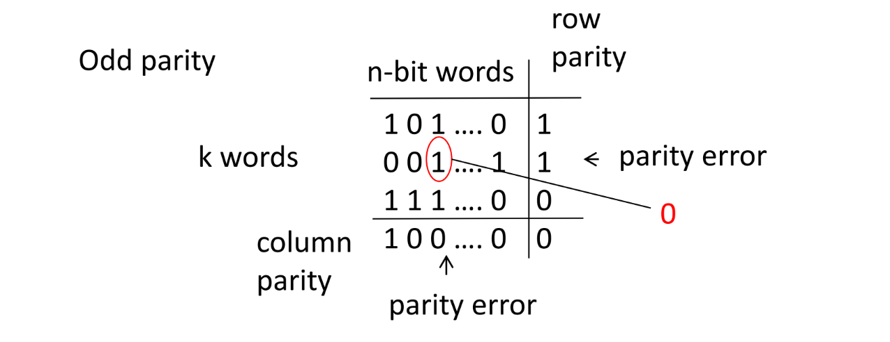
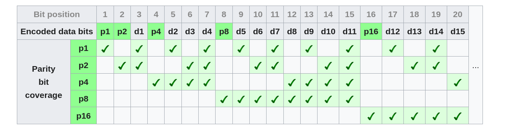

# Introduction

## Outline of the course

1.  Dependability
    -   Building high reliable computer-based systems
    -   Quantitative evaluation of dependability
    -   Threat modeling and risk assessment
    -   Malware analysis
    -   Cybersecurity engineering
2.  Formal methods for security
    -   Formal methods applied to security
    -   Case studies: Data confidentiality, Security protocols,
        Cyber-physical systems security

## Computer-based systems

Computer-based systems are everywhere, and the services they offer are
very diverses. From that, we can easy understand why the
**dependability**, which is the ability of the system to deliver the
expected service, is a critical aspect of these systems, in particular
in a security point of view.

A system should (or must) be able to deliver the expected service, even
in the presence of faults, errors, and **attacks**. This is the main
goal of dependability, which is as important as the functionality of the
system, pheraps even more. TO achieve that, we have **Formal Methods**
that provide to us a set of techniques and tools to design, verify, and
validate computer-based systems, in a rigorous and systematic way, even
in presence of faults and attacks.

# Basic concepts and terminology

All the concept and the terminology that will be presented in this
section derives directly from the paper "Basic Concepts and Taxonomy of
Dependable and Secure Computing" by Avizienis et al. (2004). This paper
is a fundamental reference in the field of dependability and security
and it is the basis for the definition of the concepts and terminology
that will be used in the entire course, as suggested by the professor.

## Dependability

We can give to **dependability** a simple definition: given a system,
which is designed to provide a certain service, the dependability is the
ability of that system to deliver the specified service also in presence
of faults and malfunctions. In other words *dependability is that
property of a computer-based system such that reliance can justifiably
be placed on the service it delivers*. Note that the latter definition
stresses the need for a justified reliance on the service, which is a
key aspect of dependability.

### Computer-based systems

A computer-based system is a system that includes a certain number of
components: each of them can be interconnected and have its own
functionality. The components can be hardware, software, humans and the
environment in which the system operates.

{width="500px"}

### Faults and Failures

We call a **failure** the inability of the system to deliver the
expected service, and a **fault** the cause of that failure.

**Example:** if a cash machine delivers the wrong amount of money, we
can say that the system has failed.

A fault causes an **error** in the state of the system, which lead to a
**failure**. A failure can have different nature, such as physical,
logical, human error or even as consequence of an attack.

**Example: Logic Bomb.** It's a piece of code that is inserted into a
software system that will execute a malicious function when specified
conditions are met.

``` c
legitimate_code();
if (date == "01/01/2020") {
    crash_system();
}
legitimate_code();
```

Computer Faults vs. Other Equipment Faults Computer faults differ from
those of other equipment in several ways:

-   **Subtler Failures**: computer failures are more subtle than
    outright crashes or sudden stops.
-   **Information Storage**: computers store information in various
    ways, leading to a multitude of possible errors, both internally and
    externally.
-   **Hidden Small Defects, Big Effects**: even small hidden defects can
    have significant impacts, especially in digital systems.
-   **Complex Hierarchies**: computer systems are intricate hierarchies
    built upon hidden components.

### Achieving Dependability

The dependability of a system can be achieved going trough a rigorous
and engineered steps. Two main figures are involved, system and software
engineers:

-   **System engineers** are responsible for the design of the system,
    and they have to use analysis to model the dependability of the
    their design. From these, the software specifications are derived,
    and the possible changes to the system are evaluated, in order to
    accomodate software limitations;
-   **Software engineers** are responsible for the implementation of the
    software, and they have to use the specifications to develop the
    software, and to test it in order to verify that it meets the
    requirements.

In general, it's crucial to understand that **dependability is not
something that can be added to a system as an afterthought**. It must be
considered from the very beginning of the design process, and it must be
an integral part of the system, wusing a scientific and engineering
approach.

## The *system* entity

A simple but effective definition of a system is the following: a system
is a entity that interacts with the environment and other systems; its
boundaries are the common frontier between the system and the
environment.

### System's properties

A system has a **function**, which is the service that it provides to
the environment, and it's described by its own functional specification.
It also has a **behavior**, visualized as the sequence of states that
the system goes through during its operation, and it's how the system
implements its function. Then there is the **structure**, which is the
way the system is organized, and it's described by its own structural
specification.

From the user point of view, the system has a **delivered service**,
which is the result of the interaction between the user and the system,
that is the behavior of the system as perceived by the user. Obviously,
the user can be seen as another system that interacts with the system
under consideration.

### System's requirements

First of all, we need to define the problem that the system has to
solve, and then we have to define the requirements that the system has
to meet, and then we have to define both functional and dependability
requirements. Pay attention to the difference between the system's
function and the system's specification: the former is the service that
the system provides, while the latter is the solution implemented to
provide that service. In the end, we define the **correctness** of the
system, which is the ability of the system to deliver the specified
service.

## Dependability tree

Take in consideration the following dependability tree:

{width="500px"}

### Threats to dependability

As we said before, a **correct service** is delivered if the service is
delivered in accordance with the system's specification. When this
doesn't happen, we have a **service failure**, which is one the possible
states of the system:

{width="500px"}

We call **service outage** the period during which the system is not
able to deliver the service, a **service degradation** the period during
which the system delivers a service that is not in accordance with the
specification, such as a subset of the services. We also recall the
**chain of threats** to dependability: **faults** causes **errors**,
which lead to **failures**: note that many errors don't cause failures
because they don't reach the external state of the system.

Faults can be **dormant**, that is they are present in the system but
they don't cause errors, and **active**, that is they cause errors, and
thay can be **external** or **internal**: from the latter we can extract
the definition of **vulnerability**, which is the property of the system
that allows an external agent to cause a fault.

**Example: Trapdoor.** It's a hidden entry within a system that allows
an attacker to bypass security measures.

``` c
username = read_username();
password = read_password();
if (username == 'dummy_user'){
    //note that the password is not checked
    grant_access();
}
if (username.isValid() && password.isValid()){
    grant_access();
}
```

From the past example we can learn that, having in mind the
dependability tree, to achieve security only the authorized actions have
to be allowed, and the confidentiality and the integrity of the data
have appears in case of improper or unauthorized actions.

### Dependability attributes

The dependability of a system can be described by a set of attributes,
measurable and quantifiable in terms of probabilities:

-   **Availability**: the readiness for correct service;
-   **Reliability**: the continuity of correct service;
-   **Safety**: the absence of catastrophic consequences on the user and
    the environment;
-   **Confidentiality**: the absence of unauthorized disclosure of
    information;
-   **Integrity**: the absence of improper system state alterations;
-   **Maintainability**: the ability to undergo modifications and
    repairs.

We also briefly present the concept of **trust** between systems, that
express the dependance of dependability of the system A from the
dependability of the system B.

From them, we can gave a new definition of dependability, based on the
frequency of the service failures:

> Dependability is the ability of the system to deliver the service in
> accordance with the specification, avoiding that service failures
> occur with a frequency that is greater than a certain threshold.

The threshold should be derived from the system requirements, and should
consider frequency, duration and severity of the service failures.

## Taxonomy of faults

### The system life cycle

We define the **system life cycle** as the period of time that starts
from the conception of the system and continues until the system is
decommissioned. We're going to consider only two phases of the system
life cycle: the **development phase**, during which the system is
designed and implemented, and the **use phase**, during which the system
is used to deliver the service.

#### Development phase

In this phase the system only interact with the **development
environment**, such as physical world, human developers, their tools and
possible facilities: in this phase development faults can be introduced
in the system.

#### Use phase

In this phase the system interacts with the **use environment**:

-   **Physical environment**: the system is subject to physical stress,
    such as temperature, humidity, vibrations, etc;
-   **administrator**: who manages the system;
-   **users**: who interact with the system;
-   **providers**: who delivers the system to the users;
-   **infrastructure**: everything that is needed to support the system;
-   **intruders**: who try to attack the system.

The use phase alternates period of **correct delivery** of the service,
**service outage** and **service shutdown**:

-   **service outage**: when the system has a service failure, and it's
    not able to deliver the service correctly;
-   **service shutdown**: when the system is stopped for maintenance or
    for other reasons. Note that maintenance may take place during every
    period of time, and includes both repair and modification.

In fact, there is a taxonomy for the maintenance: if the system is
stopped for repair an active fault, then we have a **corrective
maintenance**; if the system is stopped for repair a dormant fault, then
we have a **preventive maintenance**; if the system is stopped for
modification, then we have an **adaptive maintenance**, or
**augmentative maintenance** if the system is stopped for improvement.

\$`\newpage `{=tex}\$

### Faults classification

Given the fact that faults can't be enumerated, it's useful to classify
them in order to understand their nature and their effects, because we
can also identify the mechanisms that can be used to prevent that
specific class of faults.

{width="400px"}

We identifies three main classes of faults:

-   **development faults**: faults that are introduced during the
    development phase;
-   **physical faults**: faults that affect the physical components of
    the system;
-   **interaction faults**: faults that includes all the external
    faults.

Overlapping classes are possible, so we're able to identify 31 possible
combinations of faults.

{width="400px"}

We're going to analyze the most important classes of faults, having in
mind the previous figure.

#### Natural faults

They're the faults numbered from $11$ to $15$ in the previous figure,
and they're are mainly hardware faults caused by natural phenomena,
without the intervention of humans.

-   **Production defect**, $11$: a fault that is introduced during the
    development;
-   **internal defect**, $12 \text{ and } 13$: a fault that is
    introduced during the use phase, and it's caused by the physical
    degradation of the components;
-   **external defect**, $14 \text{ and } 15$: a fault that is
    introduced during the use phase, and it's caused by the physical
    stress of the environment, outside the system boundaries.

#### Human-made faults

We can distinguish between **malicious faults**, introduced with the
intent to harm the system, and **non-malicious faults**, introduced
without any malicious intent.

The formers have as a goal to harm the system, the latter are divided in
two more classes:

-   **non-deliberate faults**: faults that are introduced as human
    errors
    ($1 \text{, } 2 \text{, } 7 \text{, } 8 \text{, } 16 \text{-}18 \text{, } 26\text{-}28$);
-   **deliberate faults**: faults that are introduced as a consequence
    of a deliberate action, such as a bad decision
    ($3 \text{, } 4 \text{, } 9 \text{, } 10 \text{, } 19 \text{-}21 \text{, } 29\text{-}31$).

The latter can be introduced during **development** or by
**interaction**:

-   **deliberate development faults**: are generally the result of a
    trade-off, both in terms of performance and economy
    ($3 \text{, } 4 \text{, } 9 \text{, } 10$);
-   **deliberate interaction faults**: when operational procedures are
    deliberately violated ($19 \text{-}21 \text{, } 29\text{-}31$).

In general, **deliberate faults** shows up only after an unacceptable
behavior of the system, and it can be difficult to realize the actual
faults because, when it happened, who introduced the fault can be not
conscious of the consequences of his action.

However, not all mistakes and dab decisions by non-malicious humans are
accidental: we can distinguish between **accidental faults** and
**incompetence faults**.

#### Interaction faults

They can also be named as **operational faults**, given the fact that
they occour during the use phase, and they're all external, because
they're caused by the interaction between the system and the
environment. Classes from $16$ to $31$ are human made, and only $14$ and
$15$ are natural.

A common feature of these faults is the fact that they usually need the
presence of a vulnerability in the system, that is a property of the
system that allows an external agent to cause a fault, both intentional
and unintentional.

Lastly, we recognize the **permanent faults**, that are continuous and
stable, and the **transient faults**, that are temporary, even for very
short periods of time.

## Failures

In order to characterize the failures, we use four different dimensions,
such that each of them can describe a different aspect of the failure.

### Failure domain

This point of view leads us to distinguish between **content failures**,
that are the result of the system's inability to deliver the correct
service, and **timing failures**, that are the result of the system's
inability to deliver the correct service at the correct time (early,
late, or never).

### Consistency domain

When a system has more than one user, it's important to understand if a
failure shows up identically for each user, and we call this situation
**consistent failure**, or if the failure shows up differently for each
user, and we call this situation **inconsistent failure**.

### Detectability domain

It's the property of the system to check the correctness of the service,
and it's the ability of the system to detect the failure. These
mechanisms have two failure modes:

-   **false alarm**: the system detects a failure when there isn't;
-   **missed detection**: the system doesn't detect a failure when there
    is.

### Consequences domain

Consequences of a failure are divided in two classes, based on their
severity and impact:

-   **minor failure**: the failure has a similar cost to the benefit of
    the service;
-   **catastrophic failure**: the failure has a cost that is much
    greater than the benefit of the service.

### Criteria to evaluate the severity of a failure

We can use the following criteria to evaluate the severity of a failure:

-   **availability**: the duration of the service outage;
-   **safety**: possible loss of life or injury;
-   **confidentiality**: possible unauthorized disclosure of
    information;
-   **integrity**: data corruption and/or inability to recover;

### System failures

When a system has a failure, it is usually caused by different
coexisting faults; we talk about **single fails** if the failure is
caused by a single fault, and **multiple fails** if the failure is
caused by multiple faults. In the latter we can also divide the faults
in **independent** and **dependent**, respectively if the faults are not
related to each other, and if the faults have a common cause.

### Dependability and security failures

These failures occurs if the system suffers service failures more
frequently than an acceptable threshold; even the specifications of the
system can contain faults:

-   **omission**: a requirement is not included in the specification;
-   **unjustified requirements**: choice of requirements that are not
    justified by the system's function, that raises the cost of the
    system.

Systems can have different type of failures:

-   **fail-controlled**: the system is designed to fail in a controlled
    way, described by the system's specification;
-   **fail-stopped**: the system in which possible failures are only
    *haltings*;
-   **fail-silent**: the system in which possible failures are only
    *silents*;
-   **fail-safe**: the system in which there are only minor failures;

## Errors

As we saw, an error is a part of the system state that is able to lead
to a failure. An error is detected if a signal to indicate its presence
in raised, otherwise the error is undetected and it's called **latent
error**. It's not true that every error leads to a failure, and this
depends on:

-   the **structure of the system**, specially the presence of
    redundancy;
-   the **behavior of the system**, for example the part of the state
    that contains the error is never reached during the delivery of the
    service, then the error is not able to lead to a failure.

The classification of the error is done according to the damage pattern
(single, double or triple bit, burst, etc.), and how many components are
affected by the error (single, multiple, etc.).

## Chain of threats - Relationship between faults, errors and failures

When systems have to interact with each other, an error propagation can
occur:

{width="400px"}

An **active fault** is when it leads to an error, both if it's internal
or external, and it can lead to a failure, and a **fault activation**
occurs when a particular input activates a dormant fault in a specific
component. This can also be a **propagation** between the components,
where an error of a component can lead to an error of another component.

**Example**: error propagation

> Take a sensor which reports the spinning speed of a turbine. If the
> sensor fails and starts to report that the turbine is no longer
> spinning, it inject incorrect data (fault) into the control system,
> that will send to the turbine the wrong commands, and the turbine
> could be damaged (failure).

## Dependability means

When we talk about dependability means, we refer to the mechanisms that
are used to prevent, detect and tolerate, or in general deal, with
faults.

### Fault prevention

These techniques are usually related to general system design, and
they're used to avoid the introduction of faults in the system. They can
be divided in two classes:

-   **development fault prevention**: techniques that are used to avoid
    the introduction of faults during the development phase;
-   **improved development process**: techniques that are used to
    improve the development process, such as the use of formal methods,
    the use of a rigorous testing and so on.

### Fault tolerance

It's the ability to deal with faults at run-time, and ensure that the
system is able to deliver the service even in presence of faults. There
are a lot of techniques that can be used to achieve fault tolerance, as
we can see in the following figure:

{width="400px"}

#### Example of error detection

For simplicity, let's state that *when the error reaches the boundaries
of the systems, then we have a failure*. In this context, the most
challenging aspect are:

-   the **identification of the error**, that is the ability to detect
    the presence of the error;
-   **ensure that status containing the error is never reached**, that
    is the ability to avoid that the error leads to a failure;
-   the **prevention of the error propagation**, that is the ability to
    avoid that the error of a component leads to the error of another
    component.

**Example**: error detection with two systems

> Take two systems, A and B, that should provide the same service. If
> they get the same input, then they should provide the same output. If
> the outputs are different, then we have a detection of the error,
> within the hypothesis that the systems are independent and it's very
> unlikely that they have the same error at the same time.

### Fault handling

When we talk about fault handling, we refer to the mechanisms that
**prevents faults from being activated again**. It's composed by
different phases:

1.  **diagnois**: the phase in which the system detects the presence of
    the fault. Usually, a component is made in order to test another
    components, and the aim is to identify and records the cause of the
    error, in terms of location and type;
2.  **isolation**: to obtain the physical and/or logical exclusion of
    the faulty component from the rest of the system;
3.  **reconfiguration**, such as thw switch to a redundant component, or
    the use of a different path to reach the same component;
4.  **reinitialization**: to restore the system to update the system to
    the new configuration.

In conclusion we state that the **system recover is composed by the
error handling phase and the fault handling phase**.

### Fault removal

The fault removal is the process that is used to remove the faults from
the system, and it's usually done during the development phase. The main
goal is to remove the faults that are present in the system, and to
prevent the introduction of new faults. It's composed by different
phases, that we'll see in the next sections:

#### Verification phase

The verification phase is the phase in which the system is tested to
verify that it meets the **verification conditions**. To do that, there
are two main methods:

-   verification **without execution**: the system is tested without
    executing it, and it's usually done via inspection or
    theory-proving. A state-transition diagram can be used to verify the
    correctness of the system, and it's applicable to various type of
    the system, and applicable to fault tolerance mechanisms. Worth to
    mention the fact that, in this type of verification errors and
    faults are artificially injected as part of the test pattern;
-   verification **by execution**: the system is tested by executing it,
    and it's usually done via **dynamic verification** (e.g. symbolic
    execution, testing both for hardware and software), **deterministic
    testing** and **statistical testing**.

Another two steps are crucial:

-   **verification of the mechanism**: the verification of the fault
    tolerance mechanism, and it's usually done via **fault injection**;
-   **verification of the system**: ensure that the system cannot do
    more than what is supposed to do, and it's usually done via
    **penetration testing**.

To remove a fault during the exercise, both **corrective maintenance**
and **preventive maintenance**.

### Fault forecasting

The fault forecasting is done by performing an evaluation of the system
behavior, with respect to fault occurrence and activation, and it's
usually done via **qualitative evaluation** and **quantitative
evaluation**.

### Error recovery

#### Error compensation

When we talk about fault tolerance, we're in fact talking about **fault
masking**: a general method to achieve this goal is **performing
multiple computations** trough replicas, and then apply a vote mechanism
to the results. It's worth to remember that hardware faults **fails
independently** and, on the contrary, software faults **fails
dependently**: to achieve a sort of independence, we can use **design
diversity**, that is the use of different design techniques to implement
the same function.

**Example**: error compensation with TMR

> Take a system that uses a **Triple Modular Redundancy** (TMR) to
> achieve fault tolerance. The system has three replicas, and the output
> is the result of a majority vote. If one of the replicas fails, then
> the output is still correct, because the other two replicas are still
> able to provide the correct output.

#### Organization of fault tolerance

We can summarize the organization of fault tolerance in the following
figure:

{width="400px"}

WE just have to add some definitions:

-   **solid faults** are those that are permanent and their activation
    is repeatable;
-   **elusive faults** are those that are permanent and their activation
    is not systematically reproducible;
-   **intermittent faults** are those with transient physical or
    interaction faults, and their activation is not systematically
    reproducible.

Remember that the classes of faults that can be actually tolerated
depend on the fault assumption that is being considered in the
development process, and on the independence of the redundant components
that are used to achieve fault tolerance.

## Error detection

The error detection is the ability of the system to detect the presence
of an error, and different strategies can be used to achieve this goal,
such as:

-   **replication checks**: the use of multiple replicas to perform the
    same computation, and then compare the results, under the assumption
    that the replicas fail independently;
-   **reasonability checks**: the use of a model of the system to check
    the reasonability of the output, and then compare the output with
    the model;
-   **run-time checks**: mechanisms provided via hardware or software,
    like division by zero, array bounds, etc.
-   **specification-based checks**: the use of the problem specification
    to check the correctness of the output (e.g. to find a solution to
    an equation, we can substitute the result in the equation and check
    if the result is correct);
-   **reversal checks**: the use of the inverse function to check the
    correctness of the output.
-   **structural checks**: the use of known properties of the system to
    check the correctness of the output.
-   **timing checks**: the use of watchdogs to check the timing of the
    system.
-   **codes**: the use of codes to check the correctness of the output
    (e.g. parity, checksum, etc.).

### Structural approach to error detection

The main goal is to prevent the propagation of the error, and to achieve
that some structural properties should be set to help the system.

#### Principle of least privilege

the concept of **minimum privilege** is crucial, and it's the idea that
a component should have the minimum privilege to perform its function,
and nothing more. Following this idea, we should consider the fact that
**no action is permissible unless it is explicitly allowed**, also known
as the concept of **mutual suspicion**.

#### System modularization and partitioning

Remembering the fact that a system should be modularized, we can use the
**modularization** to prevent the propagation of the error, adding to
each module an error detection (and possibly recovery) mechanism, in
order to confine the error to the module in which it occurred and don't
let it spread to the other modules. The last reasoning is also valid for
the **partitioning** of the system, when modules act independently and
the error can't spread to the other modules.

#### Temporal structuring

Another thing to take in consideration is the **temporal structuring**
of the activities between the modules, for those operations only between
two specific modules that don't communicate with the rest of the system.
We also introduce the concept of **atomic action**, that is an action
that is performed in a single step, and it's not possible to interrupt
it: if a failure occurs, only the participating actions are affected.

### Measurement of effectiveness of error detection

Different metrics can be used to measure the effectiveness of the error
detection, such as:

-   **coverage**: the probability that an error is detected, given that
    it actually occurs;
-   **latency**: the time that elapses between the occurrence of the
    error and its detection;
-   **damage confinement**: the probability that the error is confined
    to the component in which it occurred;
-   **forward recovery**: the probability that the system is able to
    recover from the error, transforming the erroneous state into a
    **new** correct state;
-   **backward recovery**: the probability that the system is able to
    recover from the error, transforming the erroneous state into the
    **previous** correct state.

It's worth to spent some words for the last two metrics, that will be
discussed in the next section.

#### Forward recovery

This technique requires to **asses the damage cause** by the detected
error **propagates before detection**, and it's usually implemented
ad-hoc for the specific system. An effective **example** is the
following:

> In a real time control system, a situation when input a sensor input
> is occasionally missed is tolerable, and the system should implement a
> forward recovery by skipping its response of the missed input.

#### Backward recovery

This technique is a little bit more complex, because **requires a
previous correct state** to be restored, also called **checkpoint**, and
can be tedious, especially in case when multiple modules are involved,
because we need to restore a **consistent checkpoint** for each of them,
as we can see in the following figure:

{width="400px"}

In this image we see the checkpoint, as circle, the passed messages
between the modules, and the error that occurs with a $X$: to avoid a
**domino effect**, we need to restore a consistent checkpoint for each
module, also considering their communications, remembering the concept
of atomic action.

The basic issues of backward recovery are:

-   loss of computation time between the checkpoint and the rollback;
-   loss of data between the checkpoint and the rollback;
-   the need of a specific mechanism that implements the rollback;
-   the increase of the overhead of the system, in order to restore the
    correct state.

The class of faults that gain benefits from the backward recovery are
the **transient faults**, because they usually disappear after a short
period of time, in **parallel computing**, to avoid a complete restart
of the system, and in **real-time systems**, to avoid the loss of the
real-time constraints.

On the other hand, the class of faults that are not suitable for the
backward recovery are the **hardware and design faults**, because the
system will always do the same action, resulting in the same error.

### The exception handling

The exception handling is a mechanism that is used to deal with the
errors, and it's usually implemented via software, and it's used to deal
with the errors that are detected at run-time. The main goal of the
exception handling is to avoid the propagation of the error, and to
restore the system to a consistent state. Three are the main classes of
exceptions:

-   **interface exceptions**: exceptions that are raised when the system
    receives an input that is not in accordance with the specification,
    handled by the module that requests the service;
-   **internal local exceptions**: exceptions that are raised when the
    system detects an error in its own state, handled by the module
    itself;
-   **failure exceptions**: exceptions that are not handled by the
    mechanism, communicated to the user.

# Redundancy in Fault Tolerant Computing

In this chapter we'll se how to use redundancy to improve the
reliability of a system. There are various types of redundancy, and
we'll go through them one by one.

## Hardware Redundancy

Briefly, hardware redundancy is the physical replication of the hardware
components of a system. This is done to ensure that if one component
fails, the system can continue to operate using the redundant component.
In this category we can find **passive**, **active** and **hybrid**
redundancy.

### Passive fault tolerance techniques

In passive tolerance, the **fault masking** is the keystone of the
technique: a **voting mechanism** is implemented upon the redundant
components, and the output of the system is the result of the majority
of the components. This way, if one component fails, the system can
continue to operate using the redundant component, and **without any
external intervention**.

#### Triple Modular Redundancy (TMR)

This technique is schematized in the following figure:

{width="300px"}

The main idea is to **triplicate** the specific component, and perform a
**majority voting** on the outputs. This technique obviously needs the
assumption that the **probability of failure of the components is
independent**, but ensure a fault neutralization without the need of any
external intervention, and this for each of the components.

TMR is very effective when we're dealing with **transient faults**, but
on the contrary isn't very helpful when dealing with **permanent
faults**, and this because the fault tolerance decreases since the
faulty component remains in the system.

#### Cascaded TMR with triplicated voters

This technique is a further development of the TMR, and is schematized
in the following figure:


The effect of partitioning the modules is that the design can now
withstands more failures than the TMR, thanks to the multiple voters.
Unfortunately, we can let this technique arbitrarily reliable, because
the reliability of the system is limited by the **reliability of the
voters**, which also are a **single point of failure**.

#### The Voter

The voter is a crucial component in the previous techniques: it's
usually implemented as an hardware digital circuiting, and it's
responsible for the majority voting. This leads to difficulties on its
implementation:

-   **delay on signal propagation**: the voter must wait for the inputs
    to be stable before performing the voting, waiting for the
    synchronization of the inputs;
-   trade-off between **achieved fault tolerance** and **cost** in
    hardware complexity.

There is also another main problem, that come out when we're dealing
with **analog signals**: in this case, the majority voting is not so
straightforward, and the voter must be implemented as a
**digital-to-analog converter**. Given that these converter could
produce inconsistent results, another techniques are implemented to
ensure the correct voting, such as:

-   **average of the signals**;
-   choose the **mean of similar signals**;
-   choose the **median of the signals**.

#### N-Modular Redundancy (NMR)

This technique is a generalization of the TMR, when the number of
redundant components, which **must be odd**, is arbitrary. Using this
method, we can cover up to $m$ faulty modules, such that $N = 2m+1$. The
main problem of this technique is that the number of voters grows with
the number of redundant components, and this leads to a **high cost**.

### Active fault tolerance techniques

In active tolerance, redundancy is used in a **dynamic way**, through
fault detection, location and recovery. Briefly, the existence of faults
is detected, and some actions are taken in order to remove the faulty
component from the system, and replace through a reconfiguration. These
techniques are used in context where temporary faults while the system
is being reconfigured are acceptable.

#### Duplication with comparison scheme

Two identical pieces of hardware are used, performing the same
computation in parallel, with a comparator that takes as input their
results. If the results differs, a failure is detected and an error
signal is generated. The technique has a good coverage ratio, because
it's able to detect **every faults**, except fot those that affect the
comparator: worth to mention is the simplicity and the low cost, with a
minimal impact on the performance. On the other hand, we have to deal
with the possibility that the comparator itself could fails, leading to
both false positives and false negatives.

#### Reconfigurable Duplication

This technique is a further development of the previous one, and is
schematized in the following figure:


The circuit works like the previous one, with the difference that the
output of the comparator is used as input of the switch, in order to
select the module that will be used as output, with the implicit
hypothesis that the comparator is able to select the correct value in
case of disagreement. To do that, checks such as coding, reversal or
reasonable checks are performed, and the switch is used to select the
correct output disconnecting the faulty module. This configuration is
also called **duplex system**.

#### Stand-by sparing

As we can see in the schema, modules can be **operational** or
**spares**:

{width="400px"}

The switch implements the **fault detection and localization**, and can
decide to no longer use a module if it's faulty, and to replace it with
a spare. Spares are divided in three categories:

-   **hot spares**: they are always active, and ready to replace a
    faulty module in every moment;
-   **warm spares**: they are running, but receives inputs from the
    system only when they are activated;
-   **cold spares**: they are off, and must be activated before being
    used.

A **pair-and-spare** approach can also be used, when every module is a
**duplex system**, connected to the switch with a comparator: as long as
the outputs agree, the spares are not used, but in case of disagreement,
the switch operates the replacement.

### Hybrid fault tolerance techniques

In this category, we can find the **combination** of the previous
techniques, in order to obtain a better fault tolerance. The main idea
is to combine the advantages of the previous techniques, and to mitigate
their disadvantages. Intuitively, we can say that costs increase
dramatically, such as the complexity of the implementations, so this
techniques are used only in **critical systems**.

#### Reconfigurable NMR

This technique is a combination of the NMR and the reconfigurable
duplication, and is schematized in the following figure:

{width="300px"}

There are $N$ redundant modules, and the voter; the **fault detection
units** compare the outputs of the voters with the output of the active
modules, and replace the faulty module with a spare, isolating it from
the system. The reliability of the circuit holds as longs as the number
of spare modules isn't zero, and the coverages depends on the number of
spare: a TMR with one spare can tolerates up to two faults, by masking
the first module, replacing it and possibly mask the second one.

### Summary of the hardware redundancy techniques

The key differences between the techniques are summarized:

-   **passive** rely on the **fault masking**, and requires high
    investments in the hardware;
-   **active** rely on the **error detection**, **fault localization**
    and **recovery**, but has the disadvantage of needing additional
    hardware to detect and recover from the faults, and can produced
    **transient errors**;
-   **hybrid** are a combination of the previous techniques. The
    reliability of the system is increased, but the costs are the
    highest.

## Information Redundancy

When we talk about information redundancy, we're referring to
**coding**, that is the application of the redundancy within the
information itself. This is done using more bits than strictly necessary
to represent the information: if $n$ is the number of bits needed to
represent the information, we use $m = n + c$ bits, such that among all
the possible $2^m$ combinations, only $2^n$ represents acceptable
information, and these combinations are called **codewords**; if a
non-codeword is received, an error is detected.

**Coding** needs a phase of **encoding**, where the $c$ bit are
calculated and added to the information, and a phase of **decoding**,
where the information is extracted from the codeword. We refer to
**separable code** when the information and the redundancy are clearly
separated,such as a concatenation of the information and the redundancy,
and to **non-separable code** when the information and the redundancy
are mixed together.

### Parity codes

The simplest form of coding is the **parity code**, where a single bit
is added to the information, such that the number of 1s in the codeword
is even or odd. This technique is very simple, but is able to detect
only **single bit errors**, and can't correct them.

**Example**:

> with $n=2$ and $m=3$, 8 are the possible combinations, and 4 are the
> codewords. We can easily get that the codewords are $001$, $010$,
> $100$ and $111$.

### Complemented duplication

In this technique, the information is duplicated, having $n$ bits of
information and $n$ bits of redundancy, such that the redundancy is the
complement of the information. In this case, having $n=4$, we can have
16 possible combinations, and 4 are the codewords.

### Hamming distance

We define the **Hamming distance** has it follows:

> Given two codewords $x$ and $y$, the Hamming distance between them is
> the number of bits in which they differ.

The **minimum Hamming distance** between two codewords is the number of
independent single bit errors that the code can detect; a code such that
the Hamming distance is \$ \> k\$ will detect up to $k$ erroneous bits.

The main concept is that **the corrupted data is closer to the correct
data than to any other codeword**. In the following figure, we can see a
generic example of the Hamming distance, with the differences between
predictable and unpredictable errors.

{width="300px"}

### Checksums

This method is usually applied to large blocks of data, and it's able to
cover a single fault. The checksum for a block of $n$ words is formed by
adding together all the words modulo $k$, with $k$ arbitrary. The
checksum is then stored in the data block, and when the block is
transmitted, the checksum is recalculated and compared with the stored
one; the codeword in this case is composed by the entire block of data,
and the actual checksum.

The main disadvantages of the technique are:

-   the need to recalculate the checksum every time the data is
    modified;
-   the error detection is limited is allowed, but the error
    localization is not possible.
-   it represents a single point of failure.

### ECC

This technique enables the **error location** for single-bit error, as
we can see in the following figure:

{width="300px"}

### Hamming codes

This technique is usually used in databases, with specific disks that
implements that mechanism, and it's based on **spreading parity bits
across the data**. The main idea is to use the **parity bits**, that are
all bit in positions that are a power of 2, to check the data, and to
use the **data bits** to store the information. In this way, the data
bits are included in a set of two or more parity bits, and the parity
bits are included in a set of two or more data bits, implementing a
**detection and correction** mechanism. In the figure we can see an
example of the Hamming code:



The parity bit $p_j$ covers all the bit whose position has the $j$-th
bit set to 1, so every data bit is covered by a set of parity bits.

### Self-checking circuitry

In order to implements all the previous methods, we have the necessity
of reliability on the modules that performs checks and comparisons, and
this is done through the **self-checking circuitry**.: given a set of
faults, the circuit has the ability to **automatically detect** the
fault, during the normal course of its operations; this is usually
achieved by implementing coding techniques in the circuitry, such that
input and outputs are encoded. . Three are the main techniques:

-   **self-testing** circuitry: if, for every fault from the set, does
    exists a non-code output;
-   **fault-secure** circuitry: if, for every fault from the set, the
    circuit never produces an incorrect output for any input;
-   **totally self-checking** circuitry: if the circuit is both
    self-testing and fault-secure.
