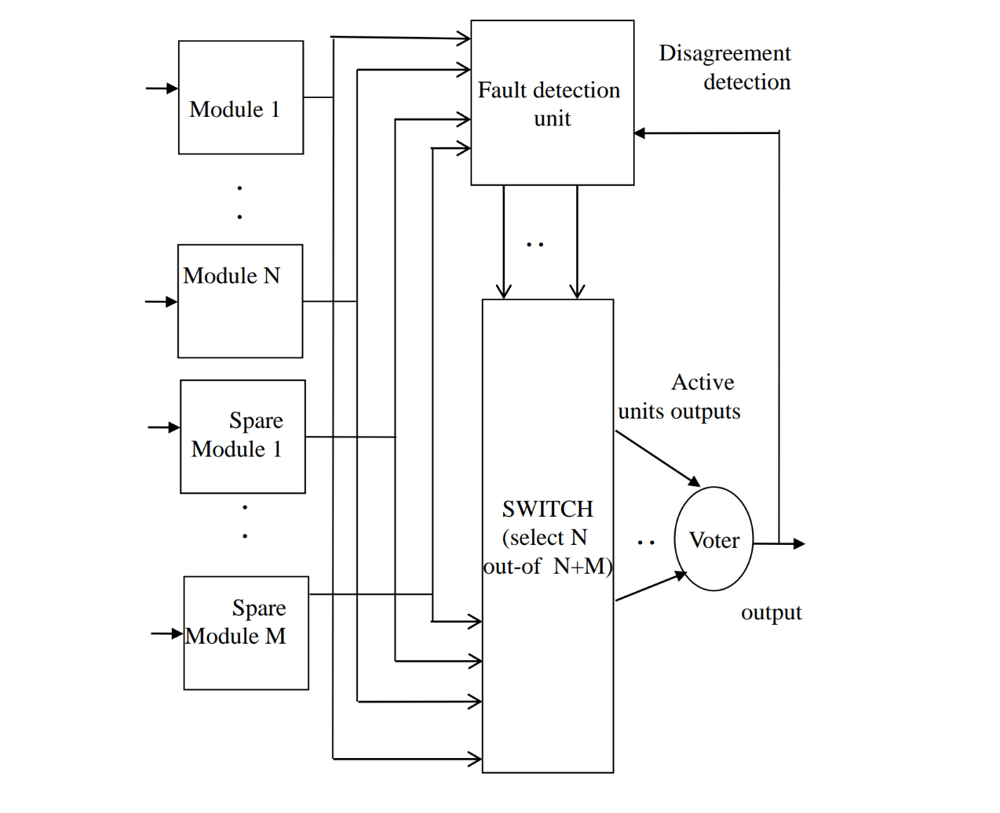
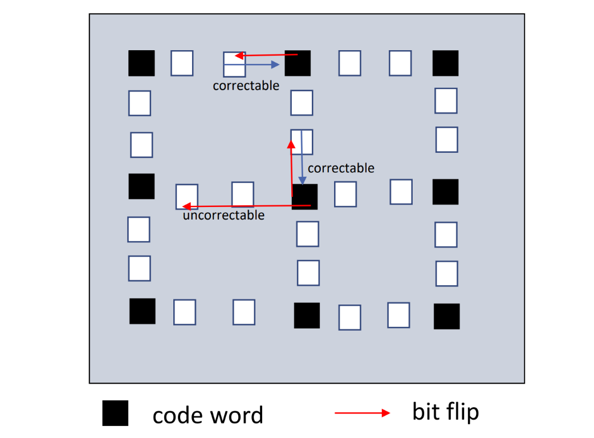

# Redundancy in Fault Tolerant Computing

In this chapter we'll se how to use redundancy to improve the reliability of a system. There are various types of redundancy, and we'll go through them one by one.

## Hardware Redundancy

Briefly, hardware redundancy is the physical replication of the hardware components of a system. This is done to ensure that if one component fails, the system can continue to operate using the redundant component. In this category we can find **passive**, **active** and **hybrid** redundancy.

### Passive fault tolerance techniques

In passive tolerance, the **fault masking** is the keystone of the technique: a **voting mechanism** is implemented upon the redundant components, and the output of the system is the result of the majority of the components. This way, if one component fails, the system can continue to operate using the redundant component, and **without any external intervention**.

#### Triple Modular Redundancy (TMR)

This technique is schematized in the following figure:

{width=300px}

The main idea is to **triplicate** the specific component, and perform a **majority voting** on the outputs. This technique obviously needs the assumption that the **probability of failure of the components is independent**, but ensure a fault neutralization without the need of any external intervention, and this for each of the components.

TMR is very effective when we're dealing with **transient faults**, but on the contrary isn't very helpful when dealing with **permanent faults**, and this because the fault tolerance decreases since the faulty component remains in the system.

#### Cascaded TMR with triplicated voters

This technique is a further development of the TMR, and is schematized in the following figure:

The effect of partitioning the modules is that the design can now withstands more failures than the TMR, thanks to the multiple voters. Unfortunately, we can let this technique arbitrarily reliable, because the reliability of the system is limited by the **reliability of the voters**, which also are a **single point of failure**.

#### The Voter

The voter is a crucial component in the previous techniques: it's usually implemented as an hardware digital circuiting, and it's responsible for the majority voting. This leads to difficulties on its implementation:

- **delay on signal propagation**: the voter must wait for the inputs to be stable before performing the voting, waiting for the synchronization of the inputs;
- trade-off between **achieved fault tolerance** and **cost** in hardware complexity.

There is also another main problem, that come out when we're dealing with **analog signals**: in this case, the majority voting is not so straightforward, and the voter must be implemented as a **digital-to-analog converter**. Given that these converter could produce inconsistent results, another techniques are implemented to ensure the correct voting, such as:

- **average of the signals**;
- choose the **mean of similar signals**;
- choose the **median of the signals**.

#### N-Modular Redundancy (NMR)

This technique is a generalization of the TMR, when the number of redundant components, which **must be odd**, is arbitrary. Using this method, we can cover up to $m$ faulty modules, such that $N = 2m+1$. The main problem of this technique is that the number of voters grows with the number of redundant components, and this leads to a **high cost**.

### Active fault tolerance techniques

In active tolerance, redundancy is used in a **dynamic way**, through fault detection, location and recovery. Briefly, the existence of faults is detected, and some actions are taken in order to remove the faulty component from the system, and replace through a reconfiguration. These techniques are used in context where temporary faults while the system is being reconfigured are acceptable.

#### Duplication with comparison scheme

Two identical pieces of hardware are used, performing the same computation in parallel, with a comparator that takes as input their results. If the results differs, a failure is detected and an error signal is generated.
The technique has a good coverage ratio, because it's able to detect **every faults**, except fot those that affect the comparator: worth to mention is the simplicity and the low cost, with a minimal impact on the performance. On the other hand, we have to deal with the possibility that the comparator itself could fails, leading to both false positives and false negatives.

#### Reconfigurable Duplication

This technique is a further development of the previous one, and is schematized in the following figure:

The circuit works like the previous one, with the difference that the output of the comparator is used as input of the switch, in order to select the module that will be used as output, with the implicit hypothesis that the comparator is able to select the correct value in case of disagreement. To do that, checks such as coding, reversal or reasonable checks are performed, and the switch is used to select the correct output disconnecting the faulty module. This configuration is also called **duplex system**.

#### Stand-by sparing

As we can see in the schema, modules can be **operational** or **spares**:

{width=400px}

The switch implements the **fault detection and localization**, and can decide to no longer use a module if it's faulty, and to replace it with a spare. Spares are divided in three categories:

- **hot spares**: they are always active, and ready to replace a faulty module in every moment;
- **warm spares**: they are running, but receives inputs from the system only when they are activated;
- **cold spares**: they are off, and must be activated before being used.

A **pair-and-spare** approach can also be used, when every module is a **duplex system**, connected to the switch with a comparator: as long as the outputs agree, the spares are not used, but in case of disagreement, the switch operates the replacement.

### Hybrid fault tolerance techniques

In this category, we can find the **combination** of the previous techniques, in order to obtain a better fault tolerance. The main idea is to combine the advantages of the previous techniques, and to mitigate their disadvantages. Intuitively, we can say that costs increase dramatically, such as the complexity of the implementations, so this techniques are used only in **critical systems**.

#### Reconfigurable NMR

This technique is a combination of the NMR and the reconfigurable duplication, and is schematized in the following figure:

{width=300px}

There are $N$ redundant modules, and the voter; the **fault detection units** compare the outputs of the voters with the output of the active modules, and replace the faulty module with a spare, isolating it from the system. The reliability of the circuit holds as longs as the number of spare modules isn't zero, and the coverages depends on the number of spare: a TMR with one spare can tolerates up to two faults, by masking the first module, replacing it and possibly mask the second one.

### Summary of the hardware redundancy techniques

The key differences between the techniques are summarized:

- **passive** rely on the **fault masking**, and requires high investments in the hardware;
- **active** rely on the **error detection**, **fault localization** and **recovery**, but has the disadvantage of needing additional hardware to detect and recover from the faults, and can produced **transient errors**;
- **hybrid** are a combination of the previous techniques. The reliability of the system is increased, but the costs are the highest.

## Information Redundancy

When we talk about information redundancy, we're referring to **coding**, that is the application of the redundancy within the information itself. This is done using more bits than strictly necessary to represent the information: if $n$ is the number of bits needed to represent the information, we use $m = n + c$ bits, such that among all the possible $2^m$ combinations, only $2^n$ represents acceptable information, and these combinations are called **codewords**; if a non-codeword is received, an error is detected.

**Coding** needs a phase of **encoding**, where the $c$ bit are calculated and added to the information, and a phase of **decoding**, where the information is extracted from the codeword. We refer to **separable code** when the information and the redundancy are clearly separated,such as a concatenation of the information and the redundancy, and to **non-separable code** when the information and the redundancy are mixed together.

### Parity codes

The simplest form of coding is the **parity code**, where a single bit is added to the information, such that the number of 1s in the codeword is even or odd. This technique is very simple, but is able to detect only **single bit errors**, and can't correct them.

**Example**:

> with $n=2$ and $m=3$, 8 are the possible combinations, and 4 are the codewords. We can easily get that the codewords are $001$, $010$, $100$ and $111$.

### Complemented duplication

In this technique, the information is duplicated, having $n$ bits of information and $n$ bits of redundancy, such that the redundancy is the complement of the information. In this case, having $n=4$, we can have 16 possible combinations, and 4 are the codewords.

### Hamming distance

We define the **Hamming distance** has it follows:

> Given two codewords $x$ and $y$, the Hamming distance between them is the number of bits in which they differ.

The **minimum Hamming distance** between two codewords is the number of independent single bit errors that the code can detect; a code such that the Hamming distance is $ > k$ will detect up to $k$ erroneous bits.

The main concept is that **the corrupted data is closer to the correct data than to any other codeword**. In the following figure, we can see a generic example of the Hamming distance, with the differences between predictable and unpredictable errors.

{width=300px}

### Checksums

This method is usually applied to large blocks of data, and it's able to cover a single fault. The checksum for a block of $n$ words is formed by adding together all the words modulo $k$, with $k$ arbitrary. The checksum is then stored in the data block, and when the block is transmitted, the checksum is recalculated and compared with the stored one; the codeword in this case is composed by the entire block of data, and the actual checksum.

The main disadvantages of the technique are:

- the need to recalculate the checksum every time the data is modified;
- the error detection is limited is allowed, but the error localization is not possible.
- it represents a single point of failure.

### ECC

This technique enables the **error location** for single-bit error, as we can see in the following figure:

{width=300px}

### Hamming codes

This technique is usually used in databases, with specific disks that implements that mechanism, and it's based on **spreading parity bits across the data**. The main idea is to use the **parity bits**, that are all bit in positions that are a power of 2, to check the data, and to use the **data bits** to store the information. In this way, the data bits are included in a set of two or more parity bits, and the parity bits are included in a set of two or more data bits, implementing a **detection and correction** mechanism. In the figure we can see an example of the Hamming code:

The parity bit $p_j$ covers all the bit whose position has the $j$-th bit set to 1, so every data bit is covered by a set of parity bits.

### Self-checking circuitry

In order to implements all the previous methods, we have the necessity of reliability on the modules that performs checks and comparisons, and this is done through the **self-checking circuitry**.: given a set of faults, the circuit has the ability to **automatically detect** the fault, during the normal course of its operations; this is usually achieved by implementing coding techniques in the circuitry, such that input and outputs are encoded. . Three are the main techniques:

- **self-testing** circuitry: if, for every fault from the set, does exists a non-code output;
- **fault-secure** circuitry: if, for every fault from the set, the circuit never produces an incorrect output for any input;
- **totally self-checking** circuitry: if the circuit is both self-testing and fault-secure.
- 