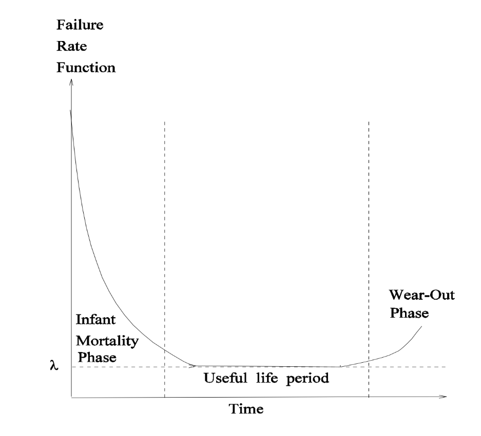
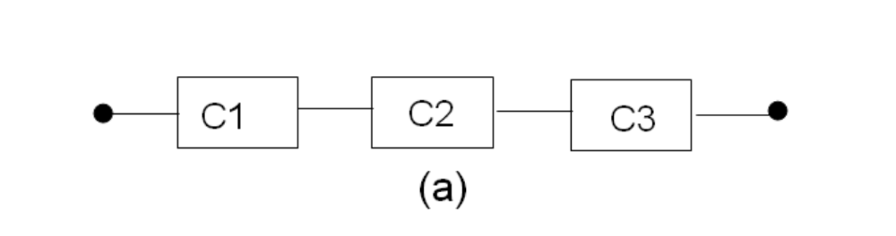
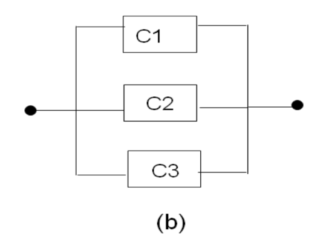
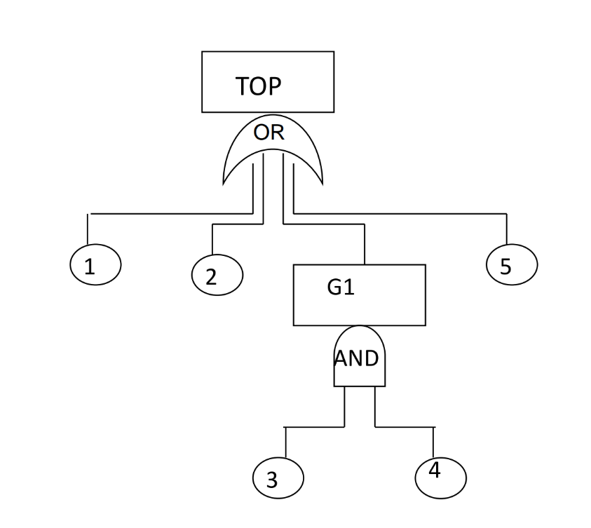
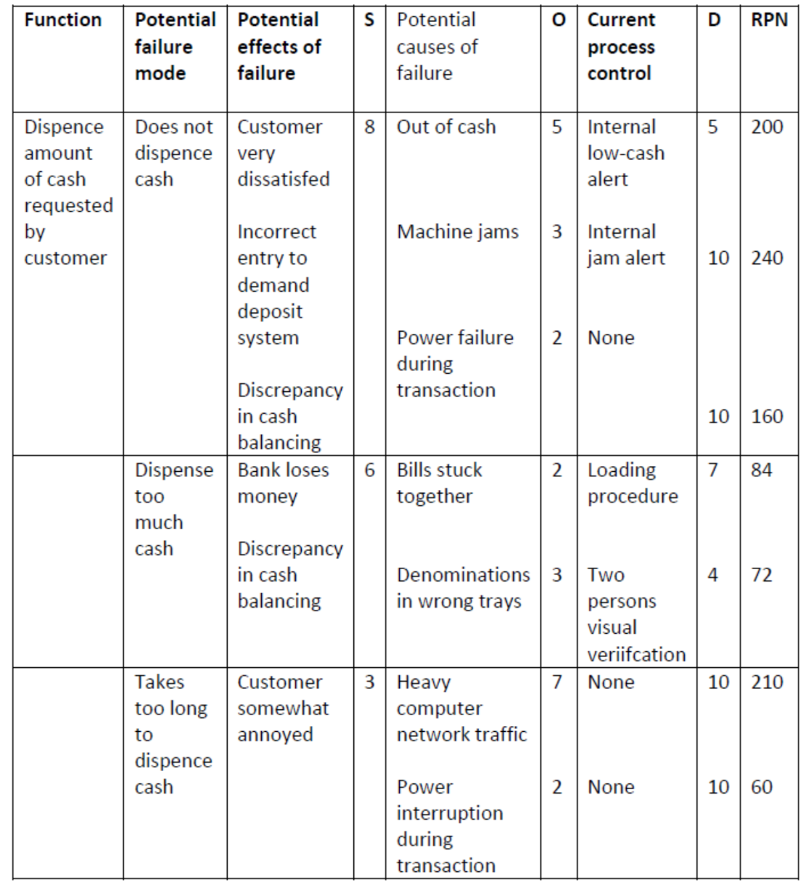
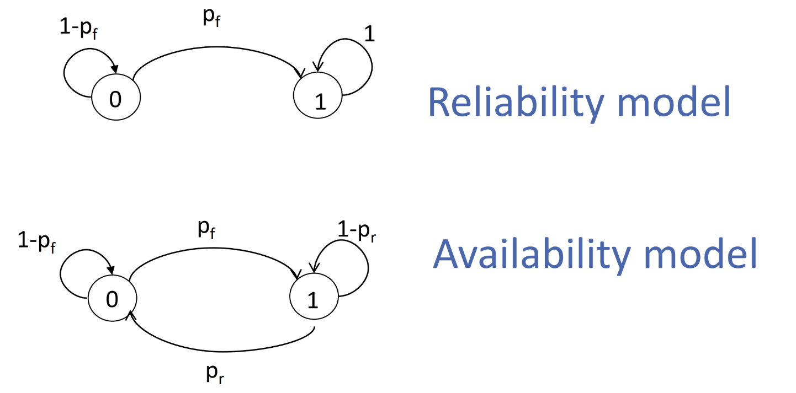
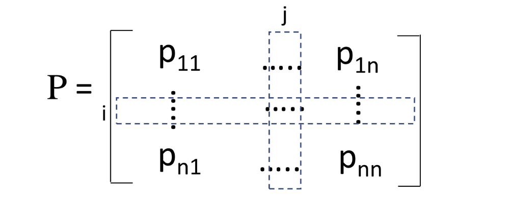

# Dependability Evaluation

## Introduction

As we stated in the previous chapters, faults cause errors and failures in the systems. however, these faults aren't unpredictable: their occurrences can be modeled trough the use of probability theory. Parameters such as the Mean Time To Failure (MTTF) and the Mean Time To Repair (MTTR) are, in fact, **random variables** that can be modeled through probability distributions.

### Definitions

- **Reliability $R(t)$** is a function of time, and it's the conditional probability that the system performs correctly trough the time interval $[0,t]$, given that the system was performing correctly at the the instant $t_0$. From the definitions, we can state that $R(0) = 1$ and $R(\infty) = 0$;
- **Unreliability $Q(t)$**, define as $Q(t) = 1 - R(t)$;
- **Availability $A(t)$** is a time function which represents the probability that the system is operating correctly and it's available to perform its functions at time $t$.
- **failure density function $f(t)$** represents the number of failures occurred in $\Delta t$. From a mathematical point of view, it's defined as $f(t) = \frac{dQ(t)}{dt}= \frac{-dR(t)}{dt}$;
- **failure rate function $\lambda(t)$**, defined by the number of failures during $\Delta t$ in relation to the number of correct components at time $t$, and we can write its equations in this way: $\lambda(t) = \frac{f(t)}{R(t)} = -\frac{dR(t)}{dt}\cdot\frac{1}{R(t)}$

### Hardware reliability

The hardware reliability is usually described using the **failure rate distribution**, that follows different behaviors depending on the lifetime of the components. An average behavior is the **bathtub curve**, which is divided into three phases:

{width=400px}

The **early life phase** is characterized by a high failure rate, due to the presence of **infant mortality**, caused by failures of weaker components (e.g. due to manufacturing defects). The **useful life phase** is characterized by a constant failure rate, which is the most common behavior of the components, and the failure rate is described as **failure every $x$ hours**  (e.g. $\lambda = \frac{1}{2000}$, which means a failure every 2000 hours). The **wear-out phase** is characterized by an increasing failure rate, due to the aging of the components and their usage.

Knowing that the failure rate is constant, we can easily get the reliability function:

$$\lambda(t) =  \lambda = \frac{f(t)}{R(t)}=-\frac{dR(t)}{dt}\cdot\frac{1}{R(t)} \rightarrow R(t) = e^{-\lambda t}$$

We can also recover the equation for the probability function:

$$f(t) = \frac{dQ(t)}{dt} = \frac{-dR(t)}{dt} = \lambda e^{-\lambda t}$$

> The exponential relation between reliability and time is known as **exponential failure law**.

### Time-to-failure of a component

The time-to-failure of a component is a random variable that can be modeled using a **random variable $X$**, defining:

- $F_X(t) = P(X \leq t)$ as the **cumulative distribution function** (CDF) of the random variable $X$, that represents the **unreliability** of the component;
- **reliability function**, defined as $R_X(t) = 1 - F_X(t) = P(X > t)$, and it represents the **probability to not observe failures before time $t$**.
- the **mean time to failure** (MTTF) is defined as $E[X] = \int_0^\infty tf(t)dt = \int_0^\infty t\lambda e^{-\lambda t}dt = \frac{1}{\lambda}$.

Taking as example a constant failure rate $\lambda = \frac{1}{2000}$, the MTTF is $2000$ hours: speaking in terms of probability, $\lambda$ means that we'll have $0.0005$ failures per hour, and the MTTF shows that the time needed for the first failure is $2000$ hours. A well-known unity is the **FIT** (Failure In Time), which is the number of failures in $10^9$ hours. All these data are usually available on handbooks and datasheets of the components.

### Distribution model for permanent faults

The **MIL-HDBK-217** is a standard that provides a model for the reliability of electronic components, and it's based on the **exponential failure law**. The model is based on the **constant failure rate** $\lambda$, and it's defined as:

$$\lambda = \tau_L\cdot \tau_Q\cdot (C_1\cdot \tau_V\cdot \tau_T + C_2\cdot \tau_E)$$

where:

- $\tau_L$ is the **learning factor**, based on the experience of the manufacturer;
- $\tau_Q$ is the **quality factor**, based on the quality of the components;
- $\tau_V$ is the **voltage factor**, based on the voltage applied to the component;
- $\tau_T$ is the **temperature factor**, based on the temperature of the ambient in which the component is placed, and the type of semiconductor;
- $\tau_E$ is the **environment factor**, based on the environment in which the component is placed;
- $C_1$ and $C_2$ are **complexity factors**, based on number of components and the complexity of the circuit.

$$\qquad$$

## Model-based dependability evaluation

A model is an **abstraction** of a real system, that highlights the most important aspects of the system that are going to be analyzed. Two main types of models are used in dependability evaluation:

- **Stochastic models**, that are based on probability theory and are used to model the behavior of the system in terms of **random variables**, such as Reliability Block Diagrams (RBDs) and Fault Trees (FTs);
- **State-space models**, that are based on the state of the system and are used to model the behavior of the system in terms of **states**, such as Markov Chains and Petri Nets.

In this chapter, we'll present the both types of models.

## Combinatorial (stochastic) models

These models offer simple and intuitive methods for the construction of the system model, and for their solution. It's fundamental to keep in mind some assumptions that will be used in the following sections:

- **Components are independent**: the failure of a component doesn't affect the failure of the others;
- each component has a **constant failure rate** $\lambda$;
- the system model is based on the actual structure of the system;

It's also importa to remember that these models aren't ideal when dealing with systems that shows complex dependencies among components, and for systems that are repairable.

### Series models

A simple schema for these systems is the following:

{width=400px}

The system is composed by $n$ components, and the system is working if all the components are working. The reliability of the system is the product of the reliability of the components.

Given $R_i(t)$ the reliability of the $i$-th component, the reliability of the system is:

$$R(t) = R_1(t)\cdot R_2(t)\cdot \ldots \cdot R_n(t) = \prod_{i=1}^n R_i(t)$$

If every component has a constant failure rate $\lambda$, the reliability of the system is:

$$R(t) = e^{-\lambda_1 t}\cdot e^{-\lambda_2 t}\cdot \ldots \cdot e^{-\lambda_n t} = e^{-(\lambda_1 + \lambda_2 + \ldots + \lambda_n)t} = e^{-\sum_{i=1}^n \lambda_i t}$$

The unreliability of the system is:

$$Q(t) = 1 - R(t) = 1 - \prod_{i=1}^n R_i(t) = 1 - \prod_{i=1}^n (1 - Q_i(t))$$

If the system doesn't contain any redundancy, and the components are independent, then:

- the **system reliability** is the product of the **component reliabilities**, and it's an **exponential function**;
- the **failure rate $\lambda$** of the system is the sum of the **failure rates $\lambda_i$** of the components.

### Parallel models

A simple schema for these systems is the following:

{width=400px}

The system is composed by $n$ components, and the system is working if at least one of the components is working.

The unreliability of the system is $Q(t) = \prod_{i=1}^n Q_i(t)$, and the reliability of the system is $R(t) = 1 - Q(t) = 1 - \prod_{i=1}^n Q_i(t) = 1 - \prod_{i=1}^n (1 - R_i(t))$.

We can generalize this system to a **M-of-N** system, in which the system is working if at least $M$ components are working. The reliability of these systems is:

$$R(t) = \sum_{i=M}^N \binom{N}{i} R_i(t)^{N-1} (1 - R_i(t))^{i}$$

If the system has redundancy, and if components are independent, then the **system reliability** is the **reliability** of a series/parallel combinatorial model.

### Example: TMR vs Simplex system

Take as example a simple system with only one component $s$, and a TMR system with three components. 

The component $s$ has a failure rate $\lambda$, with $R_s = e^{-\lambda t}$ which us also the reliability of the system.

In the TMR system, we assume the reliability of the voter $R_v(t) = 1$, and the reliability of the TMR is

$$R_{TMR} = \sum_{i=0}^1 \binom{3}{i}(e^{-\lambda t})^{3-i}(1-e^{-\lambda t})^i = (e^{-\lambda t})^3 + 3(e^{-\lambda t})^2(1-e^{-\lambda t})$$

So it's clear that the TMR system is more reliable than the simplex system, if $R_m > 0.5$.

The behavior of the reliability of these two systems is shown in the following graph:

{width=400px}

Focusing on the MTTF, we can get with ease that, for the simplex system, the MTTF is $\frac{1}{\lambda}$, while for the TMR system is $\frac{3}{2\lambda} - \frac{2}{3\lambda} = \frac{5}{6\lambda}$, which is lower than the MTTF of the simplex system.

In conclusion, we can state that:

- the **TMR system** is worst than the **simplex system** in terms of **MTTF**;
- the **TMR system** is better than the **simplex system** in terms of **reliability**, for the first 6000 hours;
- the **TMR system** with a reliability above $0.8$ lasts $66%$ longer than the **simplex system**.

{width=400px}

The *S-shaped* curve is typical of the **redundant systems**: above the **knee point**, the system is more reliable than the simplex system, while below the **knee point**, the system doesn't get any advantage from the redundancy.

### Non-series/parallel systems

Have a look at the following system:

{width=400px}

The system will operate correctly if exists a path from the input to the output that doesn't contain any faulty component. The reliability is computed expanding around one module $m$:

$$R_{sys} = R_B \cdot P(\text{system works} | B) + (1 - R_B) \cdot P(\text{system works} | \overline{B})$$

We can visualize this expansion trough the following figure:

{width=400px}

We can also parallelize the system, reaching the following schema where all the possible paths are in parallel:

{width=400px}

#### Upper bound of the system reliability

Then we define the **upper bound** as $R_{sys} \leq 1 - \prod_{i=1}^n (1-R_{\text{path i}})$; we cannot compute the exact value of the reliability of the system, because **paths are not independent**, meaning that the failure of a single module can affect the reliability of more than one path. The upper bound of the system we took as example is $R_{sys} \leq 1 - (1 - R_AR_BR_CR_D)\cdot(1 - R_AR_ER_D)\cdot(1-R_FR_CR_D)$

#### Lower bound of the system reliability

The **lower bound** is the **minimal cut set** of the system, which is the list of components such that the removal of any component from this set, will cause the system to change its state from working to failed.

In the example, the minimal cut sets are $\{D\}, \{A,F\}, \{E,C\},\{A,C\}, \{B,E,F\}$, and the lower bound can be computed as $R_{sys} \geq\prod_{i=1}^n R_{\text{cut set i}}$, which lead to $R_{sys} \geq (1-(1-R))\cdot(1-(1-R)^2)^3\cdot(1-(1-R)^3)$

### Fault Trees

Fault Trees are a graphical representation of the system, that shows the possible paths that lead to the failure of the system. The system is represented as a **root node**, which represents the **top event** in terms of status (e.g. system failure), and the **leaves** of the tree represent the **basic events** that can lead to the top event. The analysis of the tree is based on evaluating the **probability of occurrence of the top event**, in terms of the **probability of occurrence of the basic events**.

{width=400px}

#### Logical gates

The basic events are connected through **logical gates**, that are used to combine the basic events in order to get the top event. The most common gates are:

- **AND gate**: the top event occurs if all the basic events occur;
- **OR gate**: the top event occurs if at least one of the basic events occurs;
- **K-of-N gate**: the top event occurs if at least $K$ of the $N$ basic events occur.

Conventionally, the logical value **true** corresponds to a **failure**, while the logical value **false** corresponds to a **success**: the system is working if the top event is **false**, otherwise the system is failed.

#### Minimal Cut Sets

A cut is identified as a set of events such that, according to the logic showed in the tree, leads to the top event. Let's take as example the following tree:

{width=400px}

The cut sets are $\{1\}, \{2\}, \{G1\}, \{5\}$, and the minimal cut sets are $\{1\}, \{2\}, \{3,4\}, \{5\}$. To estimate the probability of the root event, the probabilities of the occurrence of every set are computed and combined.

For this purpose, we can define $Q_s(t)$ as the probability that all the components in the minimal cut set $s$ are faulty, and it's computed as $Q_s(t) = \prod_{i \in s} Q_i(t)$, having $Q_i(t)$ the probability that the component $i$ is faulty. The numerical solution for the Fault Tree is performed by computing the probability of occurrence for each cut, and then combining those probabilities, to estimate the probability of the top event.

#### Multiple appearances of the same component

In the case of multiple appearances of the same component, the independent event assumption is violated; however, we can still compute the probability of the top event: if a component $C$ appears multiple times in the Fault Tree, then:

$$Q_s(t) = Q_{s|C \text{ is faulty}}(t)\cdot Q_C(t) + Q_{s|C \text{ is working}}(t)\cdot (1 - Q_C(t))$$

where $Q_{s|C \text{ is faulty}}(t)$ is the system reliability when the component $C$ is faulty, and $Q_{s|C \text{ is working}}(t)$ is the system reliability when the component $C$ is working.

#### Fault Tree analysis

Use of Fault Tree involves defining the top event, which is the undesired outcome, and then identifying the basic events that can lead to the top event, as a cut set. The analysis of a Fault Tree includes also the need of determining the failure probability of basic events, of the minimal cut sets, and the single points of failures for the system, that corresponds to a cut set with only one component.

### Failure Mode and Effect Analysis

The **FMEA** is a failure analysis technique used to identify the risk of a failure in a system, or a component also; it involves analyzing the vulnerability of a system to a single failure, and required knowledge on how these potential failures can combine with each other, which are the consequences of these failures and possible actions to be taken in order to prevent these failures.

The technique is based on the **Risk Priority Number (RPN)**, which is computed considering the **severity** of the failure, the **occurrence** of the failure, and the **detectability** of the failure.

#### The FMEA table

To ensure dependability, a system's functionality must be identified, along with its potential failures and failures modes. A table is created: it should be created detailing each failure mode, its potential effects on components and system, and a severity ranking from 1 to 10.

For each cause of failure, a list of the current process controls is created, with details on tests, procedures, or mechanism that might prevent the cause from happening, reducing the probability that it will occur, or detect the failure before it causes a problem, before the customer is affected; a **rank dection rating** is also computed, from 1 to 10.

In the following figure, an example of an FMEA table for an ATM system is shown:

{width=400px}

#### The RPN

The **Risk Priority Number (RPN)** is computed as the product of the **severity**, **occurrence**, and **detection** rankings, and it's used to prioritize the failures that need to be addressed first. The RPN is computed as $RPN = S \cdot O \cdot D$, and the higher the RPN, the higher the priority of the failure.

In conclusion, FMEA helps ranking potential failures and identify recommended actions, such as additional controls, to improve the system's detection and prevention capabilities. It enables the association of a cause, such as a simple component failure, with its effect on the system, and helps in identifying the most critical failures that need to be addressed first.

### FMEA with Fault Trees

The FMEA can be used in combination with Fault Trees to identify the most critical failures that need to be addressed first: the first is used to analyzes the vulnerability of the system due to a single failure, while the latter describes scenarios where an event occurs due to the combination of multiple failures.

## State-based models

These models are used for dependability evaluation of systems that can be described in terms of states, considering that the reliability of these systems depends on the **frequency** and **duration** of the faults in the system. This approach is different from, as example, the series/parallel models, because the state-based enumerates all the possible states of the system, and can be employed for evaluating both reliability and availability, providing a more detailed analysis of the system.

State-based models are used in dependability evaluation to characterize the changes of the system's state over time: each state represents a different combination of both failed and working components, and the transitions between states are caused by the occurrence of faults in the system. Obviously, probabilities of failures and repairs are key factors in the analysis of these models, in order to characterize states and transitions over time.

### Representing the system state

The most used graphical representation for state-based models are **graphs**, where nodes represent states of the system, and edges represent transitions between states: in particular, labels on the edges represent the number of working and failed components in the system, and the probabilities of transitions. Consider the following example:

{width=400px}

The system is composed by a single component, and the states are represented by the number of failed components in the system. The transitions between states depends on $p_f$, which is the **probability of failure**, while $p_r$ is the **probability of repair**.

We can distinguish between **reliability model** and **availability model**: the first is used to evaluate the probability that the system is in a working state at time $t$, while the availability model is used to evaluate the probability that the system is in a working state and is available to perform its functions at time $t$.

### Random process

In probability theory, a random process is a **collection of random variables** indexed by time, representing the evolution of a system over time, such as the toss of a coin. Following the same logic, when we talk about dependability measures, we refer to variables that represent system's value of the state that changes randomly over time.

We lastly define the **state space** of the system as the set of all possible states of the system.

### Markov Chains

A **Markov Chain** is a state-based model that describes the evolution of a system over time, where the probability of the system to be in a certain state at time $t$ depends only on the state of the system at time $t-1$. This property is called is called **Markov property**, and processes that satisfy this property are called **Markov processes**.

#### Insights on Markov property

The equation that describes the Markov property is:

$$P(X_{t+1} = j | X_t = i, X_{t-1} = i_{t-1}, \ldots, X_0 = i_0) = P(X_{t+1} = j | X_t = i)$$

which means that state of the process at time $t+1$ depends only on the state of the process at time $t$, **being independent from all previous states**. This is also the basic assumption of the Markov Chain model.

#### Transition probabilities

We  define **transition probability** as the probability of the system to move from state $i$ to state $j$ in one time unit, and it's denoted as $p_{ij}$, and the **Steady-State transition Probability** as those transition probabilities such that, for any pair of states $i$ and $j$, the probability of the system to be in state $j$ at time $t+1$ is the same as the probability of the system to be in state $j$ at time $t$; in other words, the transition probabilities are constant over time.

#### Definition of a Markov Chain

A stochastic process is a Markov Chain if it satisfies the Markov property, and if the transition probabilities are constant over time. A Markov chain is called **homogeneous** if the transition probabilities are constant over time, so if it satisfies the property of steady-state transition probabilities; otherwise, it's called **non-homogeneous**.

#### Transition matrix

A Markov chain is **finite-state** if the number of states is finite; in this case transitions are representable as a matrix, called **transition matrix**.

{width=400px}

Notations represent:

- $n$ as the number of states;
- $i$ and $j$ as the states of the system;
- $p_{ij}$ as the probability of moving from state $i$ to state $j$ in one time unit;

The transition matrix satisfies the following property:
> let $u = [1, 1, \ldots, 1]^T$ be a vector of ones, then $P\cdot u = u$. 

This follows by the condition that the sum of the elements in each row of the matrix is equal to 1, and represents the probability to moving from a state $i$ into any other state.

Non-negative matrices where the property $P\cdot u = u$ holds are called **stochastic matrices**.

The matrix can be associated with ease to a graph, where the nodes represent the states of the system, and the edges represent the transitions between states.

#### Theorem for Discrete-Time Markov Chains

For each pair of states $i$ and $j$, with $n\geq 0$, then $P\{X_{n+1} = j | X_n = i\} = P\{X_n = j | X_0 = i\} \forall t \geq 0$.

From this theorem, we can derive every steady-state probability of the system after $n$ transitions:

$$ p_{ij}^{(n)} = P\{X_n = j | X_0 = i\} $$

In particular, we define:

- $p_{ij}^{(0)} = P\{X_0 = j | X_0 = i\} = \delta_{ij}$, where $\delta_{ij}$ is the **Kronecker delta**;
- $p_{ij}^{(1)} = P\{X_1 = j | X_0 = i\} = p_{ij}$;
- $p_{ij}^{(n)} = P\{X_n = j | X_0 = i\}$.

Following properties are also valid:

- $0 \leq p_{ij}^{(n)} \leq 1 \forall i,j$;
- $\sum_{j=1}^n p_{ij}^{(n)} = \sum_{j=1}^n P\{X_n = j | X_0 = i\} = 1 \forall i$.

#### Chapman-Kolmogorov theorem

This theorem states that **for each pairs of states $i$ and $j$, and for each $n,m \geq 1$, then $p_{ij}^{(n+m)} = \sum_{k=1}^n p_{ik}^{(n)}p_{kj}^{(m)}$**.

Knowing that $P^{(0)} = I$, where $I$ is the identity matrix, $P^{(1)} = P$, and $P^{(n)} = P^n$, we can prove that $P^{(n+m)} = P^n\cdot P^m$. Since $P^{(k)} = P^{(k-1)}\cdot P^{(1)} = P^{(k-1)}\cdot P$, we can state that $P^{(n)} = P^n$, with $P^{(n)}$ being a stochastic matrix.

#### Sojourn time

Given a random variable $T_i$, then we define:

$$P\{T_i = n\} = p_{ii}^{(n-1)}(1-p_{ii})$$

as the probability that, when system enters in state $i$, it will stay in state $i$ for $n$ transitions. The proposed formula recall the **geometric distribution**, of parameter $p_{ii}$, with a mean value of $\frac{1}{1-p_{ii}}$.

#### Probability distribution at time $t$

We're able to compute the probability to be in a given state after a certain number of transitions: for this reason, a **state occupancy vector** at time $t$ is defined, as $\pi(t) = [\pi_0(t), \pi_1(t), \ldots, \pi_n(t)]$, where $\pi_i(t)$ is the probability that $\pi \{X_t = i\}$ or, in other words, that system is in state $i$ at time $t$. We also have the **initial state occupancy vector** $\pi(0)$, which is the probability that the system is in state $i$ at time $0$: from these two vectors we can define any state occupancy vector for any time $\in [0,t]$.

A Markov process can be specified in terms of the **state occupancy vector $\pi(t)$**, and the **transition matrix $P$**, such that $\pi(t) = \pi(0)\cdot P^t$.

#### Classification of states

A state $j$ is called **accessible** from a state $i$ if there exists a sequence of transitions that leads from state $i$ to state $j$ or, simply, if $p_{ij_{(t)}} > 0$ for some $t \geq 0$, and it's denoted as $i \rightarrow j$.

A Markov chain is said to be **irreducible** if, for each pair of states $i$ and $j$:

- state $i$ is accessible from state $j$ in a finite number of transitions;
- state $j$ is accessible from state $i$ in a finite number of transitions.

An **irreducible** Markov chain is a chain containing only equivalence class of communicating states.

A state can also be:

- **recurrent**, if $\forall i,j$ $i\rightarrow j$ implies $j\rightarrow i$, which means that the process will move again to state $i$ with probability 1;
- **transient**, if $\exist j \ne i$ such that $i\rightarrow j$ but $j\nrightarrow i$, which means that the process will never return to state $i$.
- **absorbing**, if $p_{ii} = 1$, implying the fact that it's also a recurrent one.

Given a recurrent state, let $d$ the **GCM** of all integers $m$ such that $P_{ii}^{(m)} > 0$:

- a recurrent state is **periodic** if $d > 1$;
- a recurrent state is **aperiodic** if $d = 1$. In other words, if it's possible to move to the same state in one step, then $d=1$.
- a state is aperiodic also if $p_{ii} > i$.

#### Steady-state behavior

We now enunciate a theorem that states the steady-state behavior of a Markov Chain:

> For **irreducible** and **aperiodic** Markov Chains, $\forall j$, $\lim_{t\to\infty} \pi_j(t)$ exists and is independent from the initial state $\pi(0)$.

The steady-state behavior of the Markov Chain is given by the **fixpoint** of equation $\pi(t) = \pi(t-1)\cdot P$, whit $\sum_j \pi_j = 1$.

For an irreducible Markov Chain with periodic states, the actual periodic state oscillates periodically, and the limiting behavior does not exists due to the probability of the periodic state itself. We calculate the **time-average state space distribution** as $\Pi = \lim_{t\to\infty} \frac{1}{t}\sum_{\tau=1}^{t} \pi^{(i)}(\tau)$.

### Continuous-Time Markov Chains

In a continuous-time Markov Chain, state transitions can occur at any time, with an assigned transition rate. In this context, the Markov property assumes that the time spent in a state doesn't affect the probability distribution of the next step, or the remaining time in the same state before the next transition.

The notation used is to denote the transition rate is $\{X_t\}$, with $t \in T \subseteq \mathbb{R}$, and the transition rate from state $i$ to state $j$ is denoted as $q_{ij}$, with $q_{ii} = -\sum_{j\ne i} q_{ij}$. We consider steady-state transition probability for each $t_i \in T$, and for all $\tau \ge 0$:

$$P\{X_{t+\tau} = j | X_t = i\} = P\{X_{\tau} = j | X_0 = i\}$$

#### Time spent in a state

The time spent in a state is denoted as $T_i$, and it's a random variable that follows an **exponential distribution**, whose parameter $e^{(-ai)}$ used to characterize the behavior of the Markov Chain. In this way, the Markov Chain is able to **naturally fits** the exponential distribution, and the **memoryless property** of the exponential distribution is a direct consequence of the Markov property, leading to an **exponential distribution of inter-arrival of failures**.

Depending on the value of the transition rate, we can classify the states as:

- **absorbing**, if $ai = 0$;
- **instantaneous**, if $ai = \infty$;
- **stable** otherwise.

#### Specification of a Continuous-Time Markov Chain

A CTMC can be described by using its **occupancy vector** $\pi(t)$, which represents the probability that the system is in state $i$ at time $t$, and the **transition rate matrix** $Q$, which represents the transition rates between states. The latter is defined as $q_{ij}$being the rate of moving from state $i$ to state $j$, and $q_{ii} = -\sum_{j\ne i} q_{ij}$, under the assumption that $i \ne j$. The matrix $Q$ is a **stochastic matrix**, where the sum of the elements in each row is equal to 0.
