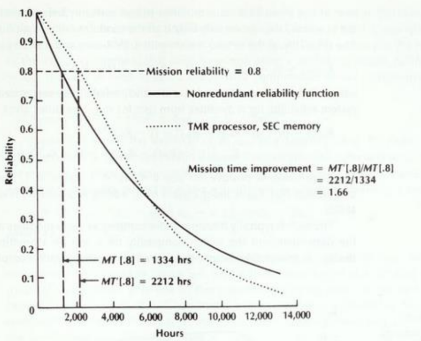
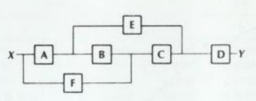
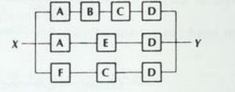
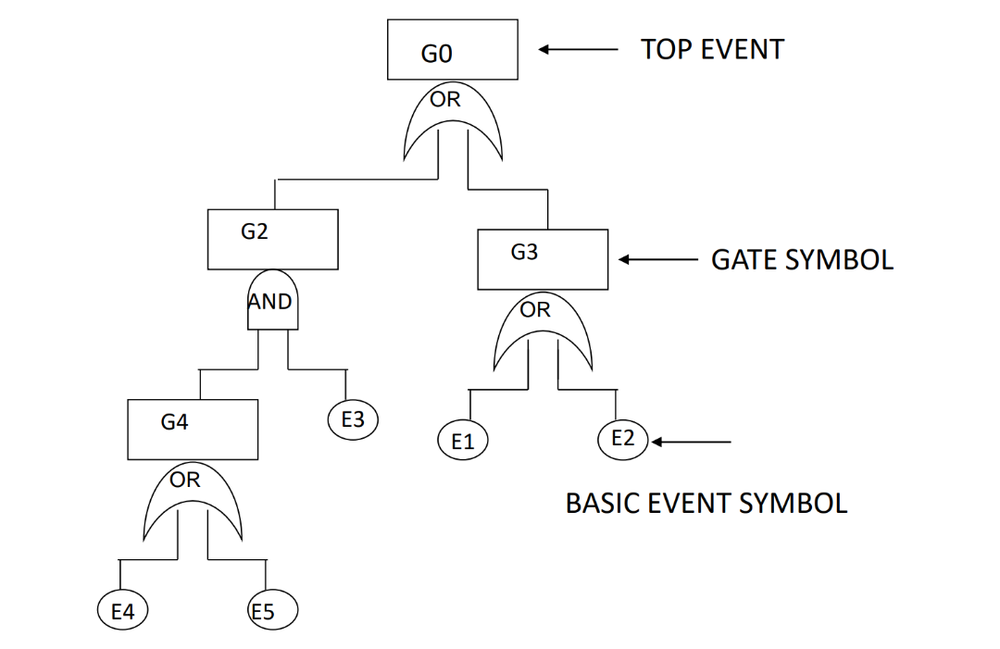

# Dependability Evaluation

## Introduction

As we stated in the previous chapters, faults cause errors and failures in the systems. however, these faults aren't unpredictable: their occurrences can be modeled trough the use of probability theory. Parameters such as the Mean Time To Failure (MTTF) and the Mean Time To Repair (MTTR) are, in fact, **random variables** that can be modeled through probability distributions.

### Definitions

- **Reliability $R(t)$** is a function of time, and it's the conditional probability that the system performs correctly trough the time interval $[0,t]$, given that the system was performing correctly at the the instant $t_0$. From the definitions, we can state that $R(0) = 1$ and $R(\infty) = 0$;
- **Unreliability $Q(t)$**, define as $Q(t) = 1 - R(t)$;
- **Availability $A(t)$** is a time function which represents the probability that the system is operating correctly and it's available to perform its functions at time $t$.
- **failure density function $f(t)$** represents the number of failures occurred in $\Delta t$. From a mathematical point of view, it's defined as $f(t) = \frac{dQ(t)}{dt}= \frac{-dR(t)}{dt}$;
- **failure rate function $\lambda(t)$**, defined by the number of failures during $\Delta t$ in relation to the number of correct components at time $t$, and we can write its equations in this way: $\lambda(t) = \frac{f(t)}{R(t)} = -\frac{dR(t)}{dt}\cdot\frac{1}{R(t)}$

### Hardware reliability

The hardware reliability is usually described using the **failure rate distribution**, that follows different behaviors depending on the lifetime of the components. An average behavior is the **bathtub curve**, which is divided into three phases:

{width=400px}

The **early life phase** is characterized by a high failure rate, due to the presence of **infant mortality**, caused by failures of weaker components (e.g. due to manufacturing defects). The **useful life phase** is characterized by a constant failure rate, which is the most common behavior of the components, and the failure rate is described as **failure every $x$ hours**  (e.g. $\lambda = \frac{1}{2000}$, which means a failure every 2000 hours). The **wear-out phase** is characterized by an increasing failure rate, due to the aging of the components and their usage.

Knowing that the failure rate is constant, we can easily get the reliability function:

$$\lambda(t) =  \lambda = \frac{f(t)}{R(t)}=-\frac{dR(t)}{dt}\cdot\frac{1}{R(t)} \rightarrow R(t) = e^{-\lambda t}$$

We can also recover the equation for the probability function:

$$f(t) = \frac{dQ(t)}{dt} = \frac{-dR(t)}{dt} = \lambda e^{-\lambda t}$$

> The exponential relation between reliability and time is known as **exponential failure law**.

### Time-to-failure of a component

The time-to-failure of a component is a random variable that can be modeled using a **random variable $X$**, defining:

- $F_X(t) = P(X \leq t)$ as the **cumulative distribution function** (CDF) of the random variable $X$, that represents the **unreliability** of the component;
- **reliability function**, defined as $R_X(t) = 1 - F_X(t) = P(X > t)$, and it represents the **probability to not observe failures before time $t$**.
- the **mean time to failure** (MTTF) is defined as $E[X] = \int_0^\infty tf(t)dt = \int_0^\infty t\lambda e^{-\lambda t}dt = \frac{1}{\lambda}$.

Taking as example a constant failure rate $\lambda = \frac{1}{2000}$, the MTTF is $2000$ hours: speaking in terms of probability, $\lambda$ means that we'll have $0.0005$ failures per hour, and the MTTF shows that the time needed for the first failure is $2000$ hours. A well-known unity is the **FIT** (Failure In Time), which is the number of failures in $10^9$ hours. All these data are usually available on handbooks and datasheets of the components.

### Distribution model for permanent faults

The **MIL-HDBK-217** is a standard that provides a model for the reliability of electronic components, and it's based on the **exponential failure law**. The model is based on the **constant failure rate** $\lambda$, and it's defined as:

$$\lambda = \tau_L\cdot \tau_Q\cdot (C_1\cdot \tau_V\cdot \tau_T + C_2\cdot \tau_E)$$

where:

- $\tau_L$ is the **learning factor**, based on the experience of the manufacturer;
- $\tau_Q$ is the **quality factor**, based on the quality of the components;
- $\tau_V$ is the **voltage factor**, based on the voltage applied to the component;
- $\tau_T$ is the **temperature factor**, based on the temperature of the ambient in which the component is placed, and the type of semiconductor;
- $\tau_E$ is the **environment factor**, based on the environment in which the component is placed;
- $C_1$ and $C_2$ are **complexity factors**, based on number of components and the complexity of the circuit.

$$\qquad$$

## Model-based dependability evaluation

A model is an **abstraction** of a real system, that highlights the most important aspects of the system that are going to be analyzed. Two main types of models are used in dependability evaluation:

- **Stochastic models**, that are based on probability theory and are used to model the behavior of the system in terms of **random variables**, such as Reliability Block Diagrams (RBDs) and Fault Trees (FTs);
- **State-space models**, that are based on the state of the system and are used to model the behavior of the system in terms of **states**, such as Markov Chains and Petri Nets.

In this chapter, we'll present the both types of models.

## Combinatorial (stochastic) models

These models offer simple and intuitive methods for the construction of the system model, and for their solution. It's fundamental to keep in mind some assumptions that will be used in the following sections:

- **Components are independent**: the failure of a component doesn't affect the failure of the others;
- each component has a **constant failure rate** $\lambda$;
- the system model is based on the actual structure of the system;

It's also importa to remember that these models aren't ideal when dealing with systems that shows complex dependencies among components, and for systems that are repairable.

### Series models

A simple schema for these systems is the following:

{width=400px}

The system is composed by $n$ components, and the system is working if all the components are working. The reliability of the system is the product of the reliability of the components.

Given $R_i(t)$ the reliability of the $i$-th component, the reliability of the system is:

$$R(t) = R_1(t)\cdot R_2(t)\cdot \ldots \cdot R_n(t) = \prod_{i=1}^n R_i(t)$$

If every component has a constant failure rate $\lambda$, the reliability of the system is:

$$R(t) = e^{-\lambda_1 t}\cdot e^{-\lambda_2 t}\cdot \ldots \cdot e^{-\lambda_n t} = e^{-(\lambda_1 + \lambda_2 + \ldots + \lambda_n)t} = e^{-\sum_{i=1}^n \lambda_i t}$$

The unreliability of the system is:

$$Q(t) = 1 - R(t) = 1 - \prod_{i=1}^n R_i(t) = 1 - \prod_{i=1}^n (1 - Q_i(t))$$

If the system doesn't contain any redundancy, and the components are independent, then:

- the **system reliability** is the product of the **component reliabilities**, and it's an **exponential function**;
- the **failure rate $\lambda$** of the system is the sum of the **failure rates $\lambda_i$** of the components.

### Parallel models

A simple schema for these systems is the following:

{width=400px}

The system is composed by $n$ components, and the system is working if at least one of the components is working.

The unreliability of the system is $Q(t) = \prod_{i=1}^n Q_i(t)$, and the reliability of the system is $R(t) = 1 - Q(t) = 1 - \prod_{i=1}^n Q_i(t) = 1 - \prod_{i=1}^n (1 - R_i(t))$.

We can generalize this system to a **M-of-N** system, in which the system is working if at least $M$ components are working. The reliability of these systems is:

$$R(t) = \sum_{i=M}^N \binom{N}{i} R_i(t)^{N-1} (1 - R_i(t))^{i}$$

If the system has redundancy, and if components are independent, then the **system reliability** is the **reliability** of a series/parallel combinatorial model.

### Example: TMR vs Simplex system

Take as example a simple system with only one component $s$, and a TMR system with three components. 

The component $s$ has a failure rate $\lambda$, with $R_s = e^{-\lambda t}$ which us also the reliability of the system.

In the TMR system, we assume the reliability of the voter $R_v(t) = 1$, and the reliability of the TMR is

$$R_{TMR} = \sum_{i=0}^1 \binom{3}{i}(e^{-\lambda t})^{3-i}(1-e^{-\lambda t})^i = (e^{-\lambda t})^3 + 3(e^{-\lambda t})^2(1-e^{-\lambda t})$$

So it's clear that the TMR system is more reliable than the simplex system, if $R_m > 0.5$.

The behavior of the reliability of these two systems is shown in the following graph:

{width=400px}

Focusing on the MTTF, we can get with ease that, for the simplex system, the MTTF is $\frac{1}{\lambda}$, while for the TMR system is $\frac{3}{2\lambda} - \frac{2}{3\lambda} = \frac{5}{6\lambda}$, which is lower than the MTTF of the simplex system.

In conclusion, we can state that:

- the **TMR system** is worst than the **simplex system** in terms of **MTTF**;
- the **TMR system** is better than the **simplex system** in terms of **reliability**, for the first 6000 hours;
- the **TMR system** with a reliability above $0.8$ lasts $66%$ longer than the **simplex system**.

{width=400px}

The *S-shaped* curve is typical of the **redundant systems**: above the **knee point**, the system is more reliable than the simplex system, while below the **knee point**, the system doesn't get any advantage from the redundancy.

### Non-series/parallel systems

Have a look at the following system:

{width=400px}

The system will operate correctly if exists a path from the input to the output that doesn't contain any faulty component. The reliability is computed expanding around one module $m$:

$$R_{sys} = R_B \cdot P(\text{system works} | B) + (1 - R_B) \cdot P(\text{system works} | \overline{B})$$

We can visualize this expansion trough the following figure:

{width=400px}

We can also parallelize the system, reaching the following schema where all the possible paths are in parallel:

{width=400px}

#### Upper bound of the system reliability

Then we define the **upper bound** as $R_{sys} \leq 1 - \prod_{i=1}^n (1-R_{\text{path i}})$; we cannot compute the exact value of the reliability of the system, because **paths are not independent**, meaning that the failure of a single module can affect the reliability of more than one path. The upper bound of the system we took as example is $R_{sys} \leq 1 - (1 - R_AR_BR_CR_D)\cdot(1 - R_AR_ER_D)\cdot(1-R_FR_CR_D)$

#### Lower bound of the system reliability

The **lower bound** is the **minimal cut set** of the system, which is the list of components such that the removal of any component from this set, will cause the system to change its state from working to failed.

In the example, the minimal cut sets are $\{D\}, \{A,F\}, \{E,C\},\{A,C\}, \{B,E,F\}$, and the lower bound can be computed as $R_{sys} \geq\prod_{i=1}^n R_{\text{cut set i}}$, which lead to $R_{sys} \geq (1-(1-R))\cdot(1-(1-R)^2)^3\cdot(1-(1-R)^3)$

## Fault Trees

Fault Trees are a graphical representation of the system, that shows the possible paths that lead to the failure of the system. The system is represented as a **root node**, which represents the **top event** in terms of status (e.g. system failure), and the **leaves** of the tree represent the **basic events** that can lead to the top event. The analysis of the tree is based on evaluating the **probability of occurrence of the top event**, in terms of the **probability of occurrence of the basic events**.

{width=400px}

### Logical gates

The basic events are connected through **logical gates**, that are used to combine the basic events in order to get the top event. The most common gates are:

- **AND gate**: the top event occurs if all the basic events occur;
- **OR gate**: the top event occurs if at least one of the basic events occurs;
- **K-of-N gate**: the top event occurs if at least $K$ of the $N$ basic events occur.

Conventionally, the logical value **true** corresponds to a **failure**, while the logical value **false** corresponds to a **success**: the system is working if the top event is **false**, otherwise the system is failed.