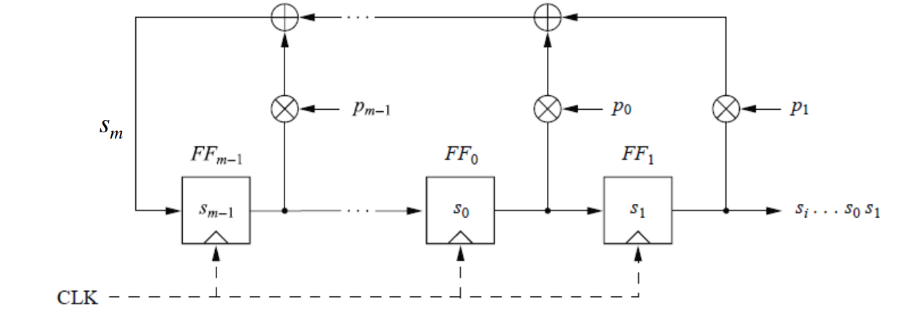
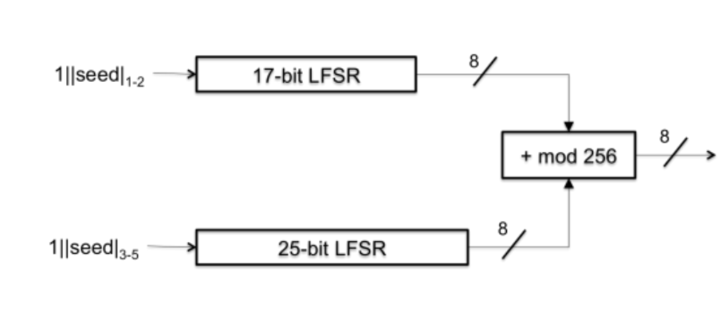
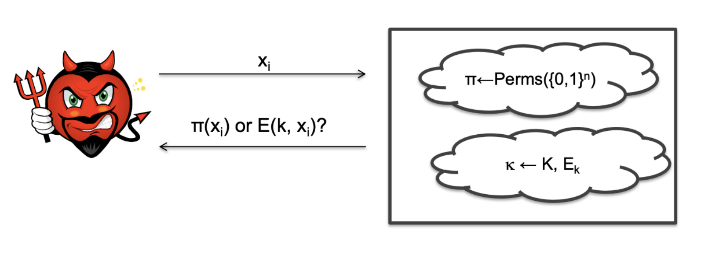

# Introduction

## Outline of the course

1.  Applied cryptography
    -   Definition **security**
    -   Crypto-primitives: hoe they work and how to use them
    -   Identification and authentication protocols
    -   Case studies
    -   Programming secure applications
2.  Hands-on labs and challenges

# Introduction to applied cryptography

Cryptography, or the art of secret writing, has been around for
thousands of years, and get more and more important in our digital
world, because of the need of secure communication and data protection
in every aspect of our lives, such as online banking, e-commerce,
e-mail, and social media, given the inevitable presence of malicious
actors.

These malicious actors are often referred to as adversaries: they are
**intelligent** users, with an *objective*, and lot of **resource** and
**abilities**. This leads to an unfair competition between the
adversaries and the defenders, also called the security engineers: the
latter have to protect a system against all possible attacks, having in
mind the usage and performance of the system, and this will be our role
in this course.

Luckily, we don't have to reinvent the wheel: we can use tools and
techniques that have been developed by cryptographers and security
engineers over the years, and we talk about **applied cryptography**
because of this very fact.

Remember these facts:

-   Cryptography is a **useful** tool, but it is not a **silver
    bullet**.
-   Cryptography is the basis of **security**, but it's not the solution
    to all security problems, and it's not reliable if not used
    properly.

## Symmetric Encryption

Let's give some context to the usage of cryptography in the real world.

In the figure above, we have two main actors: Alice and Bob. They want
to communicate securely, but they are afraid of the presence of an
eavesdropper.

To allow a secure communication, we can use a model, defining the
following elements:

-   **Plaintext *x***: the original message that Alice wants to send to
    Bob;
-   **Ciphertext *y***: the encrypted message that Alice sends to Bob;
-   **Key *k***: a shared secret between Alice and Bob, that is used to
    encrypt and decrypt the message;
-   **Encryption function *E***: a function that takes the plaintext and
    the key, and returns the ciphertext;
-   **Decryption function *D***: a function that takes the ciphertext
    and the key, and returns the plaintext;
-   **Network**: the insecure communication channel between Alice and
    Bob.

Note that the encryption and decryption functions are publicly known,
and the only secret is the key.

### The cipher

We define as **cipher** the triple (*K*, *P*, *C*) of efficient
algorithms (*Gen*, *Enc*, *Dec*) such that:

-   *Gen* is a algorithm $Z^+ \rightarrow K$ that outputs a key;
-   *Enc* is a algorithm $P \times K \rightarrow C$ that takes a key and
    a plaintext, and returns a ciphertext. An equivalent notations are
    $Enc(k, x)$, $E(k, x)$, or $E_k(x)$;
-   *Dec* is a algorithm $C \times K \rightarrow P$ that takes a key and
    a ciphertext, and returns a plaintext. An equivalent notations are
    $Dec(k, y)$, $D(k, y)$, or $D_k(y)$.

Cipher **properties** are also important, and the main ones are:

-   **Correctness**: for every key $k$ and every plaintext $p$, it holds
    that $D(k, E(k, x)) = p$;
-   **Security**: for every key $k \in K$, and for every encrypted
    $c \in C$, it's computationally infeasible to find both a plaintext
    $p$ such that $E(k, p) = c$, without knowing $k$, and the key $k$
    itself.

#### Example: mono-alphabetic substitution

A simple example of a cipher is the **mono-alphabetic substitution**,
where each letter of the alphabet is replaced by another letter, and the
key is the mapping between the original and the substituted letters. The
encryption algorithm is implemented by substituting each letter of the
plaintext with the corresponding letter of the key, and the decryption
algorithm is implemented by substituting each letter of the ciphertext
with the corresponding letter of the inverse key. To break this cipher,
we can think of a brute-force attack, where we try all the possible
keys, but this is not feasible because of the large number of possible
keys, which is $26! \approx 4 \times 10^[26]$. However, despite the
large number of possible keys, the mono-alphabetic substitution is not
secure, because of the frequency analysis attack, which is based on the
fact that some letters are more frequent than others in a language, and
this can be used to guess the key. From this example, we can see that
the security of a cipher is not only based on the number of possible
keys, but also on the structure of the cipher, and the security of the
key: good ciphers sould hide statistical properties of the plaintext,
and their security mustn't rely on the dimensions of the key space.

### Attacks overview

When we talk about the attack complexity, we refer to the number of
operations that an adversary has to perform to break a cipher, and we
can distinguish between three main types of attacks:

-   **Ciphertext-only attack**: the adversary has access to a set of
    ciphertexts, and he has to find the plaintexts. This is the weakest
    type of attack, and it's often based on the frequency analysis, or
    on the knowledge of the structure of the plaintext;
-   **Known-plaintext attack**: the adversary has access to a set of
    plaintext-ciphertext pairs, and he has to find the key. This is a
    stronger type of attack, and it's often based on the knowledge of
    the structure of the cipher;
-   **Chosen-plaintext attack**: the adversary has access to a set of
    plaintexts, and he has to find the key. This is the strongest type
    of attack, and it's often based on the knowledge of the structure of
    the cipher, and on the ability to choose the plaintexts. We can
    easily see that if a cipher is secure against chosen-plaintext
    attacks, then it's also secure against known-plaintext attacks and
    ciphertext-only attacks.

#### Kerckhoffs' principle

The security of a cipher must rely only on the secrecy of the key, and
not on the secrecy of the algorithm. This principle was formulated by
Auguste Kerckhoffs in the 19th century, and it's still valid today,
because it allows the public scrutiny of the algorithms, and it allows
the development of secure ciphers, even if the adversary knows the
algorithm. This because is **easier** to keep a small key secret, than a
large algorithm secret: in case of a leak, changing the key is easier
(and cheaper) than changing the algorithm.

#### Security trough obscurity

The opposite of Kerckhoffs' principle is the **security trough
obscurity**, which is the reliance on the secrecy of the algorithm, and
it's a bad practice, because it's not reliable, and it's not a good
security measure. This is because the adversary can reverse-engineer the
algorithm, and find the key, and because the algorithm can be leaked,
and the security of the system is compromised. This has been proved over
the year: GSM/A1 were disclosed by mistake, Enigma was broken by
intelligence, and the DVD encryption was broken by reverse-engineering.

## Perfect cipher

In the hypothesis such that attacker isn't able to recover both some
plaintext and the key, a powerful intuition is, regardless of any *a
priori* knowledge, the ciphertext shouldn't reveal any information about
the plaintext.

### A probabilistic view

Let a message $M$ be a random variable, with a probability distribution
$P_M$ such that $P[M = "attack today"] = 0.7$ and \$P\[M =
$"don't attack"$\] = 0.3\$ knew *a priori* by the attacker, and let
*Gen()* a probability distribution over the keys such that
$P[K = "key1"] = P[k \leftarrow$ Gen()$]$, with $M$ and $K$ independent.
To generate the ciphertext, we can use the following algorithm:

1.  choose a message $m$ according to $P[M]$;
2.  generate the key $k$ according to $P[K]$;
3.  compute the ciphertext $c = E(k, m)$.

### Definition of a perfect cipher

It's clear that the ciphertext $c$ is a random variable $C$, defined by
the encryption function $E$, so we can formalize the concept of
*information about plaintext* in terms of probability distributions. A
cipher is said to be **perfect** if the ciphertext $C$ is independent of
the plaintext $M$: $P[M = m | C = c] = P[M = m]\forall m, c$. This means
that the attacker can't learn anything about the plaintext by observing
the ciphertext. If a cipher is perfect, it's said that it's **perfectly
secure**, and the necessary conditions for a cipher to be perfectly
secure are that the key must be chosen uniformly at random, and that the
key space must be at least as large as the message space, as stated by
Shannon's theorem.

### Shannon's theorem

In a perfect cipher, the key space must be at least as large as the
message space. Speaking on mathematical terms, $|K| \geq |M|$. We can
prove this by contradiction:

1.  suppose that $|K| < |M|$, which is the contradiction;
2.  from the previous point, it must be true that $|C| \geq |M|$,
    because the cipher must be invertible;
3.  combining the two previous points, we have that $|C| > |K|$;
4.  now select $m \in M$ such that $P[M = m] > 0$, and $c \in C$ such
    that $E(k_i, m) = c \forall k_i in K$;
5.  because of point 5, must exists al least one $c$ such that
    $c \not ={c_i}$;
6.  therefore, $P[C = c | M = m] = 0$, that is a contradiction because
    the cipher is perfect, so holds that
    $P[M = m | C = c] = P[M = m] > 0$.

### Perfect indistinguishably

An encryption scheme $\prod = (G,E,D)$ over $(K,M,C)$ is said to be
**perfectly indistinguishable** if:

-   $\forall m_1 \text{, } m_2 \in M \text{, } |m_1| = |m_2|$;
-   $k \leftarrow$ Gen() is chosen uniformly at random;
-   $\forall c \in C$, $P[E(k, m_1) = c] = P[E(k, m_2) = c]$.

This means that the attacker can't distinguish between two plaintexts by
observing the ciphertexts: it's also true that $\prod$ is perfectly
indistinguishable if and only if it's perfectly secure.

## One-time pad

The one-time pad is a perfectly secure cipher, and it's based on the
following assumptions:

-   let $x$ be a t-bit message, i.e. $x \in \{0,1\}^t$;
-   let $k$ be a t-bit key, i.e. $k \in \{0,1\}^t$, where each bit is
    chosen uniformly at random;

The encryption function $E(k, x)$ is defined as the bitwise XOR between
the message and the key, and the decryption function $D(k, y)$ is
defined as the bitwise XOR between the ciphertext and the key.

### Proof for XOR cipher

Let $X$ a random variable over $\{0,1\}^t$, and $K$ a random variable
over $\{0,1\}^t$, with $X$ and $K$ independent. Then, define
$Y = X \oplus K$, where $\oplus$ is the bitwise XOR. We want to prove
that $Y$ is uniformly distributed over $\{0,1\}^t$. The proof, for
$t = 1$, is the following:

-   $P[X = 0] = X_0, P[X = 1] = X_1$, such that $X_0 + X_1 = 1$;
-   $P[K = 0] = K_0, P[K = 1] = K_1$, such that $K_0 + K_1 = 1$;
-   $P[Y = 0] = P[X = 0, K = 0] + P[X = 1, K = 1] =\\= P[X = 0]P[K = 0] + P[X = 1]P[K = 1] =\\= X_0K_0 + X_1K_1$
    = $X_0\cdot 0.5 + X_1\cdot 0.5 =\\= 0.5 \cdot (X_0 + X_1) = 0.5$.

### One-time pad has a perfect secrecy

The proof for the one-time pad is the following:

1.  from **Bayes' theorem**, we have that
    $P[M = m | C = c] = \frac{P[C = c | M = m]P[M = m]}{P[C = c]}$;
2.  from **Total probability theorem**, we have that
    $P[C = c] = \\ \sum_{i}^{|M|} P[C = c | M = m_i]P[M = m_i] = \sum_{i}^{|M|} P[K = c \oplus m_i]P[M = m_i] =\\= \sum_{i}^{|M|} \frac{1}{2^t}P[M = m_i] = \frac{1}{2^t}$;
3.  substituting the previous point in the first one, we have that
    $P[M = m | C = c] = \\ P[K = c \oplus m] \frac{P[M = m]}{2^t} = 2^{-t} \frac{P[M = m]}{2^t} = P[M = m]$.

### One-time pad: pros and cons

The one-time pad has some pros:

-   it's perfectly secure;
-   it's simple and efficient;
-   only one key maps a message $m$ to a ciphertext $c$.

On the other hand, it has some cons:

-   the key must be as long as the message, so it's almost impossible to
    use it in practice;
-   keys must be used only once, so they must be shared in advance, and
    this is not always possible;
-   a known-plaintext attack is possible, because the key can be
    recovered by XORing the plaintext and the ciphertext.

### One time pad malleability

A crypto scheme is said to be **malleable** if it's possible to modify
the ciphertext in such a way that the resulting plaintext is related to
the original plaintext. The one-time pad is malleable, because if we XOR
the ciphertext with a message, we obtain a new ciphertext that decrypts
to a message related to the original message. A pratical example is the
following:

-   suppose that Alice sends a message $c = p \oplus k$ to Bob, and Eve
    intercepts the message;
-   Eve can modify the message by XORing it with another message $m$,
    and send the new message $c' = c \oplus r$ to Bob, where r is a
    *perturbation*;
-   Bob now receives the message $c'$, and decrypts it to obtain \\
    $p' = c' \oplus k = c \oplus r \oplus k = p \oplus k \oplus r \oplus k = p \oplus r$.

The perturbation goes unnoticed, and can have a significant impact on
the plaintext.

## Stream ciphers

The one-time pad is a stream cipher, and it's based on the concept of a
**keystream**: a sequence of bits that is used to encrypt the message.
The keystream is generated by a **keystream generator**, which is a
function that takes a key and a nonce, and returns the keystream. The
keystream is then XORed with the message to obtain the ciphertext, and
the same keystream is then XORed with the ciphertext to obtain the
message. The keystream generator must be a **pseudo-random generator**,
which is a function that takes a seed and returns a sequence of bits
that is indistinguishable from a truly random sequence of bits. The
keystream generator must also be **deterministic**, which means that the
same seed must always produce the same sequence of bits.

When we refer to a **pseudo-random generator**, we mean:

> a deterministic algorithm that, given a truly random binary sequence
> of length $k$, called the **seed**, produces a binary sequence of
> length $n$, called the **output**, such that the output is
> indistinguishable from a truly random sequence of length $n$.

If a pseudo-random generator has these two main properties:

-   it's **computationally secure**, which means that it must be
    computationally infeasible to distinguish the output from a truly
    random sequence;
-   it's **unpredictable**.

then is called **cryptographically secure pseudo-random generator**.
Formally, we can say that given a sequence of bit $s_i$, $s_{i+1}$,
$s_{i+2}$, ..., $s_{i+n-1}$, it's computationally infeasible to predict
$s_{i+n+1}$ or, in other words, doesn't exist an algorithm that can
predict the next bit of the sequence with a probability greater than
$0.5$.

### Case study: 802.11 WEP

The Wired Equivalent Privacy (WEP) is a security protocol for wireless
networks, and it's based on the RC4 stream cipher. Its structure is the
following:

The key length is fixed to 104 bits, and the IV length is fixed to 24
bits; it can be settled with a counter, or with a random number. The IV
is concatenated with the key, and the result is used as the seed for the
keystream generator. The keystream is then XORed with the message to
obtain the ciphertext, and the same keystream is then XORed with the
ciphertext to obtain the message. During the years, WEP has been proved
to be insecure, because of the following reasons:

-   the **key is too short** and can be used more than once, and this
    can lead to the recovery of the key. In particular, it's possible to
    recover the value of $K$ in about $40'000$ frames.
-   the **repetition of the IV** after $2^{24}$ frames, and this can
    lead to the recovery of the keystream.
-   **CRC**, used to check the integrity of the message and chosen for
    its execution speed, is not secure and can be easily forged.

### Case study: Linear Feedback Shift Register

The LFSR is a pseudo-random generator, and it's used in many
applications, such as the generation of pseudo-random numbers, the
generation of keystreams, and the generation of test patterns for
digital circuits. First of all, let's introduce the scheme of a Linear
Feedback Shift Register:

The crucial parts of the scheme are the **feedback coefficients**: those
are bits that, if settled to 1, enable the feedback mechanism. The
feedback is implemented through a multiplication between the feedback
coefficients and the bits of the register, and the result is then XORed
to obtain the next bit of the register; trying to compute some steps we
can easily get that
$s_{i+m} = \sum {j=0} {m-1} p_js_{i+j} \text{ mod } 2$, where $p_j$ are
the feedback coefficients.

#### Properties of LFSR

The system is **periodic**, and the period is at most $2^m - 1$, where
$m$ is the length of the register, and that property is called
**maximum-length LSFR**. $m$ is also the **degree** of the LSFR, and we
call **seed** the initial state of the register, that can assume any
value except the all-zero value.

This generator has good statistical properties, but on the other hand,
it's not secure as a result of the following observation: it's
**linear** and **periodic** because of its own construction, means that
is **predictable**.

#### Attack against LFSR

It's possible to perform a Known-Plaintext Attack against the LFSR:

1.  given $2m$ pairs $(p, c)$, where $p$ is the plaintext and $c$ is the
    ciphertext, the adversary can determines the prefix of the sequence
    $s_i$;
2.  then, the adversary can determines the feedback coefficients,
    resolving a system of $m$ equations with $m$ unknowns;
3.  finally, the adversary can build the entire LSFR and produces the
    entire sequence.

#### How to use LFSR correctly

A good strategy to use LSFR is to use a non-linear combination of
several LSFRs, such as an AND operation between the outputs of two
LSFRs.

### CSS: Content Scrambling System

The Content Scrambling System is a cryptographic system used to protect
digital video discs: it's a pseudo-random generator that use this
structure:

The output is a keystream, combined with the plaintext with an OR
operation, and it takes as input 5 bytes from two different LSFR. Each
round is composed by 8 clock cycles, in which each LFSR produces 8 bit,
modded by 256.

#### Attack against CSS

This generator is breakable in $2^{17}$ steps with a Known-Plaintext
Attack: this is possible knowing the format of the media content that
has been encrypted, which has an known initial sequence. In this way, a
prefix of the keystream can be computed; let's see how.

For all possible setting of an LFSR-17, we have to:

1.  run the LFSR-17 to get 20 bytes in output;
2.  subtract LFSR-17$_{1-20}$ from the keystream$_{1-20}$, to obtain a
    possible output for LFSR-25$_{1-20}$;
    -   if it's consistent with the known plaintext, we have found the
        initial setting for both LFSR-17 and LFSR-25, and the keystream
        can be computed.
    -   otherwise, we have to try with another setting.

Using the initial state, we can compute the entire keystream in at most
$2^{17}$ steps, which is dramatically lower than the $2^{40}$ steps that
would be required to break the system with a brute-force attack.

## Random bit generator

By definition: \> a **random bit generator** is a device/algorithm that
*outputs a sequence of statistically independent and unbiased bits*.

With **statistically independent** we mean that the probability of a bit
doesn't depend on the previous bits, and with **unbiased** we mean that
the probability of a bit is $0.5$. The main problem is that it's
impossible to build a random bit generator, because it's impossible to
build a device/algorithm that is statistically independent and unbiased.
However, we can build a **pseudo-random bit generator**, which is a
device/algorithm that *outputs a sequence of bits that is
indistinguishable from a truly random sequence of bits*. These generator
can be used to generate **uniformly distributed** numbers, composed by
bits: given an interval $[0, n]$, we can generate a bit sequence of
length $\lfloor \log_2(n) \rfloor+ 1$, and convert it to an integer.

There are three classes of RGB:

-   **true random bit generator**, (TRBG);
-   **pseudo-random bit generator**, (PRBG);
-   **cryptographically secure pseudo-random bit generator**, (CSPRBG).

### True random bit generator

This category of generators is based on physical processes, such as
radioactive decay, thermal noise, and chaotic systems, such that the
probability to reproduce the same sequence is negligible; they can be
**hardware** or **software** based.

#### Hardware TRBG

They are based on physical processes, but it's possible that they can be
influenced by external factors, or malfunctions: for this reason it's
important to periodically test these generators, to check they're not
biased, or having non correlated bits. De-skewing is a common technique
to reduce the bias of the output: a common practice is to pass the
sequence through a cryptographic hash function, to reduce the bias.

Another technique is to **group** bits into pairs: given $p$ the
probability of a bit to be $1$, and $1-p$ the probability of a bit to be
$0$, we can group bits into pairs, and then apply the following
operation:

-   if the pair is $00$ or $11$, discard it;
-   if the pair is $01$, output $0$, with probability $P[1] = p(1-p)$;
-   if the pair is $10$, output $1$, with probability $P[0] = p(1-p)$.

This operation ensures both that the output is unbiased, and that the
bits are independent, as we can see from the computed probabilities.

#### Software TRBG

An example of a software TRBG is the **/dev/random** device in Unix-like
systems, which is based on an **entropy pool**, which contains a certain
number of sources of randomness, such as keyboard and mouse events, and
network traffic. The entropy pool is then used to generate random
numbers, and it's periodically replenished with new sources of
randomness. The **/dev/urandom** device is similar to the
**/dev/random** device, but it doesn't block when the entropy pool is
empty, and it uses a pseudo-random generator to generate random numbers.

Having multiple sources of randomness is important, because we're able
to reduce the risk of observation and/or manipulation of the sources by
an adversary.

### Pseudo-random bit generator

We can give a precise definition of a PRBG:

> a **pseudo-random bit generator** is a deterministic algorithm that,
> given a seed of length $k$, outputs a sequence of bits of length $l$,
> with $l \gg k$ that is indistinguishable from a truly random sequence
> of bits.

From the **security** point of view, we can say that a *small* seed is
expanded into a *large(r)* pesudo-random sequence, such that an
adversary can't distinguish the output from a truly random sequence, and
can't predict the next bit of the sequence with a probability greater
than $0.5$; furthermore, the seed must be sufficiently large, such that
it's infeasible to search over the entire seed space.

To measure the properties of a PRBG, we can use the **statistical
tests**, such as the **frequency test**; in general it's also true that
*the more the random string is compressible, the more it's predictable*.

#### Linear Congruential Generator

The Linear Congruential Generator is a simple PRBG, where $s_0$ is the
**seed**, $s_{i+1} = (a \cdot s_i + b) \mod m$, where $a$, $b$, and $m$
are constants, and $s_i$ is the $i$-th bit of the sequence.

An unfortunate property of the LCG is that the output is
**predictable**,: knowing a prefix $s_r$, $s_{r+1}$, $s_{r+2}$, it's
possible to easy define a linear system of two equations with two
unknowns, and solve it to obtain the next bit of the sequence. This is a
consequence of the fact that the LCG is **linear**, and this is a common
problem of many PRBGs, and for this very reason, it's not suitable for
cryptographic applications.

# Block ciphers

BLock ciphers are the most used type of encryption. The intuition is
simple: we take the entire block of data, and we split it into smaller
blocks with fixed length, and we encrypt each block separately. The
length is fixed by the chosen algorithm, like the encryption and
decryption functions. In general, we can say that:

-   $E_k: \{0,1\}^n \rightarrow \{0,1\}^n$, and outputs, in fact, a
    keyed permutation of the input. It should be **efficient**,
    **bijective** and **invertible**.
-   $D_k: \{0,1\}^n \rightarrow \{0,1\}^n$.

## True random ciphers

Given the fact that, given $n$ the length of the block, there are $2^n!$
possible permutations, a true random cipher should implement all of
them: this is impossible, because the size of the key would be
$\log_2(2n!) \approx (n-1.44)\cdot2^n$, which is exponential in $n$;
given also the fact that the block size cannot be small, in order to
**avoid dictionary attacks** (common values of $n$ are 64 or 128), we
conclude that a true random cipher is impossible to be implemented.

## Pseudo-random permutation

Considering a family of permutation $k \in K = {0,1}^k$,
$E_k : {0,1}^n \rightarrow {0,1}^n$ is a pseudo-random permutation if
it's indistinguishable from a true random permutation, given a random
key $k$. The number of possible pseudo-random permutations is $2^{k}$,
and it's the practical instance of a true random permutation.

### Practical block ciphers

In real life applications, we intend Indistinguishability as the
capacity of the encryption function to choose a key in a way that
appears to be random to an adversary, that is able to perform a
**exaustive search** on the key space.

{width="500px"}

Let assume that the adversary has access to an encryption oracle, so
they cannot look into the box, but only submit an input and get the
relative output. The box, which is our algorithm that choose the
permutation, is considerate secure if the adversary cannot guess which
permutation has bee used with a probability larger that $0.5$. Thus, the
output of a block cipher is a uniform random variable, no efficient
analytical attack is possible.

#### Brute force attack - Exhaustive search

This is a known-plaintext attack, where the adversary has access to a
set of plaintext-ciphertext pairs. Given one of these pairs, check
whether the plaintext is the correct one, by trying all the possible
keys. The complexity of this attack is $2^k$, where $k$ is the length of
the key.

#### False positive

The attack also have to deal with **false positives**: given a pair of
plaintext-ciphertext, such that the ciphertext is the result of the
encryption of the plaintext for a given key, we have to determines the
number of keys that map the plaintext into the ciphertext. This can be
calculated considering that
$P[k] = P[E_{k^*}(\text{plaintext}) = \text{ciphertext}] = 2^{-n}$,
where $k^*$ is the correct key, so the number of keys that map the
plaintext into the ciphertext is $2^k \cdot 2^{-n} = 2^{k-n}$.
