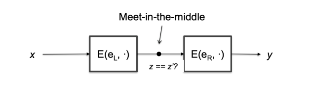
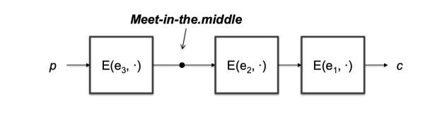

# Block ciphers

BLock ciphers are the most used type of encryption. The intuition is simple: we take the entire block of data, and we split it into smaller blocks with fixed length, and we encrypt each block separately. The length is fixed by the chosen algorithm, like the encryption and decryption functions. In general, we can say that:

- $E_k: \{0,1\}^n \rightarrow \{0,1\}^n$, and outputs, in fact, a keyed permutation of the input. It should be **efficient**, **bijective** and **invertible**.
- $D_k: \{0,1\}^n \rightarrow \{0,1\}^n$.

## True random ciphers

Given the fact that, given $n$ the length of the block, there are $2^n!$ possible permutations, a true random cipher should implement all of them: this is impossible, because the size of the key would be $\log_2(2n!) \approx (n-1.44)\cdot2^n$, which is exponential in $n$; given also the fact that the block size cannot be small, in order to **avoid dictionary attacks** (common values of $n$ are 64 or 128), we conclude that a true random cipher is impossible to be implemented.

## Pseudo-random permutation

Considering a family of permutation $k \in K = {0,1}^k$, $E_k : {0,1}^n \rightarrow {0,1}^n$ is a pseudo-random permutation if it's indistinguishable from a true random permutation, given a random key $k$. The number of possible pseudo-random permutations is $2^{k}$, and it's the practical instance of a true random permutation.

### Practical block ciphers

In real life applications, we intend Indistinguishability as the capacity of the encryption function to choose a key in a way that appears to be random to an adversary, that is able to perform a **exaustive search** on the key space.

{ width=500px}

Let assume that the adversary has access to an encryption oracle, so they cannot look into the box, but only submit an input and get the relative output. The box, which is our algorithm that choose the permutation, is considerate secure if the adversary cannot guess which permutation has bee used with a probability larger that $0.5$. Thus, the output of a block cipher is a uniform random variable, no efficient analytical attack
is possible.

#### Brute force attack - Exhaustive search

This is a known-plaintext attack, where the adversary has access to a set of plaintext-ciphertext pairs. Given one of these pairs, check whether the plaintext is the correct one, by trying all the possible keys. The complexity of this attack is $2^k$, where $k$ is the length of the key.

#### False positive

The attack also have to deal with **false positives**: given a pair of plaintext-ciphertext, such that the ciphertext is the result of the encryption of the plaintext for a given key, we have to determines the number of keys that map the plaintext into the ciphertext. This can be calculated considering that $P[k] = P[E_{k^*}(\text{plaintext}) = \text{ciphertext}] = 2^{-n}$, where $k^*$ is the correct key, so the number of keys that map the plaintext into the ciphertext is $2^k \cdot 2^{-n} = 2^{k-n}$. In generalo, two pairs of plaintext-ciphertext are enough to perform an exhaustive search.

## Multiple encryption

In 1981 a challenge was issued in order to find an efficient algorithm to recover DES keys, knowing a prefix of the plaintext: in fact no efficient way has been found, but become clear that a brute force attack could be performed, given the small space of keys. In 1992 as exhaustive search was made in 3 months, but nowadays it's possible to perform it in a few days, showing the need to ensure better security, and this lead to the concept of **multiple encryption**.

### Double DES

We encrypt the plaintext twice, using the same algorithm: $y = 2E((e_L, e_R), x) = E(e_L, E(e_R, x))$, with $x$ and $y$ as plaintext and ciphertext, and $e_L$ and $e_R$ as the keys. The time to perform an encryption doubled, but the security doesn't show an improvement, due to a **meet-in-the-middle attack**. This attack is, in fact, a known-plaintext attack, where the adversary has access to a set of plaintext-ciphertext pairs, and it's performed in these steps:

- build a table $T$ containing $z = E(e_L, x)$ for all $e_L$ and $x$;
- check whether $z' = D(e_R, y)$ is in $T$: if we found a match, then we can map $x$ into $y$ with $e_L$ such that $T[e_L] = z'$

{width=500px}

For what concerns the complexity of this attack, we have to consider:

- **data complexity**: it's negligible, because few pairs of plaintext-ciphertext are enough to perform the attack, considering a negligible probability of false positives;
- **space complexity**: it's $2^k$, because we have to store all the possible values of $z$;
- **time complexity**: it's the sum to build and sort the table, and then the time to search for a match, so it's approximately  $2^k + 2^k = 2^k$.

As we can see, the double encryption doesn't improve the security, because the time complexity is the same of a single encryption.

### Triple DES

The encryption scheme is $y = 3E((e_1, e_2, e_3), x) = E(e_1, D(e_2, E(e_3, x)))$: note that if $e_1 = e_2 = e_3$, then we're back to single DES, which is good for backward compatibility. The time needed to perform an encryption is tripled respect to the single DES, but performing a meet-in-the-middle attack is not feasible: the time complexity is $2^{118}$, because we have to try two keys on one side, which is $2^{2k}$

{width=500px}

Summarizing, 3DES is still used, even if slower than DES, because it's more secure, but we have some withdrawals:

- there isn't an efficient software implementation;
- it has short block size(64-bit), which is a drawback if you want to make a hash function with 3DES;
- keys longer than 256 bit are necessary, in order to let the algorithm secure against quantum computers computation.

### 4DES and 5DES

Using the same reasoning, we can define 4DES and 5DES, but we can observe that 4DES don't increase the security respect to 3DES, because the time complexity of a meet-in-the-middle attack is the same, and 5DES has a non negligible encryption time, and it's not used in practice.