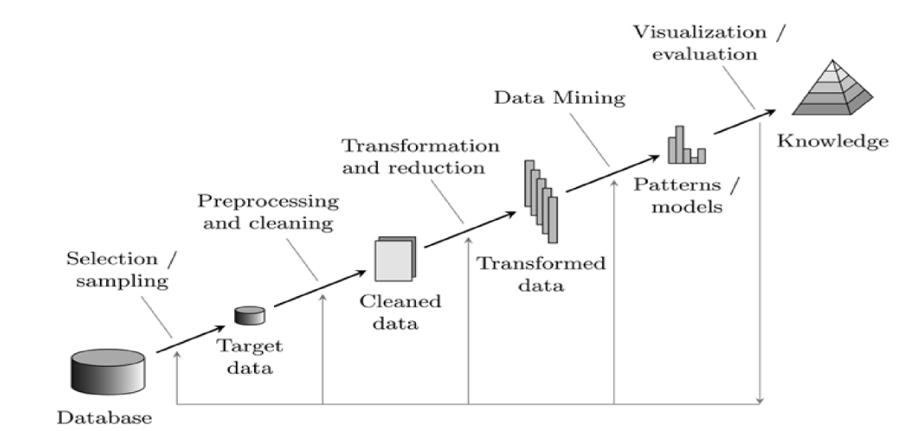
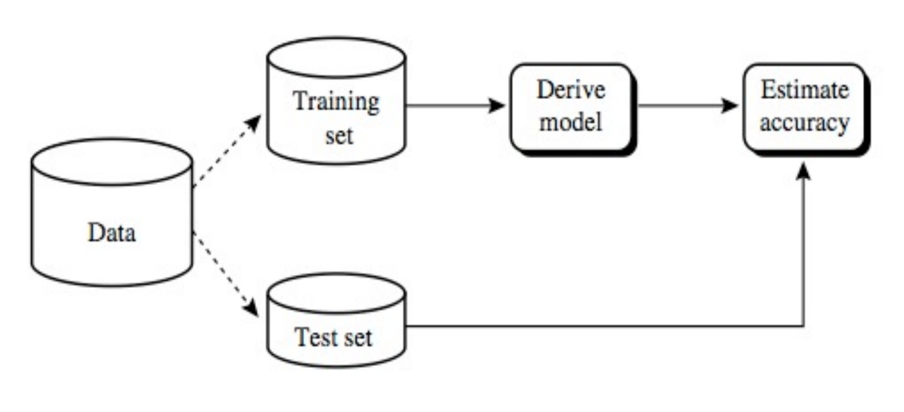
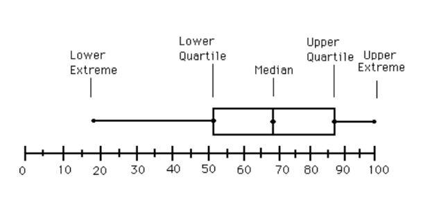
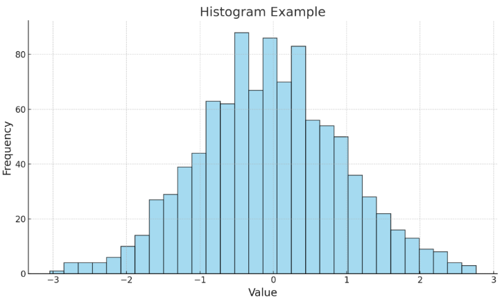
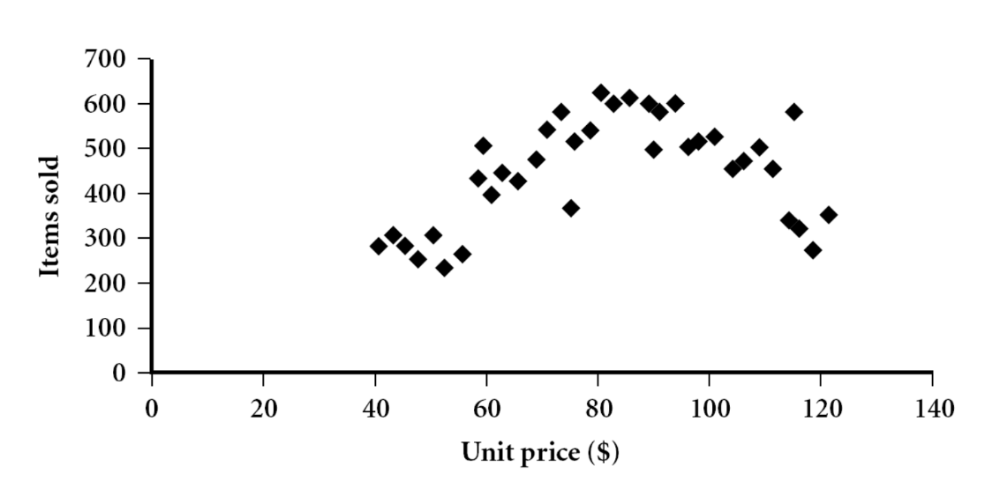
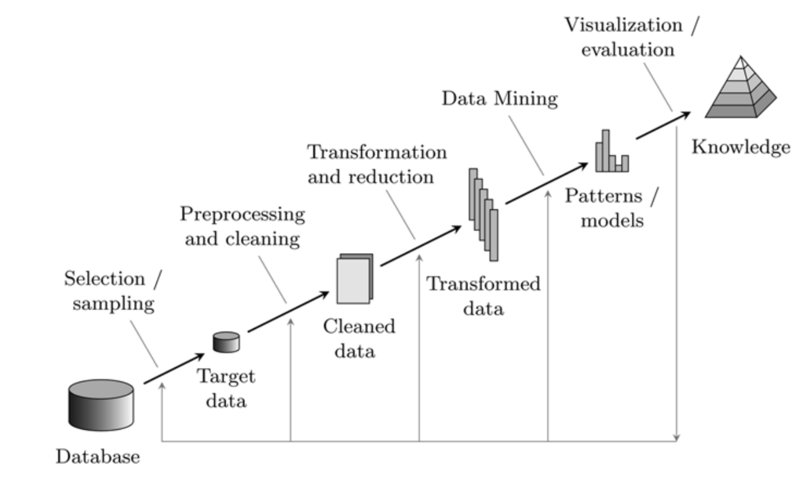
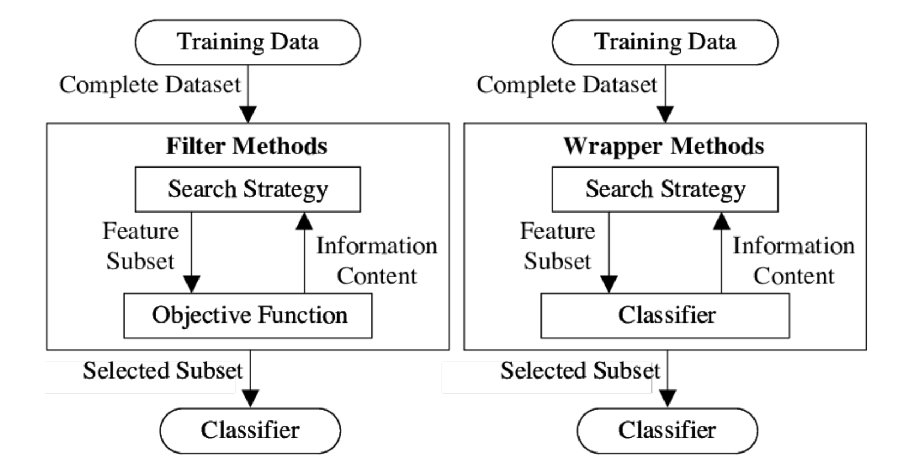
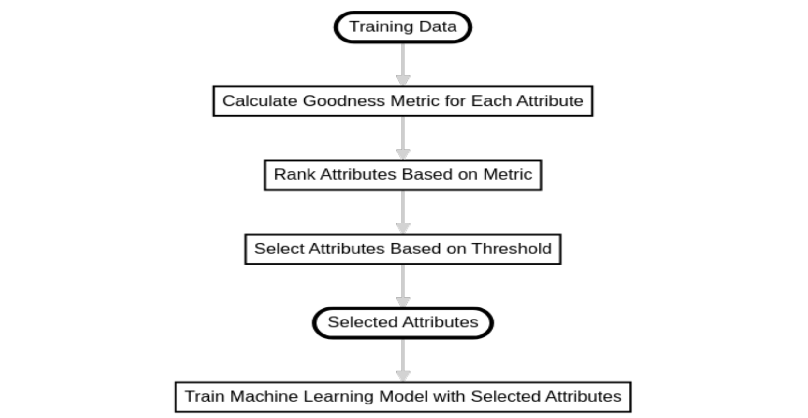
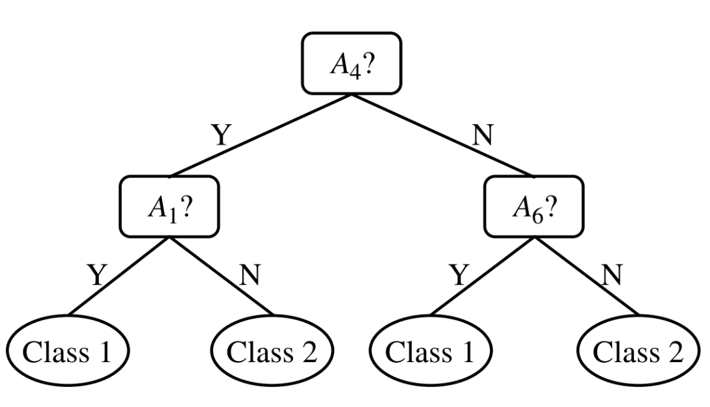

# Introduction to Models and Data

## Introduction

When we talk about Artificial Intelligence, we're talking about
**building a model**, starting from the available data, that provides
some **knowledge** about the world: this knowledge must be **readable**,
**interpretable** and **tangible**, with a practical use in various
fields. Each IA algorithm on the following operational pillars:

-   **exploration**;
-   **modeling**,
-   **evaluation**.

### Exploration

In this first step, data are crucial, serving as the main focus of the
algorithm to begin its analysis and the **hypothesis generation**. The
data, stored in databases, represent the reality, and the effectiveness
of the AI algorithm is based on the ability to **utilize data**, to
inform strategic decision trough a process called **business
intelligence**. Obviously, to have an effective algorithm, we require
data that are logically consistent with themselves, and that are
**representative** of the reality: to achieve that, a good strategy
could be to gather data from different sources; this could be
challenging, but it's a necessary step to have a good model. Lastly,
it's crucial to understand how to **leverage data**, both for validation
and the testing phases of the model.

### Modeling

In this phase, the figure of the **knowledge engineer** appears: it has
a good understanding of the data, the principles over them and their
defining parameters. The aim of this phase is to **estimate** the
parameters of the model, using statistics and machine learning
techniques. It' also important to **define the model**: based on the
goal of the analysis, different possibilities are available.

#### Descriptive models

These models are typically identified by **clustering** and
**association rules mining** algorithms; they're used to **describe the
organizational structure and the data distribution**, and the main goal
is a **deeper understanding** of the data and its knowledge.

#### Predictive models

These models are usually implemented for **classification** and
**regression** problems, and they're used to **predict** the future
behavior of the data, based on the past one. This is made by exploiting
**parameters** and **mechanisms** within the data, predicting how they
will behave in the future.

#### Unsupervised learning

This is a type of learning where the algorithm is given a set of data
and must find patterns and relationships within it, without any prior
knowledge, such as labels; it's related to the descriptive models and
it's used for **building a model**.

#### Supervised learning

Typical of predictive models, where the data are labeled, and it's a
method used to **train the model**.

### Evaluation

In this phase, we want want to **evaluate the validity** of the model.
When we're dealing with predictive models, performances are assessed by
appropriate **accuracy metrics**; if instead we're dealing with
descriptive ones, we have to evaluate the **quality** of the model
trough **model-specific metrics**. Part of this phase is also the
**comparison between models**, made by knowledge engineers, trough
statistical tests and analysis of the results. At the end of this step,
we can both decide to **deploy** the model, or to refine it in order to
obtain better results.

### Remarks

-   Achieving a good model is a **complex process**, that requires a
    meticulous approach to all the steps, such as leading to a multiple
    execution of the same step for multiple times;
-   the knowledge of the application domain can aids during the modeling
    phase, adding some **domain-specific knowledge** to the model that
    could be not clear by simply analyzing the data;
-   the process of **knowledge elicitation**, where the knowledge
    engineer has to **extract the knowledge** from the domain expert, is
    crucial to have a good model;

## Data and transactions

Before going deep into the AI models, we have to understand what are the
data, and define a common way to refer to them. *Data* is usually a
general term that refers to the **raw facts**, but in fact we call
**data set** the collection of **data objects**, which are the
information that represent an **entity**.

> Example: in a database of students, the data set is the collection of
> all the students, and the data objects are the single students.

### Data objects

Data objects are also called **samples**, **instances** or **records**,
and they're defined by **atributes**: we can image a samples as a **row
of a table**, and the attributes as the **columns**. The attributes are
also called **features**, they're the **characteristics** of the data
object and they can be expressed with different types.

### Attribute types

The attributes can be of different types, such as:

-   **nominal**;
-   **binary**;
-   **numeric**, and we can distinguish between **interval** and
    **ratio**.

#### Nominal attributes

Intuitively, we define a nominal attribute as a **category**, a **name**
or a \*name of a thing\*\*:

> Example: possible hair colors are blonde, brown, black, red, etc.

Dealing with nominal attributes, we can define the **distance** between
two attributes $d(i, j)$ as $d(i,j) = \frac{p - m}{p}$ where $p$ is the
number of attributes and $m$ is the number of matching attributes.

> Example: given the variables *eye color* and *hair color* and two
> elements \$i = \$ {green, blonde} and \$j = \$ {gree, black}, we have
> $d(i,j) = \frac{2-1}{2} = 0.5$.

#### Binary attributes

These are a particular case of nominal attributes, where we have only
two possible values, usually 0 and 1. If the possible outcomes are
equally important, they're called **symmetric**; if instead one of the
two outcomes is more important, they're called **asymmetric**, and we'll
use the convention to assign the value 1 to the most important outcome.

#### Ordinal attributes

These are attributes that have a **natural order**, but with a **not
defined distance** between them. They're used to represent **rankings**
or **grades**.

> Example: *size = {small, medium, large}*.

Notice the **importance** of the order, and for this reason we can treat
them as **interval-scaled** attributes, by mapping them into a set of
**integer values**, and this could be done with this algorithm:

1.  assign a number to each value, starting from 1;
2.  convert the values into a number between 0 and 1 using this formula:
    $v = \frac{x_i - 1}{x_M-1}$, where $x_i$ is the value of the
    attribute and $x_M$ is the maximum value.

In this way, we can compute the **distance** using the same methods of
the interval-scaled attributes.

#### Interval-scaled attributes

They are some sort of **quantity**, measured in a scale of equal-sized
units. Values have an order, but they lacks on the definition of a
**zero point**.

> Example: *temperature* measured in Celsius, where the 0 doesn't mean
> the absence of temperature.

#### Ratio-scaled attributes

They're similar to the interval-scaled attributes, but they have a
**true zero point** (usually **naturally defined**) and this allows us
to compute the **ratio** between two values.

> Example: *weight* measured in kilograms, where the 0 means the absence
> of weight.

### Distance of numeric attributes

A popular measurement for the distance between two numeric attributes is
the **Minkowski distance**, defined as
$d(i,j) = \sqrt[h]{\sum_{k=1}^{n} |x_{ik} - x_{jk}|^h}$. When $h = 1$,
we have the **Manhattan distance**, when $h = 2$ we have the **Euclidean
distance**.

## Working with models

When operating with models, we have to **extract** the knowledge from
the data; an example is the **data mining** process, in which we have to
**extract patterns** and knowledge from massive data sets. In general,
this process can be summarized as follows:

### Training and generalization

We start knowing that **training data contain the knowledge** that we
want to extract: any AI algorithm is dependent on these data, and the
aim is to create a model that **mirror the data** as close as possible,
both for predictive and descriptive models. Now appears clear that the
**quality of the data** is crucial in order to made the extraction
process effective. When we build a system, we must include a **training
phase**, where the data are used to **estimate the parameters** of the
model: the effectiveness of this phase is evaluated by the **capacity of
the model to generalize** the knowledge, that is,classify correctly new
data that are not part of the training set.

### Data sampling

Given a set of data, not all the records are used to create the model,
and this for two main reasons:

-   for certain datasets, there are too much data available, and this
    could lead to very long training times;
-   part of the data have to be used in the evaluation phase, to test
    the model.

A sampling strategy is used to select the data that will be used in the
training phase, considering the fact that our model should have a good
**generalization capacity**.

### Overfitting

In statistics, the **overfitting** problem arises when the model has
**to many parameters** relative to the amount of data, leading to a
model that is **too complex**: we should avoid this situation, because
**simpler models have a better generalization capacity**. The
overfitting problem is usually solved by **reducing the number of
parameters** of the model, or by **increasing the amount of data**.

### Using the model

Once the model is created, it's ready to be used, following its purpose.

#### Usage of predictive models

**Predictive model** can be used, where the functions are like **boxes**
with different **opacity** (black, which is a neural network, grey,
which is a rule-based system, or white), that based on their structure
and complexity can produce outputs from the given input. The output of
these models are obtained by mechanisms, called **inference engines**,
that use the parameters obtained in the training.

#### Usage of descriptive models

These models use their parameters to **describe** the characteristics of
the data, such as **centroid** or **clusters**, to represent similar
data objects; we can use these models to categorize new data objects,
assigning them to the most similar cluster. The accuracy of that
classification, when data aren't labeled, is evaluated by the **domain
expert**.

### Training and testing

Only a portion of the data (that have to be **labeled** in order to
create a predictive model), known as **training set**, is used to train
the model, while the remaining part, the **testing set**, is used to
evaluate the model. The testing set is used to evaluate the
**generalization capacity** of the model, and it's crucial to have a
good model. Labeled data allow us to evaluate the model, computing
values such as **average error** or **accuracy**.

Dealing with classification models, we instead use **misclassification
rate**, while for **regression models** we use the **error metrics**.

{width="400px"}

The training and test set have to be carefully, in order to ensure
randomness and to avoid **bias** towards a particular class. In general:

-   we must assure the **independence** of the training and test set;
-   the ratio between sets is unbalanced, with the training set that is
    usually larger than the test set.

## Useful techniques

### K-fold cross-validation

This is one the most robust, and also used, approach used to **evaluate
a model**. Remember the fact that this is only an evaluating procedure:
it doesn't gave any clue about how to improve the model!. The technique
is employed to **reduce the model dependence** on data for both
identification and evaluation.

Suppose to have a dataset, splittable in $N$ instancies, the dataset is
divided in $K$ random partitions, also called **folds**. The model is
then trained and evaluated $K$ times, using for each iteration $K-1$
folds for training and the remaining one for testing: this results in
having $K$ different models, each one evaluated against a different test
set, to assess the model's generalization capacity. The output of the
procedure is $K$ different values of **error**, or **accuracy**,
corresponding to the $K$ different models: the average of these values
gives the **cross-validation error**.

Some general consideration about the standard deviation can be made: if
the **standard deviation** of the error is high, this means that the
model is **sensitive** to the data used for training; on the other hand,
if the **standard deviation** is low, this means that the model appears
to be **insensitive** to the data used for training.

It's important to remember that **we cannot compare results obtained
with different evaluation techniques**: the **cross-validation error**
is only a measure of the model's generalization capacity, and it's not a
measure of the model's quality. Lastly, remember that the
**cross-validation error** isn't suitable in every situation, and it's
not always the best choice.

#### Example of K-fold cross-validation

The following figure shows an example of a 5-fold cross-validation,
where the dataset is divided into 4 folds:

{width="400px"}

Every color represents a different fold, and we can clearly see the
creation of 4 different models, where each of them is created using 3
different folds for training and the remaining one for testing.

In output, we have 4 different statistics, that are used to evaluate the
model's generalization capacity.

### Stratified cross-validation and leave-one-out

Stratified CV is an extension of the standard cross-validation, and it's
often applied when we're dealing with classification problems.

In this technique, the subsets are partitioned in a way such that the
**initial distribution of instancies** of every class is **preserved**
in every fold. In case where the partitions $K$ are equal to the number
of instancies $N$ (the number of available instancies), the strategy is
to **leave one instance out**.

Then, $N - 1$ instancies are iteratively used to train the model, and
the generalization capacity is evaluated for each of them. In the end,
**average error** is computed, considering the $N$ results of the test
set (which is the single instance left out).

### Bagging

This technique is used to **reduce the overtraining**: we train a set of
$T$ models, such that they are of different types but aiming to solve
the same problem. Each of them is trained on a **unique training set**,
drawn from the total data available, using the **bootstrap sampling**.
The latter let, for the same instance, to appears multiple times in a
single training set, while other instances could not appear at all.

For each model $n_i$, the number of training samples $N_i$ is such that
$N_i \leq N$, where $N$ is the total number of instances available.
After the training phase of all the $T$ models, we can combine the
outcomes to classify new instances:

-   each model predicts the class of the new instance;
-   the final class will be the one that appears most frequently, using
    the principle of **majority voting**.

### Boosting

Boosting is in fact an **ensemble technique**, which have the aim to
**create a strong model** from a set of weak models. The idea is to
build a model using **the entire training set**, and then creating a
**second model** that attempts to **correct the errors** of the first
one. Models can be created and added sequentially, and new models focus
on the instances that were **misclassified** by the previous ones.

This technique wants to give more importance to the instances that are
**hard to classify**; it also differs from the bagging technique because
the models aren't trained in parallel (which results in a independent
training), but they're trained **sequentially**, where the new model is
trained based on the performance of the previous one.

The final model is made by taking the weighted vote, or average, of the
models created during the boosting process, where the weights are
assigned based on the individual performance of the models, having the
best models a higher weight.

{width="400px"}

## Essential Statistical Concepts

In order to deal correctly with data, it is important to understand some
basic statistical and analysis concepts. In this section, we will cover
some fundamental concepts that will help you to understand the data
exploration process.

### Dispersion of data

Dispersion is a measure of how much the data points in a dataset differ
from the mean. We'll use the **$k\text{-th}$ percentile** to measure the
dispersion of data that are numerically sorted. We say that *value $x_i$
has the property that $k$ percent of the data points are less than or
equal to $x_i$*. From the previous we obtain that the **median** is the
$50\text{-th}$ percentile, and we also define **quartiles** $Q_1$ and
$Q_3$ as the $25\text{-th}$ and $75\text{-th}$ percentiles,
respectively. The **interquartile range (IQR)** is defined as
$Q_3 - Q_1$.

### Box plot

A box plot is a graphical representation of the dispersion of data. It
is composed of a box that represents the interquartile range, and two
whiskers that represent the range of the data. The box plot also shows
the median as a line inside the box, as we can see in the following
figure.

{width="400px"}

### Histogram analysis

A histogram is a graphical representation of the distribution of data.
It is composed of bars that represent the frequency of data points in a
given range, where the bars are called **bins**. The main purpose of a
histogram is to show the distribution of data, and it is useful to
identify patterns in the data. An example of a histogram is shown in the
following figure.

{width="400px"}

### Scatter plot

A scatter plot is a graphical representation of the relationship between
two variables. It is composed of points that represent the values of the
two variables, where the x-axis represents one variable and the y-axis
represents the other. The main purpose of a scatter plot is to show the
relationship between the two variables, and it is useful to identify
patterns in the data. An example of a scatter plot is shown in the
following figure.

{width="400px"}

### $X^2$ (Chi-squared) test

The $\chi^2$ test is a statistical test that is used to determine if two
categorical variable, that are independent by hypothesis, $A$ and $B$
are somehow related in a given population. The **correlation
coefficient**, also called **Pearson's correlation coefficient**, is a
measure of the strength and direction of the linear relationship between
two variables. The correlation coefficient ranges from -1 to 1, where -1
indicates a perfect negative linear relationship, 0 indicates no linear
relationship, and 1 indicates a perfect positive linear relationship,
and it's calculated as
$r = \frac{\sum_{i=1}^{n} (x_i - \bar{x})(y_i - \bar{y})}{\sqrt{\sum_{i=1}^{n} (x_i - \bar{x})^2 \sum_{i=1}^{n} (y_i - \bar{y})^2}}$.

# Data exploration and preprocessing - Data mining process

The data mining process is a systematic approach to extract knowledge
from data. It is composed of several steps that are executed in a
sequence, which are shown in the following figure.

{width="400px"}

## Data cleaning

Data that are extracted from the real world are **dirty**. Different
classes of *dirtiness* exist, and they differ in the way they affect the
data, and how they can be detected and corrected.

### Incomplete data

Those are data that lack one or more attribute values: this might be due
to several reasons, such as the data collection process, equipment
failures, or human errors. In this case, missing data **may need to be
inferred**:

-   **Ignore the tuple**: this is usually done when class label is
    missing, but it's not an effective method when the percentage of
    missing values varies from attribute to attribute;
-   **Fill in the missing value manually**: this is usually done when
    the percentage of missing values is small. Infeasible when the
    number of missing values is large;
-   **automatic filling in of missing values**: this can be done using:
    -   a **global constant**, such as "unknown" or even a new class;
    -   the **attribute mean** (or median, or mode);
    -   the **attribute mean** for all samples belonging to the **same
        class**;
    -   the **most probable value** (e.g., using a decision tree);

### Noisy data

We define the noise as *random error or variance in a measured
variable*. This can be due to several reasons, such as data collection
errors, data transmission errors, or data entry errors. We can deal with
noisy data considering the source of the data that are usually affected
by noise, and the nature of the noise. Typical data affected by noise
are those from ambient intelligence, sensor networks, and data streams:
here the true signal amplitude (the y-value) change **rather smoothly**,
compared to the x-value. We can operate a process called **smoothing**
to remove the noise from the data: data points of a signal are modified
so that individual points that are higher than the adjacent points are
reduced, and those that are lower are increased, naturally preserving
the shape of the signal, while reducing the noise and being naturally
smoothed.

> Example: the simplest smoothing algorithm is the **moving average**.
> We can use the **rectangular sliding-average smooth**, that simply
> replace the point $i$ with the mean of the $m$ points around it, where
> $m$ is called **smooth width**. The formula for a 3-point rectangular
> sliding-average smooth is
> $y_i = \frac{1}{3} (x_{i-1} + x_i + x_{i+1})$.

## Data discrepancy detection

Data discrepancy detection is the process of identifying and correcting
discrepancies in the data. Different methods can be used to detect
discrepancies, such as:

-   checking the **metadata** of the data;
-   check the **field overload**, typically results when developers
    squeeze new attribute definitions into unused portions of existing
    fields;
-   check the **uniqueness rule**: each value of a certain attribute
    must be different from all the others;
-   check the **consecutive rule**: there cannot be missing values
    between the lowest and the highest value of an attribute;
-   check the **null rule**: specifies the conditions under which an
    attribute value can be null;
-   use commercial tools for both **data scrubbing** and **data
    auditing**.

## Data redundancy

Redundancy may appears when an integration of multiple databases is
performed:

-   an attribute, or an object, may have different names in different
    databases, also known as **object identification problem**;
-   an attribute can be a **derived attribute**, that is, it can be
    computed from other attributes;

Redundant attributes can be also detected trough **correlation
analysis**; in general, extra care must be taken when dealing during a
data integration process, to reduce or entirely remove redundancy.

## Data reduction

Data reduction strategies are used to get a reduced representation of
the data set, while maintaining the same analytical power. This could be
done by several reason, such as no enough data storage, or to reduce the
time needed to perform the analysis. Two are the main strategies to
reduce data: **dimensionality reduction** and **numerosity reduction**.

### Dimensionality reduction

We start defining the dimensionality as the *number of attributes in the
data set*: adding dimensions to data, they become increasingly
**sparse**, and this lead to the **curse of dimensionality**. This is a
problem that arises when the data set has a large number of dimensions,
and it is difficult to analyze and visualize the data: when dimensions
increase, analysis such as density, critical in clustering and outlier
detection, become less powerful, and this because the combinations of
subspaces grow exponentially with the number of dimensions.

{width="400px"}

Understood the problem, we can now define the **dimensionality
reduction** as the process of reducing the number of dimensions in the
data set. Note that the process also helps to **reduce the noise** in
the data, and **remove redundant information**. The main techniques to
reduce the dimensionality are divided in two main classes: the
supervised ones, such as **PCA** or **Wavelet Transform**, and the
unsupervised ones, that are in matter of fact kind of optimization
problems, such as **feature selection** or **feature extraction**.

#### Principal Component Analysis (PCA)

The aim of this process is to project relevant attributes in a different
space, with a *hopefully* reduced space than the original one. The
projection should capture the largest amount of variation in data, and
this is done by finding the **eigenvectors** of the **covariance
matrix** of the data. Using this technique we have to deal with the
**loss of the feature meaning**, that is explained in the further
example.

> Example: loss of feature meaning. Having a dataset containing data
> about the weather, such as temperature, humidity, and wind speed, we
> can apply PCA to reduce the dimensionality of the data. Reducing the
> dataset dimensionality, we're going to lose some features, that will
> be replaced by a **linear combination** of the original features. This
> means that the new features will be a mix of the original ones, and
> they will not have a clear meaning.

#### Attribute and feature selection

This selection involves a search trough all possible combinations of
attributes, in order to find which subset of attributes is the most
relevant for the analysis, leading in fact to an optimization problem.
The main used algorithms are:

-   **evaluator algorithms**: they evaluate the goodness of a subset of
    attributes using a **quality function**;
-   **search algorithms**: they search for the best subset of attributes
    using a **search strategy**, exploiting heuristics to reduce the
    search space.

#### Metrics for feature importance

We know that features aren't independent when we're using them to
predict a result; however, we can use some metrics to understand which
features are more important than others. The most used metrics are the
**correlation**, the **information gain**, and the **Gini index**, that
show how much data entropy exists between a given feature and the
result.

Dealing with **multiple feature evaluation**, we use the **mRMR**
approach: *maximal Relevance, Minimal Redundancy*. This approach is
based on a filter feature measurement criterion, which computes
**redundancy** between features in the subset, and **correlation**
between features, and class based on the **mutual information**, in
order to estimate the capability of making a good prediction for a given
group of features.

#### Filter and wrapper methods

These are common optimization methods used to select the best subset of
features.

{width="400px"}

The **search strategy** is common on both methods, and it's based on
heuristics: it identifies a subset which goes as input in different
modules, based on the method used. Using the **filter method**, the
subset is evaluated using a **objective function**, that returns to the
search module the goodness of the subset, and other possibly useful
statistics. The **wrapper method** instead uses a **predictive model**
to evaluate the subset, and this model is trained on the subset, and
then tested on a validation set.

Take care of the model used in the wrapper method: we're using a
classifier to obtain parameters for another classifier! The one used
during this evaluation phase should be very simple, using few (and
possibly different) parameters, compared to the one used in the final
model.

In both cases, we can stop the search when the **quality function**, or
the **predictive model**, reaches a certain given stop condition.

#### Ranking method

This is the fastest method to select the best subset of features, but
also the one with the worst results. We can see the phases of the
ranking method in the following figure.

{width="400px"}

Examples of threshold can be, for instance, the **number of features**
to select, or a minimum **quality function** value.

### Numerosity reduction

The aim of this process is to reduce the number of data instances, while
maintaining the same analytical power. The first operation we can make
is the **sampling**: we can select a subset of the data, and use it for
the analysis; this is typically done when dealing with skewed data.
Another methods are available: they're called **mining algorithms**, and
they should be potentially **sub-linear** in the size of the data set.
The key idea to have in mind is choose a representative subset of the
data: operating a random selection could lead to a non-representative
subset, and this could lead to a wrong analysis. To achieve a good
results, different sampling methods can be used:

-   **random sampling**: each data instance has the same probability to
    be selected;
-   **sampling without replacement**: each data instance can be selected
    only once;
-   **sampling with replacement**: each data instance can be selected
    multiple times;
-   **stratified sampling**: the data set is divided into strata, and
    then a random sample is selected from each stratum.

The latter is particularly useful when dealing with skewed data, because
it ensure that even the smallest stratum is represented in the sample.

## Advices for attribute selection

The most important thing to understand is that **we never want to touch
the training set**. Suppose to have a dataset, and a certain reduction
is being applied to it. We consider the training set as a *part of the
future*, because our model should never see the test set during the
training phase. If we included the test set during the analysis for the
attribute selection, we're somehow **including the test set inside the
model**, and this is a **bad practice**. We're, in fact, introducing a
bias in the model, using *future data* that are impossible to obtain in
the real world. Given that rationale, we'll refer at the following
figure, that shows the correct way to perform the attribute selection,
as the **golden rule**.

{width="400px"}

## Heuristic search in Attribute Selection

### Decision tree induction

The decision tree induction is an automatic way to perform a search; to
explain the concept, we can consider the following example.

{width="400px"}

Take an initial set of attributes $\{A_1, A_2, A_3, A_4, A_5, A_6\}$,
and compute metrics on these attributes (e.g., the **information gain**,
usually chosen based on the problem we're dealing with), and we choose
an attribute based on that metric. Then we start to build our tree from
the root: it will have a condition based on the chosen attribute, and
the branches will develop themselves based on other attributes. The aim
of the technique is to find the **splitting point** as the point such
that we split the attribute set in two parts, and we chose the one that
represents better the data. The process is repeated until we reach a
stopping condition, that could be the **maximum depth** of the tree, or
the **minimum number of samples** in a leaf. Following the example, the
reduced attribute set will be $\{A_1, A_4, A_5\}$.

### Backward elimination

This is a **greedy** algorithm, that starts with the full set of
attributes, and then removes one attribute at a time, based on a certain
criterion such as the **information gain**. The process is repeated
until a stopping condition is reached, such as the **minimum number of
attributes**.

### Forward selection

This is another **greedy** algorithm, that starts with an empty set of
attributes, and then adds one attribute at a time, based on a certain
criterion. The pseudo-code for the algorithm is the following:

1.  initialize: set $F = \{f_i | i = 1, \ldots, N\}$ the initial set of
    the features, and $S = \emptyset$;
2.  calculate, for each attribute, the importance metric $M(f_i, Y)$
    with respect to the input $Y$;
3.  select the first feature $f_i$ that maximizes $M(f_i, Y)$, and set
    $F = F \setminus \{f_i\}$, and $S = S \cup \{f_i\}$;
4.  **greedy selection**: repeat the process until a stopping condition
    is reached, such as the **minimum number of attributes**.
    1.  calculate the importance metric $M(f_i \cup S, Y)$ for each
        attribute $f_i \in F$;
    2.  select the next feature $f_i$ that maximizes $M(f_i \cup S, Y)$,
        and set $F = F \setminus \{f_i\}$, and $S = S \cup \{f_i\}$.
5.  output the set $S$.

## Data transformation

Data transformation is the process of **changing the format, the
structure or the values of the data**. These techniques are usually
applied to ensure **more efficient data analysis** and better
**knowledge extraction**.

### Normalization

The aim of this process is to scale the data in a certain range, usually
$[0, 1]$, or $[-1, 1]$. This is done to avoid that some attributes have
a **higher weight** in the analysis, compared to others. The most used
normalization techniques are:

-   **min-max normalization**: the data are scaled in the range
    $[\text{new-min}_A, \text{new-max}_A]$, using the formula
    $x' = \frac{v - \text{min}_A}{\text{max}_A - \text{min}_A}\cdot (\text{new-max}_A - \text{new-min}_A) + \text{new-min}_A$;
-   **z-score normalization**: the data are scaled using the formula
    $x' = \frac{v - \mu_A}{\sigma_A}$, where $\mu_A$ is the mean of the
    attribute $A$, and $\sigma_A$ is the standard deviation of the
    attribute $A$.

# Introduction to Artificial Neural Networks

## Introduction

### What is a Neural Network?

An **Artificial Neural Network (ANN)** is an abstract simulation of a
human nervous system, that contains a collection of neurons connected
with each other trough connections called **axons**. The aim of a neural
network is to simulate neurons and connections, resembling the human
brain.

### Neuron model

Many neurons have a structure called **dendrites** that receive signals
from other neurons trough **synapses**. The neuron processes the signals
and sends the output signal through the **axon**, which is basically an
electrical impulse: it can be **excitatory** or **inhibitory**, and in
case of excitatory signals, the neuron will generate informational
messages to other neurons.

It's estimated that around 100 billion neurons are in the human brain,
and each neuron can be connected to thousands of other neurons: their
switching time is significantly slower than the switching time of a
computer, but the connectivity is much higher, up to hundreds times
more.

## Artificial Neural Networks

### Structure of an ANN

An NNN is composed by a set of **neurons** and **weighted connections**
between them, plus a series of thresholds or **activation levels**.
During the design of an ANN, we have to take into account the **number
and type of neurons**, the **morphology of the network**, the
**weights** and the **training examples**, in terms of network inputs
and outputs.

### Artificial Neuron

The scheme of an artificial neuron is shown in the following image:

{width="400px"}
