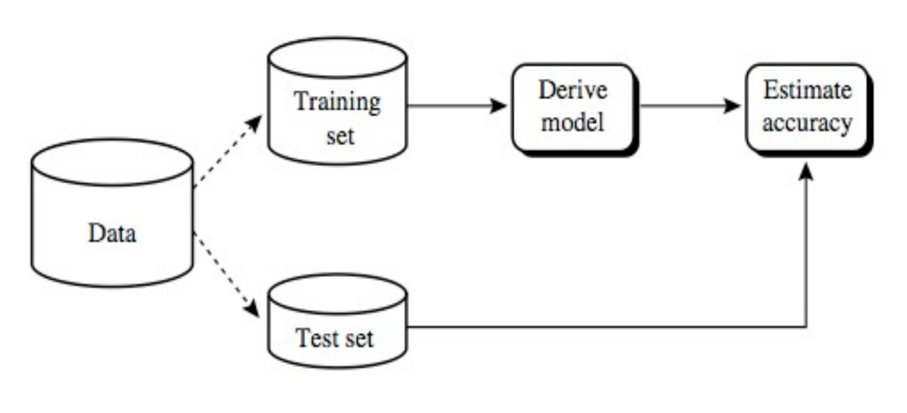
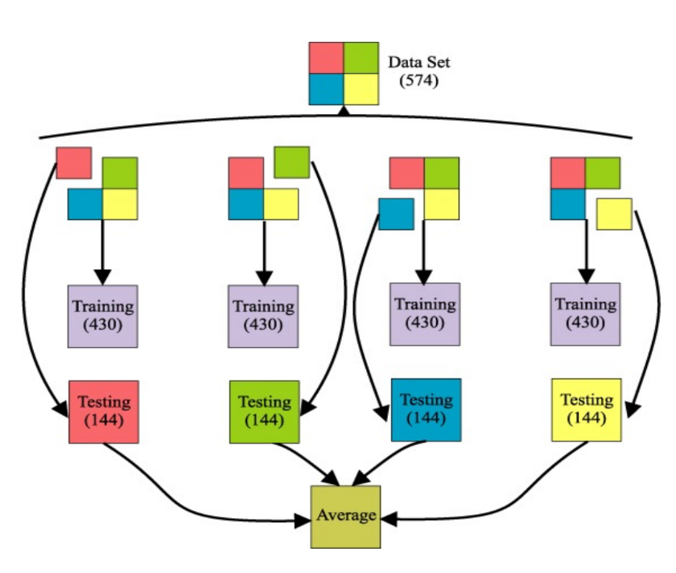
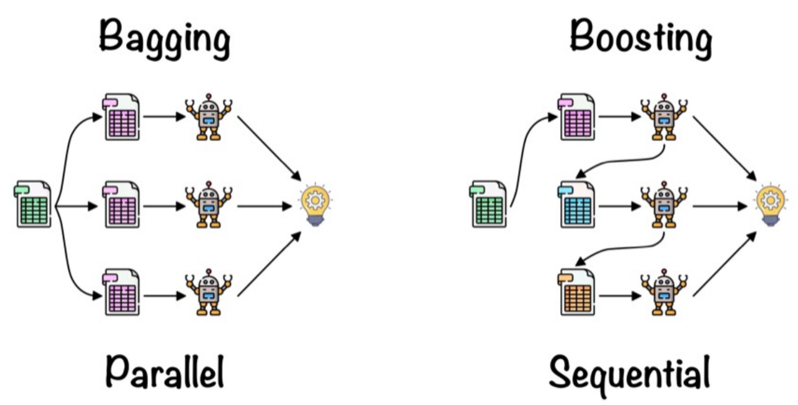

# Introduction to Models and Data

## Introduction

When we talk about Artificial Intelligence, we're talking about **building a model**, starting from the available data, that provides some **knowledge** about the world: this knowledge must be **readable**, **interpretable** and **tangible**, with a practical use in various fields. Each IA algorithm on the following operational pillars:

- **exploration**;
- **modeling**,
- **evaluation**.

### Exploration

In this first step, data are crucial, serving as the main focus of the algorithm to begin its analysis and the **hypothesis generation**. The data, stored in databases, represent the reality, and the effectiveness of the AI algorithm is based on the ability to **utilize data**, to inform strategic decision trough a process called **business intelligence**. Obviously, to have an effective algorithm, we require data that are logically consistent with themselves, and that are **representative** of the reality: to achieve that, a good strategy could be to gather data from different sources; this could be challenging, but it's a necessary step to have a good model. Lastly, it's crucial to understand how to **leverage data**, both for validation and the testing phases of the model.

### Modeling

In this phase, the figure of the **knowledge engineer** appears: it has a good understanding of the data, the principles over them and their defining parameters. The aim of this phase is to **estimate** the parameters of the model, using statistics and machine learning techniques. It' also important to **define the model**: based on the goal of the analysis, different possibilities are available.

#### Descriptive models

These models are typically identified by **clustering** and **association rules mining** algorithms; they're used to **describe the organizational structure and the data distribution**, and the main goal is a **deeper understanding** of the data and its knowledge.

#### Predictive models

These models are usually implemented for **classification** and **regression** problems, and they're used to **predict** the future behavior of the data, based on the past one. This is made by exploiting **parameters** and **mechanisms** within the data, predicting how they will behave in the future.

#### Unsupervised learning

This is a type of learning where the algorithm is given a set of data and must find patterns and relationships within it, without any prior knowledge, such as labels; it's related to the descriptive models and it's used for **building a model**.

#### Supervised learning

Typical of predictive models, where the data are labeled, and it's a method used to **train the model**.

### Evaluation

In this phase, we want want to **evaluate the validity** of the model. When we're dealing with predictive models, performances are assessed by appropriate **accuracy metrics**; if instead we're dealing with descriptive ones, we have to evaluate the **quality** of the model trough **model-specific metrics**. Part of this phase is also the **comparison between models**, made by knowledge engineers, trough statistical tests and analysis of the results. At the end of this step, we can both decide to **deploy** the model, or to refine it in order to obtain better results.

### Remarks

- Achieving a good model is a **complex process**, that requires a meticulous approach to all the steps, such as leading to a multiple execution of the same step for multiple times;
- the knowledge of the application domain can aids during the modeling phase, adding some **domain-specific knowledge** to the model that could be not clear by simply analyzing the data;
- the process of **knowledge elicitation**, where the knowledge engineer has to **extract the knowledge** from the domain expert, is crucial to have a good model;

## Data and transactions

Before going deep into the AI models, we have to understand what are the data, and define a common way to refer to them. *Data* is usually a general term that refers to the **raw facts**, but in fact we call **data set** the collection of **data objects**, which are the information that represent an **entity**.

> Example: in a database of students, the data set is the collection of all the students, and the data objects are the single students.

### Data objects

Data objects are also called **samples**, **instances** or **records**, and they're defined by **atributes**: we can image a samples as a **row of a table**, and the attributes as the **columns**. The attributes are also called **features**, they're the **characteristics** of the data object and they can be expressed with different types.

### Attribute types

The attributes can be of different types, such as:

- **nominal**;
- **binary**;
- **numeric**, and we can distinguish between **interval** and **ratio**.

#### Nominal attributes

Intuitively, we define a nominal attribute as a **category**, a **name** or a *name of a thing**:

> Example: possible hair colors are blonde, brown, black, red, etc.

Dealing with nominal attributes, we can define the **distance** between two attributes $d(i, j)$ as $d(i,j) = \frac{p - m}{p}$ where $p$ is the number of attributes and $m$ is the number of matching attributes.

> Example: given the variables *eye color* and *hair color* and two elements $i = $ {green, blonde} and $j = $ {gree, black}, we have $d(i,j) = \frac{2-1}{2} = 0.5$.

#### Binary attributes

These are a particular case of nominal attributes, where we have only two possible values, usually 0 and 1. If the possible outcomes are equally important, they're called **symmetric**; if instead one of the two outcomes is more important, they're called **asymmetric**, and we'll use the convention to assign the value 1 to the most important outcome.

#### Ordinal attributes

These are attributes that have a **natural order**, but with a **not defined distance** between them. They're used to represent **rankings** or **grades**.

> Example: *size = {small, medium, large}*.

Notice the **importance** of the order, and for this reason we can treat them as **interval-scaled** attributes, by mapping them into a set of **integer values**, and this could be done with this algorithm:

1. assign a number to each value, starting from 1;
2. convert the values into a number between 0 and 1 using this formula: $v = \frac{x_i - 1}{x_M-1}$, where $x_i$ is the value of the attribute and $x_M$ is the maximum value.

In this way, we can compute the **distance** using the same methods of the interval-scaled attributes.

#### Interval-scaled attributes

They are some sort of **quantity**, measured in a scale of equal-sized units. Values have an order, but they lacks on the definition of a **zero point**.

> Example: *temperature* measured in Celsius, where the 0 doesn't mean the absence of temperature.

#### Ratio-scaled attributes

They're similar to the interval-scaled attributes, but they have a **true zero point** (usually **naturally defined**) and this allows us to compute the **ratio** between two values.

> Example: *weight* measured in kilograms, where the 0 means the absence of weight.

### Distance of numeric attributes

A popular measurement for the distance between two numeric attributes is the **Minkowski distance**, defined as  $d(i,j) = \sqrt[h]{\sum_{k=1}^{n} |x_{ik} - x_{jk}|^h}$. When $h = 1$, we have the **Manhattan distance**, when $h = 2$ we have the **Euclidean distance**.

## Working with models

When operating with models, we have to **extract** the knowledge from the data; an example is the **data mining** process, in which we have to **extract patterns** and knowledge from massive data sets. In general, this process can be summarized as follows:

### Training and generalization

We start knowing that **training data contain the knowledge** that we want to extract: any AI algorithm is dependent on these data, and the aim is to create a model that **mirror the data** as close as possible, both for predictive and descriptive models. Now appears clear that the **quality of the data** is crucial in order to made the extraction process effective. When we build a system, we must include a **training phase**, where the data are used to **estimate the parameters** of the model: the effectiveness of this phase is evaluated by the **capacity of the model to generalize** the knowledge, that is,classify correctly new data that are not part of the training set.

### Data sampling

Given a set of data, not all the records are used to create the model, and this for two main reasons:

- for certain datasets, there are too much data available, and this could lead to very long training times;
- part of the data have to be used in the evaluation phase, to test the model.

A sampling strategy is used to select the data that will be used in the training phase, considering the fact that our model should have a good **generalization capacity**.

### Overfitting

In statistics, the **overfitting** problem arises when the model has **to many parameters** relative to the amount of data, leading to a model that is **too complex**: we should avoid this situation, because **simpler models have a better generalization capacity**. The overfitting problem is usually solved by **reducing the number of parameters** of the model, or by **increasing the amount of data**.

### Using the model

Once the model is created, it's ready to be used, following its purpose.

#### Usage of predictive models

**Predictive model** can be used, where the functions are like **boxes** with different **opacity** (black, which is a neural network, grey, which is a rule-based system, or white), that based on their structure and complexity can produce outputs from the given input. The output of these models are obtained by mechanisms, called **inference engines**, that use the parameters obtained in the training.

#### Usage of descriptive models

These models use their parameters to **describe** the characteristics of the data, such as **centroid** or **clusters**, to represent similar data objects; we can use these models to categorize new data objects, assigning them to the most similar cluster. The accuracy of that classification, when data aren't labeled, is evaluated by the **domain expert**.

### Training and testing

Only a portion of the data (that have to be **labeled** in order to create a predictive model), known as **training set**, is used to train the model, while the remaining part, the **testing set**, is used to evaluate the model. The testing set is used to evaluate the **generalization capacity** of the model, and it's crucial to have a good model. Labeled data allow us to evaluate the model, computing values such as **average error** or **accuracy**.

Dealing with classification models, we instead use **misclassification rate**, while for **regression models** we use the **error metrics**.

{width=400px}

The training and test set have to be carefully, in order to ensure randomness and to avoid **bias** towards a particular class. In general:

- we must assure the **independence** of the training and test set;
- the ratio between sets is unbalanced, with the training set that is usually larger than the test set.

## Useful techniques

### K-fold cross-validation

This is one the most robust, and also used, approach used to **evaluate a model**. Remember the fact that this is only an evaluating procedure: it doesn't gave any clue about how to improve the model!. The technique is employed to **reduce the model dependence** on data for both identification and evaluation.

Suppose to have a dataset, splittable in $N$ instancies, the dataset is divided in $K$ random partitions, also called **folds**. The model is then trained and evaluated $K$ times, using for each iteration $K-1$ folds for training and the remaining one for testing: this results in having $K$ different models, each one evaluated against a different test set, to assess the model's generalization capacity. The output of the procedure is $K$ different values of **error**, or **accuracy**, corresponding to the $K$ different models: the average of these values gives the **cross-validation error**.

Some general consideration about the standard deviation can be made: if the **standard deviation** of the error is high, this means that the model is **sensitive** to the data used for training; on the other hand, if the **standard deviation** is low, this means that the model appears to be **insensitive** to the data used for training.

It's important to remember that **we cannot compare results obtained with different evaluation techniques**: the **cross-validation error** is only a measure of the model's generalization capacity, and it's not a measure of the model's quality. Lastly, remember that the **cross-validation error** isn't suitable in every situation, and it's not always the best choice.

#### Example of K-fold cross-validation

The following figure shows an example of a 5-fold cross-validation, where the dataset is divided into 4 folds:

{width=400px}

Every color represents a different fold, and we can clearly see the creation of 4 different models, where each of them is created using 3 different folds for training and the remaining one for testing.

In output, we have 4 different statistics, that are used to evaluate the model's generalization capacity.

### Stratified cross-validation and leave-one-out

Stratified CV is an extension of the standard cross-validation, and it's often applied when we're dealing with classification problems.

In this technique, the subsets are partitioned in a way such that the **initial distribution of instancies** of every class is **preserved** in every fold. In case where the partitions $K$ are equal to the number of instancies $N$ (the number of available instancies), the strategy is to **leave one instance out**.

Then, $N - 1$ instancies are iteratively used to train the model, and the generalization capacity is evaluated for each of them. In the end, **average error** is computed, considering the $N$ results of the test set (which is the single instance left out).

### Bagging

This technique is used to **reduce the overtraining**: we train a set of $T$ models, such that they are of different types but aiming to solve the same problem. Each of them is trained on a **unique training set**, drawn from the total data available, using the **bootstrap sampling**. The latter let, for the same instance, to appears multiple times in a single training set, while other instances could not appear at all.

For each model $n_i$, the number of training samples $N_i$ is such that $N_i \leq N$, where $N$ is the total number of instances available. After the training phase of all the $T$ models, we can combine the outcomes to classify new instances:

- each model predicts the class of the new instance;
- the final class will be the one that appears most frequently, using the principle of **majority voting**.

### Boosting

Boosting is in fact an **ensemble technique**, which have the aim to **create a strong model** from a set of weak models. The idea is to build a model using **the entire training set**, and then creating a **second model** that attempts to **correct the errors** of the first one. Models can be created and added sequentially, and new models focus on the instances that were **misclassified** by the previous ones.

This technique wants to give more importance to the instances that are **hard to classify**; it also differs from the bagging technique because the models aren't trained in parallel (which results in a independent training), but they're trained **sequentially**, where the new model is trained based on the performance of the previous one.

The final model is made by taking the weighted vote, or average, of the models created during the boosting process, where the weights are assigned based on the individual performance of the models, having the best models a higher weight.

{width=400px}
