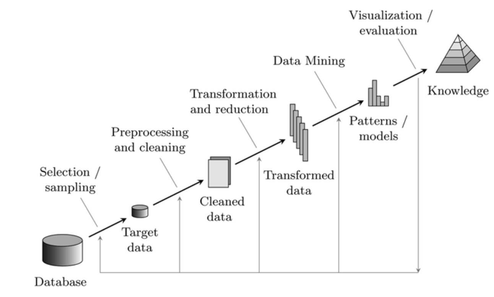
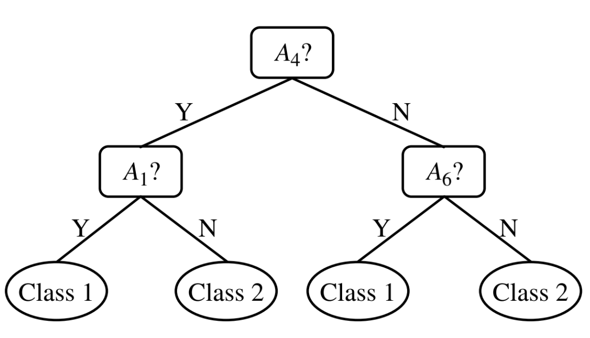

# Data exploration and preprocessing - Data mining process

The data mining process is a systematic approach to extract knowledge from data. It is composed of several steps that are executed in a sequence, which are shown in the following figure.

{width=400px}

## Data cleaning

Data that are extracted from the real world are **dirty**. Different classes of *dirtiness* exist, and they differ in the way they affect the data, and how they can be detected and corrected.

### Incomplete data

Those are data that lack one or more attribute values: this might be due to several reasons, such as the data collection process, equipment failures, or human errors. In this case, missing data **may need to be inferred**:

- **Ignore the tuple**: this is usually done when class label is missing, but it's not an effective method when the percentage of missing values varies from attribute to attribute;
- **Fill in the missing value manually**: this is usually done when the percentage of missing values is small. Infeasible when the number of missing values is large;
- **automatic filling in of missing values**: this can be done using:
  - a **global constant**, such as "unknown" or even a new class;
  - the **attribute mean** (or median, or mode);
  - the **attribute mean** for all samples belonging to the **same class**;
  - the **most probable value** (e.g., using a decision tree);

### Noisy data

We define the noise as *random error or variance in a measured variable*. This can be due to several reasons, such as data collection errors, data transmission errors, or data entry errors. We can deal with noisy data considering the source of the data that are usually affected by noise, and the nature of the noise. Typical data affected by noise are those from ambient intelligence, sensor networks, and data streams: here the true signal amplitude (the y-value) change **rather smoothly**, compared to the x-value. We can operate a process called **smoothing** to remove the noise from the data: data points of a signal are modified so that individual points that are higher than the adjacent points are reduced, and those that are lower are increased, naturally preserving the shape of the signal, while reducing the noise and being naturally smoothed.

> Example: the simplest smoothing algorithm is the **moving average**.
> We can use the **rectangular sliding-average smooth**, that simply replace the point $i$ with the mean of the $m$ points around it, where $m$ is called **smooth width**.
> The formula for a 3-point rectangular sliding-average smooth is $y_i = \frac{1}{3} (x_{i-1} + x_i + x_{i+1})$.

## Data discrepancy detection

Data discrepancy detection is the process of identifying and correcting discrepancies in the data. Different methods can be used to detect discrepancies, such as:

- checking the **metadata** of the data;
- check the **field overload**, typically results when developers squeeze new attribute definitions into unused portions of existing fields;
- check the **uniqueness rule**: each value of a certain attribute must be different from all the others;
- check the **consecutive rule**: there cannot be missing values between the lowest and the highest value of an attribute;
- check the **null rule**: specifies the conditions under which an attribute value can be null;
- use commercial tools for both **data scrubbing** and **data auditing**.

## Data redundancy

Redundancy may appears when an integration of multiple databases is performed:

- an attribute, or an object, may have different names in different databases, also known as **object identification problem**;
- an attribute can be a **derived attribute**, that is, it can be computed from other attributes;

Redundant attributes can be also detected trough **correlation analysis**; in general, extra care must be taken when dealing during a data integration process, to reduce or entirely remove redundancy.

## Data reduction

Data reduction strategies are used to get a reduced representation of the data set, while maintaining the same analytical power. This could be done by several reason, such as no enough data storage, or to reduce the time needed to perform the analysis. Two are the main strategies to reduce data: **dimensionality reduction** and **numerosity reduction**.

### Dimensionality reduction

We start defining the dimensionality as the *number of attributes in the data set*: adding dimensions to data, they become increasingly **sparse**, and this lead to the **curse of dimensionality**. This is a problem that arises when the data set has a large number of dimensions, and it is difficult to analyze and visualize the data: when dimensions increase, analysis such as density, critical in clustering and outlier detection, become less powerful, and this because the combinations of subspaces grow exponentially with the number of dimensions.

{width=400px}

Understood the problem, we can now define the **dimensionality reduction** as the process of reducing the number of dimensions in the data set. Note that the process also helps to **reduce the noise** in the data, and **remove redundant information**. The main techniques to reduce the dimensionality are divided in two main classes: the supervised ones, such as **PCA** or **Wavelet Transform**, and the unsupervised ones, that are in matter of fact kind of optimization problems, such as **feature selection** or **feature extraction**.

#### Principal Component Analysis (PCA)

The aim of this process is to project relevant attributes in a different space, with a *hopefully* reduced space than the original one. The projection should capture the largest amount of variation in data, and this is done by finding the **eigenvectors** of the **covariance matrix** of the data. Using this technique we have to deal with the **loss of the feature meaning**, that is explained in the further example.

> Example: loss of feature meaning.
> Having a dataset containing data about the weather, such as temperature, humidity, and wind speed, we can apply PCA to reduce the dimensionality of the data. Reducing the dataset dimensionality, we're going to lose some features, that will be replaced by a **linear combination** of the original features. This means that the new features will be a mix of the original ones, and they will not have a clear meaning.

#### Attribute and feature selection

This selection involves a search trough all possible combinations of attributes, in order to find which subset of attributes is the most relevant for the analysis, leading in fact to an optimization problem. The main used algorithms are:

- **evaluator algorithms**: they evaluate the goodness of a subset of attributes using a **quality function**;
- **search algorithms**: they search for the best subset of attributes using a **search strategy**, exploiting heuristics to reduce the search space.

#### Metrics for feature importance

We know that features aren't independent when we're using them to predict a result; however, we can use some metrics to understand which features are more important than others. The most used metrics are the **correlation**, the **information gain**, and the **Gini index**, that show how much data entropy exists between a given feature and the result.

Dealing with **multiple feature evaluation**, we use the **mRMR** approach: *maximal Relevance, Minimal Redundancy*. This approach is based on a filter feature measurement criterion, which computes **redundancy** between features in the subset, and **correlation** between features, and class based on the **mutual information**, in order to estimate the capability of making a good prediction for a given group of features.

#### Filter and wrapper methods

These are common optimization methods used to select the best subset of features.

{width=400px}

The **search strategy** is common on both methods, and it's based on heuristics: it identifies a subset which goes as input in different modules, based on the method used. Using the **filter method**, the subset is evaluated using a **objective function**, that returns to the search module the goodness of the subset, and other possibly useful statistics. The **wrapper method** instead uses a **predictive model** to evaluate the subset, and this model is trained on the subset, and then tested on a validation set.

Take care of the model used in the wrapper method: we're using a classifier to obtain parameters for another classifier! The one used during this evaluation phase should be very simple, using few (and possibly different) parameters, compared to the one used in the final model.

In both cases, we can stop the search when the **quality function**, or the **predictive model**, reaches a certain given stop condition.

#### Ranking method

This is the fastest method to select the best subset of features, but also the one with the worst results. We can see the phases of the ranking method in the following figure.

{width=400px}

Examples of threshold can be, for instance, the **number of features** to select, or a minimum **quality function** value.

### Numerosity reduction

The aim of this process is to reduce the number of data instances, while maintaining the same analytical power. The first operation we can make is the **sampling**: we can select a subset of the data, and use it for the analysis; this is typically done when dealing with skewed data. Another methods are available: they're called **mining algorithms**, and they should be potentially **sub-linear** in the size of the data set. The key idea to have in mind is choose a representative subset of the data: operating a random selection could lead to a non-representative subset, and this could lead to a wrong analysis. To achieve a good results, different sampling methods can be used:

- **random sampling**: each data instance has the same probability to be selected;
- **sampling without replacement**: each data instance can be selected only once;
- **sampling with replacement**: each data instance can be selected multiple times;
- **stratified sampling**: the data set is divided into strata, and then a random sample is selected from each stratum.

The latter is particularly useful when dealing with skewed data, because it ensure that even the smallest stratum is represented in the sample.

## Advices for attribute selection

The most important thing to understand is that **we never want to touch the training set**. Suppose to have a dataset, and a certain reduction is being applied to it. We consider the training set as a *part of the future*, because our model should never see the test set during the training phase. If we included the test set during the analysis for the attribute selection, we're somehow **including the test set inside the model**, and this is a **bad practice**. We're, in fact, introducing a bias in the model, using *future data* that are impossible to obtain in the real world. Given that rationale, we'll refer at the following figure, that shows the correct way to perform the attribute selection, as the **golden rule**.

{width=400px}

## Heuristic search in Attribute Selection

### Decision tree induction

The decision tree induction is an automatic way to perform a search; to explain the concept, we can consider the following example.

{width=400px}

Take an initial set of attributes $\{A_1, A_2, A_3, A_4, A_5, A_6\}$, and compute metrics on these attributes (e.g., the **information gain**, usually chosen based on the problem we're dealing with), and we choose an attribute based on that metric. Then we start to build our tree from the root: it  will have a condition based on the chosen attribute, and the branches will develop themselves based on other attributes. The aim of the technique is to find the **splitting point** as the point such that we split the attribute set in two parts, and we chose the one that represents better the data. The process is repeated until we reach a stopping condition, that could be the **maximum depth** of the tree, or the **minimum number of samples** in a leaf.
Following the example, the reduced attribute set will be $\{A_1, A_4, A_5\}$.

### Backward elimination

This is a **greedy** algorithm, that starts with the full set of attributes, and then removes one attribute at a time, based on a certain criterion such as the **information gain**. The process is repeated until a stopping condition is reached, such as the **minimum number of attributes**.

### Forward selection

This is another **greedy** algorithm, that starts with an empty set of attributes, and then adds one attribute at a time, based on a certain criterion. The pseudo-code for the algorithm is the following:

1. initialize: set $F = \{f_i | i = 1, \ldots, N\}$ the initial set of the features, and $S = \emptyset$;
2. calculate, for each attribute, the importance metric $M(f_i, Y)$ with respect to the input $Y$;
3. select the first feature $f_i$ that maximizes $M(f_i, Y)$, and set $F = F \setminus \{f_i\}$, and $S = S \cup \{f_i\}$;
4. **greedy selection**: repeat the process until a stopping condition is reached, such as the **minimum number of attributes**.
   1. calculate the importance metric $M(f_i \cup S, Y)$ for each attribute $f_i \in F$;
   2. select the next feature $f_i$ that maximizes $M(f_i \cup S, Y)$, and set $F = F \setminus \{f_i\}$, and $S = S \cup \{f_i\}$.
5. output the set $S$.

## Data transformation

Data transformation is the process of **changing the format, the structure or the values of the data**. These techniques are usually applied to ensure **more efficient data analysis** and better **knowledge extraction**.

### Normalization

The aim of this process is to scale the data in a certain range, usually $[0, 1]$, or $[-1, 1]$. This is done to avoid that some attributes have a **higher weight** in the analysis, compared to others. The most used normalization techniques are:

- **min-max normalization**: the data are scaled in the range $[\text{new-min}_A, \text{new-max}_A]$, using the formula $x' = \frac{v - \text{min}_A}{\text{max}_A - \text{min}_A}\cdot (\text{new-max}_A - \text{new-min}_A) + \text{new-min}_A$;
- **z-score normalization**: the data are scaled using the formula $x' = \frac{v - \mu_A}{\sigma_A}$, where $\mu_A$ is the mean of the attribute $A$, and $\sigma_A$ is the standard deviation of the attribute $A$.