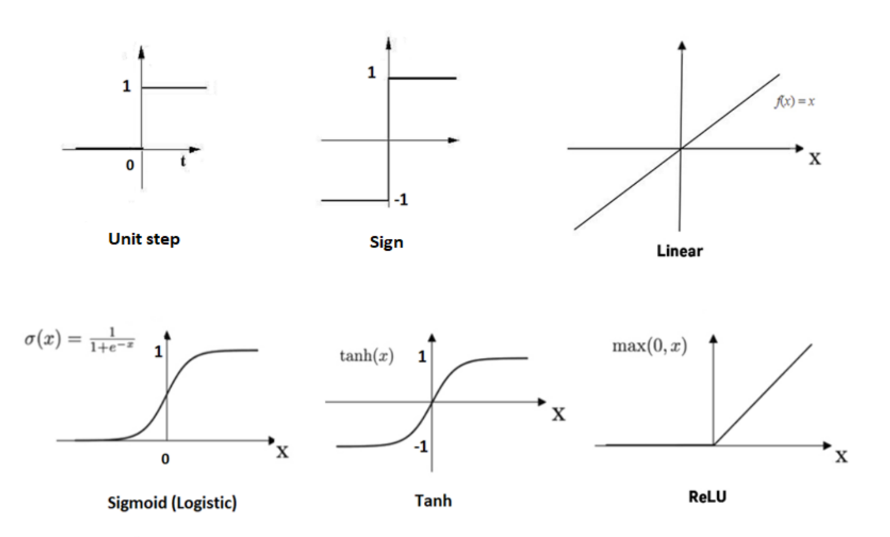
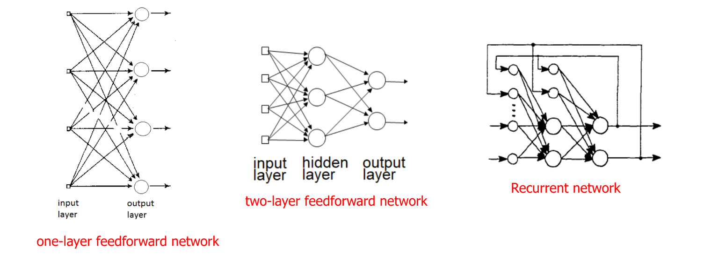
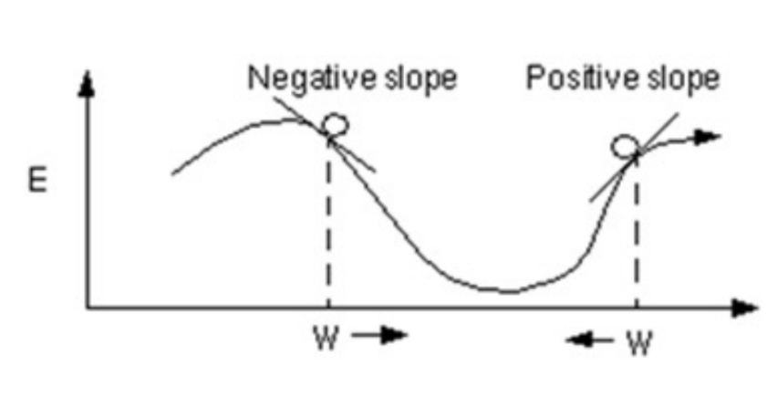
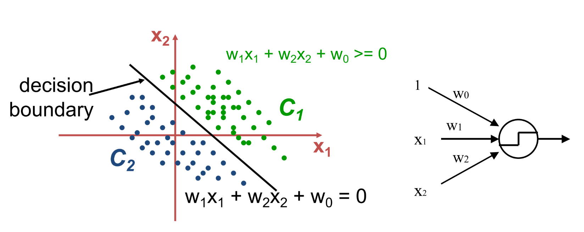
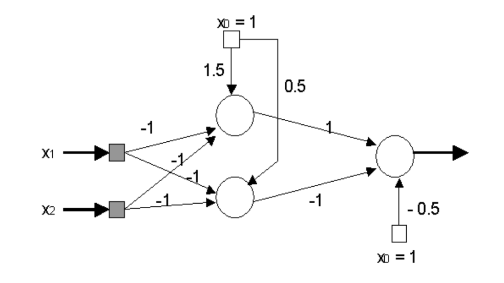
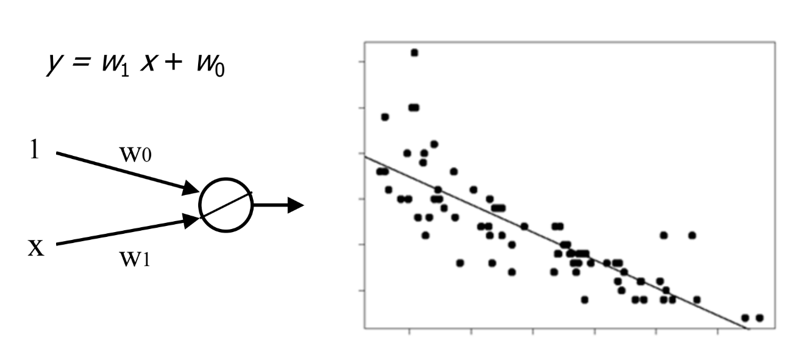
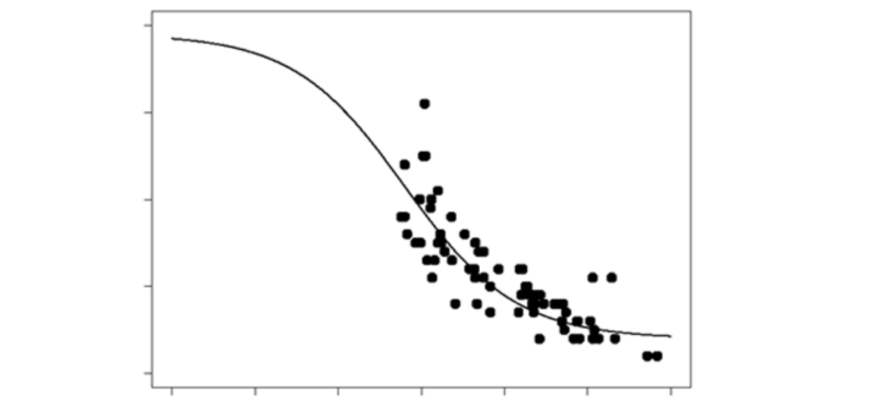

# Introduction to Artificial Neural Networks

## Introduction

### What is a Neural Network?

An **Artificial Neural Network (ANN)** is an abstract simulation of a human nervous system, that contains a collection of neurons connected with each other trough connections called **axons**. The aim of a neural network is to simulate neurons and connections, resembling the human brain.

### Neuron model

Many neurons have a structure called **dendrites** that receive signals from other neurons trough **synapses**. The neuron processes the signals and sends the output signal through the **axon**, which is basically an electrical impulse: it can be **excitatory** or **inhibitory**, and in case of excitatory signals, the neuron will generate informational messages to other neurons.

It's estimated that around 100 billion neurons are in the human brain, and each neuron can be connected to thousands of other neurons: their switching time is significantly slower than the switching time of a computer, but the connectivity is much higher, up to hundreds times more.

## Artificial Neural Networks

### Structure of an ANN

An NNN is composed by a set of **neurons** and **weighted connections** between them, plus a series of thresholds or **activation levels**. During the design of an ANN, we have to take into account the **number and type of neurons**, the **morphology of the network**, the **weights** and the **training examples**, in terms of network inputs and outputs.

### Artificial Neuron

The scheme of an artificial neuron is shown in the following image:

{width=400px}{width=400px}

Note that the artificial neuron has a set of **inputs** $x_1, x_2, \ldots, x_n$ and a set of **weights** $w_1, w_2, \ldots, w_n$, which are real number such that, if positive, they are excitatory, and if negative, they are inhibitory; these weights are related to the corresponding inputs. The neuron computes the **weighted sum** of the inputs and weights as a linear combination $a = \sum_{i=1}^{n} w_i \cdot x_i$, that goes into an **activation function** $\phi(a)$. The output of the neuron can be a real number, both non-limited or limited to a certain range, or even a discrete value. Lastly, there also is a binary threshold function such that, if the output is above a certain threshold $\theta_i$, the neuron will fire. In fact, the latter is a generalization of a **step function** for a given threshold. Typically, the threshold is also subtracted from the weighted sum, in order to have the function $y = f(\sum_{i=1}^{n} w_i \cdot x_i - \theta_i) = f(\sum_{i=0}^{n}w_i \cdot x_i)$ **centered in zero**. If a threshold assumes a negative value, is called **bias**, and it's considered as a weight connected to a unit that always outputs 1 (note that in the previous equation we added the index 0 to the sum, which is the bias).

### Activation functions

In the following image, we can see some examples of activation functions:

{width=400px}

### Network topology

The topology depends on **how neurons are connected which each other**: if they're arranged in a **hierarchical** way, such that the neurons are connected only with **adjacent layers**, we have a **feedforward network**. If the neurons are connected with **non-adjacent layers**, we have a **recurrent network**. We can see an example of these two types of networks in the following image:

{width=400px}

Note how the firsts neurons are connected only with the second layer in the feedforward network, while in the recurrent network they this rule is not respected; in particular, in this case, the network is implementing a sort of *memory*, with a structure that resembles a **flip-flop**.

## Network training

When we want to use a neural network to deal with classification and regression problems, we resort to a **supervised learning** process, which modifies the weights of the network by applying a set of **labeled training examples**: each sample consists of an input and the corresponding target output. During the training phase, the network is fed with the input, and the output is compared with the target output, then the weights are adjusted in order to **minimize the error**. The training process is repeated until there are no significant changes in the weights.

### Delta rule

The **delta rule** is a simple algorithm that modifies the weights of the network in order to minimize the error. The rule is based on the **gradient descent** method, which is a method to find a local minimum of a function. The delta rule says that the adjustment to be made is $\Delta w_i = \eta \cdot \delta \cdot x_i$, where $\eta$ is the **learning rate**, and $\delta$ is defined as $\delta = t - y$, $t$ is the target output, $y$ is the actual output, and $x_i$ is the input. Note that this is a **recursive rule**, and the formula can be rewritten as $w_i (n+1) = w_i (n) + \Delta w_i(n)$.

We define the **error for the k-th sample** as $E_k = \frac{1}{2} \sum_{i=1}^{n} (t_i - y_i)^2$, where $t_i$ is the target output and $y_i$ is the actual output. The **total error** is defined as $E = \sum_{k=1}^{m} E_k$, where $m$ is the number of samples.

#### Main idea

TO understand the main idea behind the delta rule, we have to give a mathematical interpretation of the error function, that is the fact that it lies in the same space of the weights. This is crucial because, after the start where the weights are randomly assigned, the algorithm adjusts them in a direction **towards a lower overall error**: in other words, the weights are modified in the direction of the **steep descent** of the error surface, and we'll prove the convergence of the algorithm in the next section.

#### Proof of convergence

For the proof, we start rewriting the delta rule as $\Delta w_{ij} = -G = - \frac{\partial E}{\partial w_{ij}}$, and we can visually interpret this in the following image:

{width=400px}

Iterating the rule, we move *downhill* in $E$, until we reach a minimum $G=0$.

Now we write the actual output of the network as $y_i = \sum_ix_iw_{ij}$, so as a linear combinations of the inputs and weights. We can now compute the partial derivative, applying the *chain rule*, and we obtain $\frac{\partial E}{\partial w_{ij}} = \frac{\partial E}{\partial y_i}\cdot \frac{\partial y_i}{\partial w_{ij}}$. Then, we write $- \delta = \frac{\partial E}{\partial y_i}$, and we can compute the partial derivative of the output with respect to the weights as $\frac{\partial y_i}{\partial w_{ij}} = x_i$. So, we can rewrite the delta rule, adding the **learning rate** $\eta$, as $\Delta w_{ij} = \eta \cdot \delta \cdot x_i$, and we can prove that the algorithm converges to a minimum.

The definition of $\delta$ came out by calculating the partial derivative of the error with respect to the output, considering a single instance: $\frac{\partial E}{\partial y_i} = \frac{\partial}{\partial y_i} \frac{1}{2} (t_i - y_i)^2 = - (t_i - y_i) = - \delta$.

#### The learning rate

The learning rate $\eta$ is a crucial parameter in the delta rule, because it determines the **step size** of the algorithm. If the learning rate is too high, the algorithm may oscillate around the minimum, and if it's too low, the algorithm may take too long to converge. In real cases, its value is determined experimentally, and it can vary overtime, getting smaller as the training progresses.

### Momentum

In real-world problems, it can happens that the error surface is not smooth, and the algorithm may get stuck in a local minimum. To overcome this issue, we can introduce a **momentum** $m$ term in the delta rule, such that the new formula is $\Delta w_{ij}(n+1) = \eta \cdot \delta \cdot x_i + m \cdot \Delta w_{ij}(n)$. The momentum term is a fraction of the previous weight update, and it's domain is $]0,1[$, and the actual value is determined by trial and error.

### Learning algorithms

We divide the learning algorithms in three categories:

- **online learning**, where the weights are updated after each sample;
- **batch learning** (or *offline*), where the gradient is computed for all the samples, and the weights are updated at the end of the process;
- **mini-batch learning**, where the gradient is computed for a subset of the samples, and the weights are updated at the end of the process.

The last two methods provide both a more precise estimation of the gradient vector, and possibly a faster computation, given the fact that these processes can be parallelized; on the other hand, the online learning is more flexible, because it doesn't need a fixed training set, requires less memory and, lastly, it has the ability to escape from local minima under certain conditions.

## Perceptron

A perceptron is a **single neuro**n with an hard limiter as activation function, such as sign or step function , and it's used to solve **binary classification** problems. It can be trained to correctly classify training examples from classes $C_1$ abd $C_2$ by assigning inputs to $C_1$ if the output is positive, and to $C_2$ if the output is negative.

The classification is made by using a **straight line** in the input space, that represents the **decision boundary** between the two classes, which are the regions that are separated by the line.

{width=400px}

### Perceptron learning algorithm

A pseudo-code of the perceptron learning algorithm is the following:

1. Initialize the weights to 0 or small random values;
2. choose an appropriate learning rate $\eta$;
3. until the stopping criterion is met (such as the number of iterations or the fact that weights don't change significantly):
    1. for each training sample $(x_i, t_i)$:
        1. compute the output $y_i = f(w,x)$;
        2. if $y_i = t_i$, continue;
        3. if $y_i \neq t_i$, update the weights as $w = w + \eta \cdot (t_i - y_i) \cdot x_i$, where $t_i$ is the target output.

### Decision boundary

We can make a mathematical consideration about the points that lie in the decision boundary: they all have the same inner product with the weight vector. From this, we can say that they have the **same projection** on the weight vector, so they must lie on a line that is **orthogonal** to the weight vector. Look at these two images:

{width=400px}

The red dashed line is the decision boundary, so note that both points $p_1$ and $p_2$ are incorrectly classified. What happens if we choose one of the as training sample to update the weights?

- choosing $p_1$, it has target $t=1$, so weights are slightly updated in the direction of $p_1$;
- choosing $p_2$, it has target $t=-1$, so weights are slightly updated in the direction of $p_2$.

Note that in both cases, the new boundary is better than the previous one, and this because **the perceptron learning algorithm is a linear algorithm is guaranteed to converge in a finite number of steps, if the problem us linearly separable**.

### XOR problem with perceptron

The XOR problem is a problem that can't be solved by a single perceptron, because the classes are not linearly separable. In fact, the XOR problem is a **non-linear** problem, and it can be solved by adding a **hidden layer** to the network, or by using a specific activation function.

If we want to resolve the problem by using two separating lines, we'll need **two perceptrons** to represents the two lines, and a third neuron to combine the outputs of the first two neurons. We'll obviously need a **threshold** for each neuron, and the output of the third neuron will be the final output of the network.

{width=400px}

The effect of the first layer on the weights is such that now the problem that goes into the second layer is linearly separable, and the second layer will be able to solve the problem.

### Hidden layers

In general, we observe that adding a hidden layer to the network, the network itself became able to model regions with a number of sides at most equal to the number of neurons in the hidden layer. In fact, the hidden layer is able to model **non-linear** regions, and the output layer is able to combine the results of the hidden layer to solve the problem. If we instead add a second hidden layer, the network will be able to model regions that are arbitrarily complex.

### Improving the fitting

Observe the following image:

{width=400px}

We can clearly see that data are not evenly distribuited around the straight line, so we can achieve a better approximation by using a **hidden layer**, consisting in a single neuron with **tanh** as activation function. The result is shown in the following image:

{width=400px}

This approach can be used to approximate even more complex functions, simply adding more neurons to the hidden layer. However, we need to consider the negative aspect of this approach: too **many neurons** in a single hidden layer, or simply too **many hidden layers**, can have a **negative impact on the network performance**. The best practice is to start with a network with a reasonable minimum number of hidden neurons, and then increase the number of neurons only if the network doesn't perform well. Remember that a network with a hidden layer that contains enough neurons can approximate any continuous function.

## Feedforward Neural Networks 

In a FNN with Multi-Layer Perceptrons (MLP), the neurons are organized in layers, and the connections are such that neurons in a layer are connected only with neurons in the next layer. The first layer is called **input layer**, the last layer is called **output layer**, and the layers in between are called **hidden layers**. These networks let us to learn highly complex decisions surface, that are not separated by a straight line.

### Back propagation

Training phase for hidden layers can be tedious, because we don't have any *desired value* for the hidden neurons. The solution is to use the **back propagation** algorithm, which consists in forward activation of the network, and then in the backward propagation of the error. Each perceptron implements the **sigmoid** as a threshold function, whose formula is $\sigma(x) = \frac{1}{1 + e^{-\vec{w}\cdot\vec{{x}}}}$, and the error is calculated as $E = \frac{1}{2} \sum_{i=1}^{n} \sum_{k \in \text{outputs}(t_i - y_i)^2}$.

The goal of the algorithm is to **minimize the error between each desired output and the actual one**, computed by the neural network $o_k$. The error is propagated back to the hidden layer, and the weights are updated by using the delta rule. We can write a pseudo-code for the back propagation algorithm as follows:

1. define the function backProp(D, $\eta$, $n_{in}$, $n_{hid}$, $n_{out}$), where:
   1. $D$ is the training set;
   2. $\eta$ is the learning rate;
   3. $n_{in}$, $n_{hid}$ and $n_{out}$ are the number of neurons in the input, hidden and output layers;
2. create a network with $n_{in}$ input neurons, $n_{hid}$ hidden neurons and $n_{out}$ output neurons;
3. initialize the weights with small random values $\in \R$
4. until the stopping criterion is met:
   1. for each training sample $(x_i, t_i) \in D$:
      1. propagate the input forward to compute the output $o_k$ of each neuron;
      2. propagate the error backward to compute the error of each neuron:
         1. for each output neuron $k$:
            1. compute the error $\delta_k = f'(o(x))(t_k - o_k) \rightarrow \delta_k = o_k(1-o_k)\cdot(t_k - o_k)$
            2. for each hidden unit $h$, calculate its error term $\delta_h = o_h(1-o_h)\sum_{k \in \text{outputs}} w_{kh} \delta_k$
            3. update the weights $w_{ij} = w_{ij} + \eta \cdot \delta_j \cdot x_i$
         2. $x_{ij} is the input of the j-th neuron in the i-th layer;

The stopping criterion can be the number of iterations, or the fact that the error doesn't change significantly.

### Guidelines for training samples

The training sample must represents the entire set of data the network will work on: an high number of training samples reduce the risk of undersampling, and if the samples are not enough, the network may not be able to generalize the problem. As we can image, there not exists a fixed rule that assess how many samples are needed, but the heuristic guide us in having 5 to 10 training samples for each weight in the network.

### Early stopping

In order to prevent the network from overfitting, we need a third, independent, set of data called **validation set**. The idea is to train the network on the training set, and to validate it on the validation set, by plotting some error function. A typical behavior of the MSE for training and validation sets is shown in the following image:

{width=400px}

Both errors typical fall quickly at the beginning, but the validation error starts to rise again, while the training error continues to fall. This phenomena shows that the network has stopped learning what is useful for the validation set, and it's starting to learn the noise in the training set. This overfitting harms the ability of the network to generalize the problem, and the best practice is to stop the training when the validation error starts to rise. To achieve the best generalization, training phase should be stopped when the validation error is at its minimum: this is called **early stopping**.

### Network's size

A larger network with many weights can model more complex functions, having an adequate number of training samples, but in the other hand, having too much weights can be a disadvantage, in case the network use them to **memorize the training set**. On the other hand, a small network won't be able to learn the problem at all: the key is to find a network large enough to learn the problem, but small enough to generalize it well; a good choice is a network with the minimum number of weights needed to process correctly the training set, starting with a small amount of hidden neurons, and increasing them monitoring the generalization ability after each epoch.

### Preventing overfitting

These are some techniques to prevent overfitting:

- **early stopping**: stop the training when the validation error starts to rise;
- **gather more data**: more data means less risk of overfitting;
- **data augmentation**: add noise to the training set, or rotate the images, to increase the number of training samples;
- **reduce the network size**: a smaller network is less likely to overfit.
